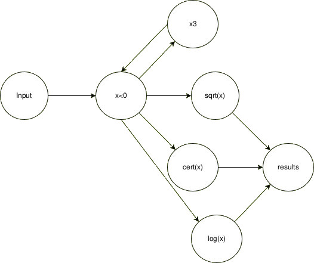

In a programmer's lifetime, you have to deal with thousands of structures. In other words, you are always deciding how to organize your data. There are many options out there, from single variables to complex matrices of custom-defined structs. One of those common approaches is graphs.

**But graphs are not data structures: they are mathematical structures.**

Of course, you can apply them as data structures; so many pieces of software depend on them. Even if you don't realize it, you are dealing with graphs all the time. For example, a linked list is just a special case of a directed graph.

But when considering graphs as mathematical constructs rather than mere data structures, they become a much more powerful tool. Here I present two more applications of graphs in software development: as a processing design and as codebase representation.

*Note: Although this is a general programming post, I'm using Go for the code examples.*

## Process by graphs

Let's deal with this problem:

We have to process each day's minimum temperature of a city (X), doing x³ and then the result square root or its opposite natural logarithm. Then, store values into a map with key the result and value its certificate.

But we have to take care of:

- Numbers are 8-bit signed integers [-128; 127] (Go: int8)
- Handling real-number groups
- If `x < 0`, doing `sqrt(x³)` will result in a math error. In such cases, program will look for `logn(-x)`
- If `x³` overflows `int8` max value, will look for `logn(-x³)`
- When looking for logn, we will ask a remote service for an error signature

*Is it a realistic problem? Of course not. But the abstract idea is present here.*

Lets think in a traditional approach:

```go
  func process(input []int8, certs map[float64]string) {
    for i := 0; i < len(input); i++ {
      var result float64
      var needCert bool
      var cert = "no_need"
    
      x := input[i]
      switch {
        case x > 0 && x*x*x < 0: // testing for overflow scenarios
          x = x * x * x
          // we want the same behavior as x < 0
          // Note: In Go, fallthrough transfers control to the
          // next case rather than breaking out of the switch
          fallthrough 
        case x < 0:
          needCert = true
          result = math.Log(float64(-x))
        default:
          x = x * x * x
          result = math.Sqrt(float64(x))
      }
  
      if needCert {
        cert = askCert(x)
      }
    
      certs[result] = cert
    }
  }
```

Now, we have problems: we are processing inputs one by one, we are trying to do all in the same place, processing in batch, and waiting for `askCert(x)` response before processing another input. In summary, we are not being efficient and not applying clean code good practices.

**So, for cleaning this mess, we can take a different approach: graphs.**

Let's assume we treat processes as vertices and communications as edges. Each process will perform one of our atomic operations: `x³`, `x < 0`, `sqrt(x)` and `log(x)`, and communication will be done via channels.



To implement this, let's create each function assuming that it will run indefinitely (as nodes). Then, we pass them the input and output channels (edges). The clearest approach to declaring edges is to first define an adjacency matrix, then specify the corresponding channel types, and finally, assign edge weights (e.g., using buffer sizes in Go). Of course, doing this way is not strictly necessary; in the example of the full implementation below I'm declaring each channel manually, expecting to be clearer in the intentions:

[Playground code implementation](https://go.dev/play/p/K4tpZ-flF5a)

But, why would we want to create this mess? Two main factors: control and performance. That is because our example is just a base to start thinking. Processes are as flexible as we can imagine. One of the most important scenarios to apply is when you have a lot of I/O operations; you can use a vertex process to start background calls to your I/O op and send its response to some other vertex where you know it will be used. That would reduce the awaiting time without compromising the remote resource, by avoiding an overload of calls (*an abstraction of "just in time" inventory system*).

In **Cloud(x)** we applied this approach to enhance our customer's data processing—achieving a 16x improvement in combined time efficiency and resource utilization.

## Code as Graph

Another benefit is that it aids in the study and maintenance of software. You can apply graph theory to understand your codebase and even predict its behavior before writing any code.

Studying code by itself is something that, as programmers, we usually don't do. **But we should.** That topic has been studied by `German Cárdenas` in his publication "*Evaluating the Graph-based Visualization Technique: A Controlled Experiment*".

The application of graphs to study codebases is not a new idea. Back in 2002, `Eva Van Emden` and `Leon Moonen` published "*Java Quality Assurance by Detecting Code Smells*". In that research, they represented "*entities*" of the software using graphs: packages, classes, methods, etc.

To have graphs at a design stage is relatively common, but how much time do we actually invest in studying and maintaining these graphs? In my experience, almost no one will ever update a graph that was created in the early stages of the project. Plus, the graph will serve merely as a visual reference rather than as an active development tool.

Imagine a fully updated graph representing your RESTful API—encompassing functions, calls, and models. We will be able to quickly realize the effort of a change. You can apply `Depth First Search` or `Breadth First Search` to find out how many parts of your code will be affected. Then, take your `Dominators Tree` to evaluate the risks of your plan. And of course, if after the changes your graph is no longer connected (*your connectivity is greater than 1*), you will realize you have dead code to deal with.

Let's also assign weights to edges to represent the expected execution time of functions. This allows us to estimate an endpoint's response time using `Dijkstra's algorithm`. We would be able to calculate how many resources we need to serve the expected number of concurrent users, and what parts of our software require more optimizations.

This topic is as extensive as graph theory itself. There is a wealth of studies and documentation available. It is up to you, as a developer, to adopt this knowledge and apply it to your daily work.

## Conclusion

As software developers, we know that there are too many tools available. Almost every year, a new technology or update with amazing features is released in the market, and many expect us to remain up-to-date and adopt them as quickly as possible to stay at the forefront of the tech industry. Consequently, we are drifting further away from fundamental principles.

Periodically discussing computer science fundamentals helps us rediscover valuable tools, tricks, and best practices. It reminds us that we should continuously reflect on our implementations and study their behavior instead of merely reapplying the same formula repeatedly.

This time, graphs have been put into discussion. Their advantages are huge. We should harness their full potential rather than using them merely to structure data. Remember:

**Graphs are not data structures.**
