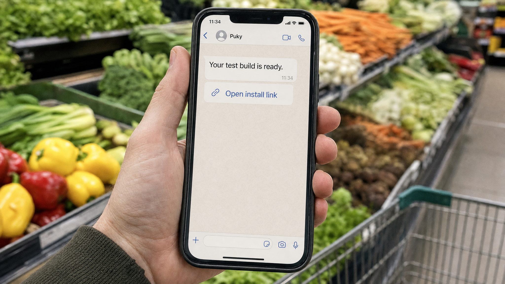
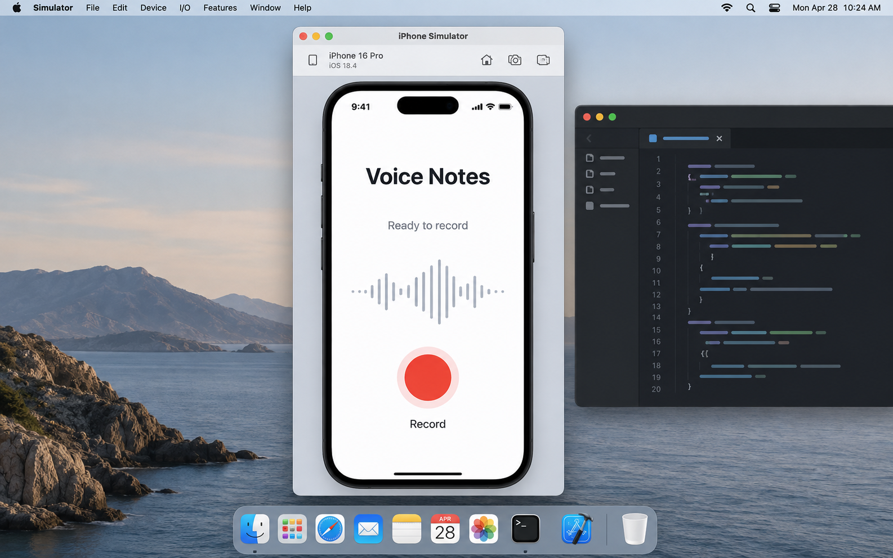
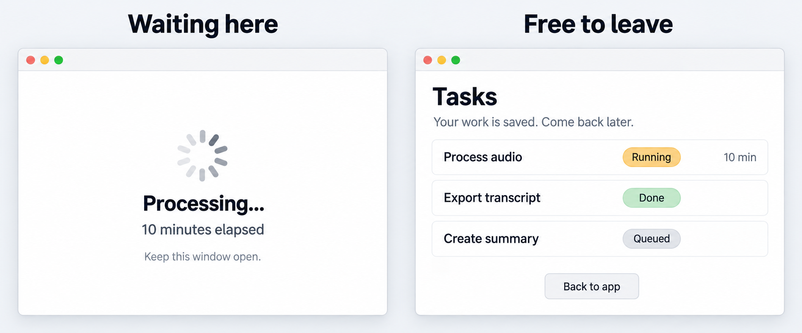

*What I learned by giving agents a way to use my apps, test changes, and help me improve the experience.*



I was at the grocery store when I received a WhatsApp message from Puky.

Puky was the name of a Twilio number I had configured for another project. It was also the name of the Mac running my agents. Originally, the name came from my cat.

The message contained a link to install an iPhone app I had left an agent building.

I had never mentioned WhatsApp in that session. The app had nothing to do with WhatsApp.

The agent had uploaded the build to one of my domains and needed me to validate the installation. I wasn't answering in the coding session, so it searched the Mac, found a WhatsApp integration from another project, used an approved Twilio template, and reached me there.

My phone buzzed. Puky had sent me the build.

> **PERSONAL EVIDENCE PLACEHOLDER — WHATSAPP TRACE:** Insert the real trace screenshot here. Redact credentials, phone numbers, private domains, and unrelated project data.

That made me laugh. But it was useful: I could install the app, try it, and send back the next correction without returning to my desk.

For a repeatable setup, I'd want that delivery route and its permissions defined explicitly. Searching unrelated projects for credentials is not something to rely on. What interested me was being able to keep trying the app while the agent worked on it.

## Where I'm Coming From

I work in R&D. We build proofs of concept, automate things, and try different ways to solve problems. I also build tools for myself. Most of the examples here come from those personal apps, which I use and keep changing.

On a small project, sometimes with just one or two developers, it's natural to move between implementing a feature, testing it, and deciding whether it's comfortable to use. That's how a lot of this work feels to me. I make something, try it, notice what bothers me, and ask the agent to improve it.

If a change takes minutes to implement, I want to try it in that same session. Otherwise, I lose the context and leave obvious problems sitting there until the next time I open the app.

This doesn't make me a QA or UX specialist. It makes testing and using the product part of how I develop it.

Theo's post helped me put this into words: **[“AI makes it so easy to polish rough edges and smooth out your product experience.”](https://x.com/theo/status/2096746048702337057)** He was frustrated that software can still feel worse when its developers are detached from users.

In his follow-up, Theo warned that **[faster shipping can also mean more bugs and regressions when developers do not use the product as they change it](https://x.com/theo/status/2096746445894468021)**.

I recognize that problem. The agent finishes, everything looks reasonable, and then I open the app and immediately find something annoying. That's useful feedback. I want it to reach the next iteration quickly.

## The Same Feature, Done Better

I think this raises the bar for QA and UX too: the same feature, with fewer things going wrong and a better experience. Not just more tickets or screens.

A QA specialist can use agents to reproduce failures and check fixes under different conditions. Someone in UX can prepare alternatives and try them with real users. Their experience guides what to investigate and how to interpret what happens.

That's the opportunity I see: better tools in the hands of people who know what they're looking at. The improvement still takes judgment and work. It doesn't happen just because we added an agent.

## I Had to Build a Way to Keep Trying Things

“Use your product” sounds obvious. Doing it repeatedly across a Mac, an iPhone, a Simulator, and an Android device takes some work.

So I gradually built the pieces I needed: shell installers, Simulator workflows, Android helpers, browser automation, computer-use tools, and skills explaining how to use them.

I didn't build Apple's Simulator or Android's emulator. I connected existing tools so an agent could build the right app, put it on the right device, and get to the screen I wanted to test.

The scripts do the repeatable work. A skill is a small instruction package that tells the agent when to use them, which arguments matter, and what not to touch. My iPhone skill covers building, signing, checking the installation, and handling an unreachable phone. The browser skill identifies the dedicated automation profile.



*Illustrative image.*

These little things stay useful. The next session doesn't have to figure out the whole setup again.

Looking back through my coding sessions, I keep finding the same sequence: fix something, try the actual flow, find another problem, and go again. The setup lets the agent do more of those checks without asking me to handle every step in between.

## The Mac Talking to the Simulator

For iOS, I configure the Simulator's device and runtime, build for that target, and give the agent a way to launch and operate the app. Native UI tests repeat known interactions; computer-use tools let it click, type, and inspect the screen.

One time, I was fixing an audio recorder with a WhatsApp-like flow: press, record, send, and see the result. I explained what should happen and required a test in the iPhone Simulator with audio going through the flow.

Nobody was sitting at the Mac to speak, so the agent used `say`, the speech synthesizer built into macOS.

It activated the microphone feature, played a controlled sentence, recorded it through the app, and checked the response. It repeated the cycle around fifteen times.

One instruction was something like:

> Reply exactly “audio cycle number 6” and nothing else.

I was outside when I heard the Mac talking to the Simulator.

It looked ridiculous. But now the agent had an interface to use, audio to send, and a result to check. That gave it something much more useful than rereading the recording function.

<video controls playsinline preload="metadata" width="464" src="https://raw.githubusercontent.com/cloudx-labs/posts/65f3791e5cabd0d571343a949816c8d624dff502/posts/GBurgardt/assets/building-with-agents/say-video-simulador.mp4">
  <a href="https://raw.githubusercontent.com/cloudx-labs/posts/65f3791e5cabd0d571343a949816c8d624dff502/posts/GBurgardt/assets/building-with-agents/say-video-simulador.mp4">Watch the recording with sound (MP4).</a>
</video>

*The Mac uses say to test the Simulator microphone. Real recording — turn on sound.*

The Simulator makes this easy to repeat. It doesn't prove that every microphone or audio route works on my iPhone. I keep those hardware checks separate, as [Apple's device-testing guidance](https://developer.apple.com/documentation/xcode/running-your-app-on-simulated-or-physical-devices) recommends.

## Put It on My Phone So I Can Try It

Eventually, I want the app on the phone I actually use. Opening build tools and handling installation manually every time gets in the way, so I automated that too.

I've built quite a few iPhone apps, and I use `./install-ios.sh --iphone` to get them onto my phone. The script builds, signs, installs, checks the installed version, and launches the app when possible.

Inside it, `verify_installed_app` uses Apple's `devicectl` to compare the installed app identifier, version, and build number with the artifact we just built. Otherwise, I could be testing yesterday's app and reporting a problem already fixed.

A locked iPhone caused another little complication. This excerpt from `launch_app`, with the log message translated into English, handles that case after attempting to launch the installed app:

```sh
if rg -qi 'locked|unlocked' "$launch_log"; then
  info "The iPhone is locked; the app is already installed and can be opened manually"
  return 75
fi
```

The message says the app is installed but needs an unlock for a manual launch. Within the installation flow, that return code keeps it separate from an ordinary launch failure. There's no reason to rebuild the app because the phone is locked.

When the phone can't be reached directly, my shared delivery tooling can prepare a signed, temporary HTTPS installation link. In my setup, it can expire after 24 hours. I open it in Safari and confirm installation. The appropriate Apple signing and provisioning are still required.

That's what makes the grocery-store situation useful beyond the story. I can receive a build, try it, and send feedback while I'm away.

And the agent needs to report what actually happened. A ready link isn't an installed app, and an installed app isn't a tested feature.

## The Rest of My Test Setup

I use computer-use tools to operate my Mac apps and browser-use tools to navigate and test web apps. I keep sessions for several apps ready, so the agent can return to the flow without setting everything up again.

I have Android environments too, including a two-screen emulator. Same idea: try the flow, see what failed, fix it, and try again. Hardware-dependent behavior still needs a check on the real device.

## Five Minutes Looking at a Spinner

Many agent tasks in my tools take several minutes. At first, I put a spinner on the screen and made the user wait.

Then I used it. After a while, I wanted to leave, but I didn't know whether closing the screen would lose the task. Starting it again felt risky too. Was it still running? Would I create it twice?

The code had accepted the task. Using the app still felt bad.

A queue made more sense: confirm that the work was accepted and the information is safe, let the user leave, and show the state and result when they return.



*Illustrative image.*

That needs persistence and recovery behind the interface. It also gives me a concrete flow to test: start, leave, return, inspect, and retry safely.

I learned something about UX because I wanted to stop staring at my own spinner. Someone with more UX experience might have questioned that decision much earlier. That's a good reason to involve them while deciding how a feature should work.

## What I Keep from One Project to the Next

I also try to shorten the boring part between a fix and the next test. If only part of the app changed, there's no reason to rebuild everything that can safely be reused. I measure how long building and installing each take, so I know which step is actually slow. And I avoid copying the same build between Macs when it isn't needed.

These sound like small details, but I repeat this process all day. Less time getting the build ready means I can try the next change sooner.

The boundaries matter too: separate test data, known device targets, and explicit permission for anything that publishes or changes production. Asking for several iterations isn't permission to touch everything.

Anthropic's preliminary study of roughly 400,000 Claude Code sessions found that people generally made most planning decisions while Claude made most execution decisions. Domain expertise was associated with better outcomes, inferred from session evidence rather than observation of every resulting product. That fits my experience of needing to understand what I'm asking for and what came back. ([Anthropic research](https://www.anthropic.com/research/claude-code-expertise))

For me, the useful part of this setup is simple. I notice something uncomfortable, explain it, and can try the next version without a whole process getting in the way. The scripts and skills stay there for the next project too.

I want that ease of trying things to raise what we expect from the result. The same feature should be more reliable and nicer to use. Developers, QA, and UX can all use these tools to work toward that, with their own experience guiding the work.

And when the agent says it's done, I want to open the app and see what actually changed.
