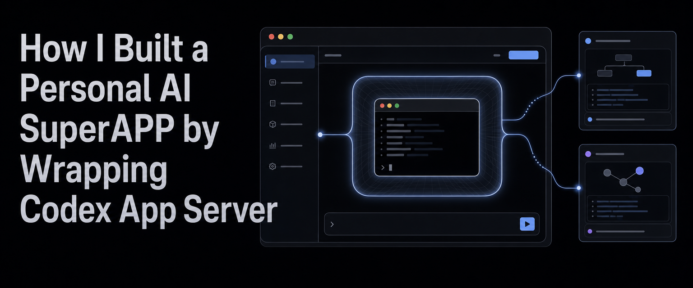
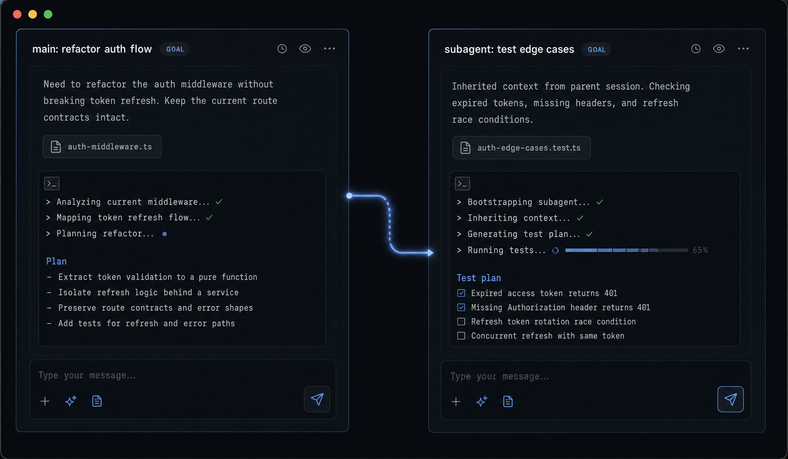
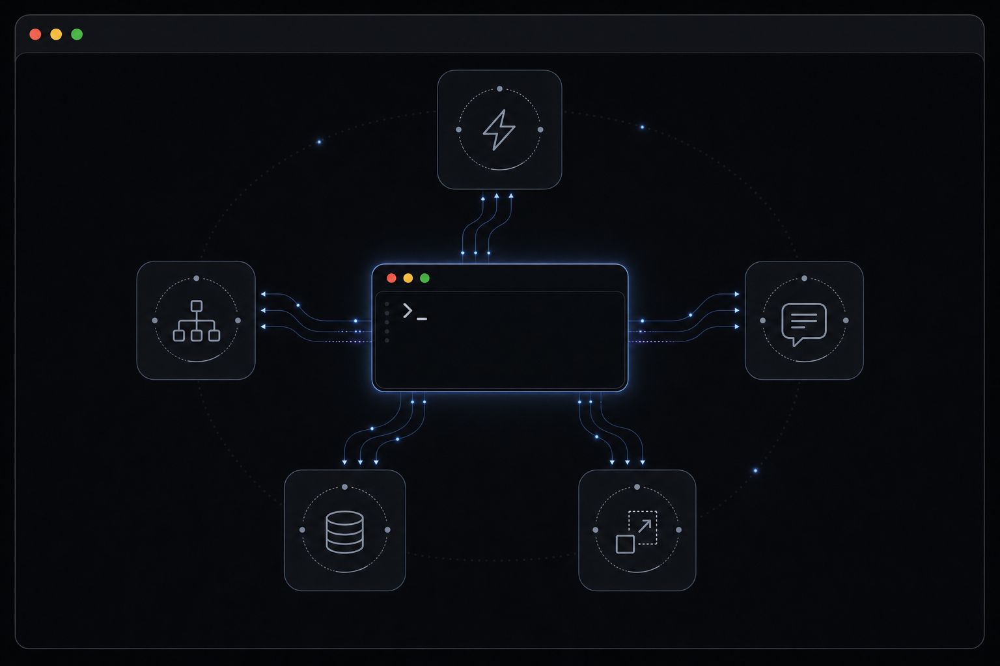
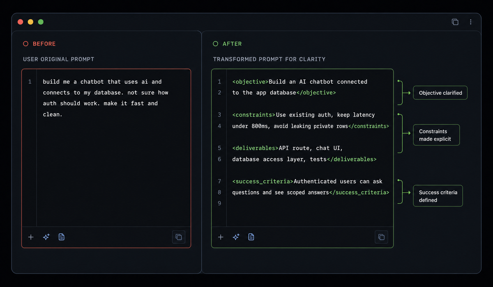
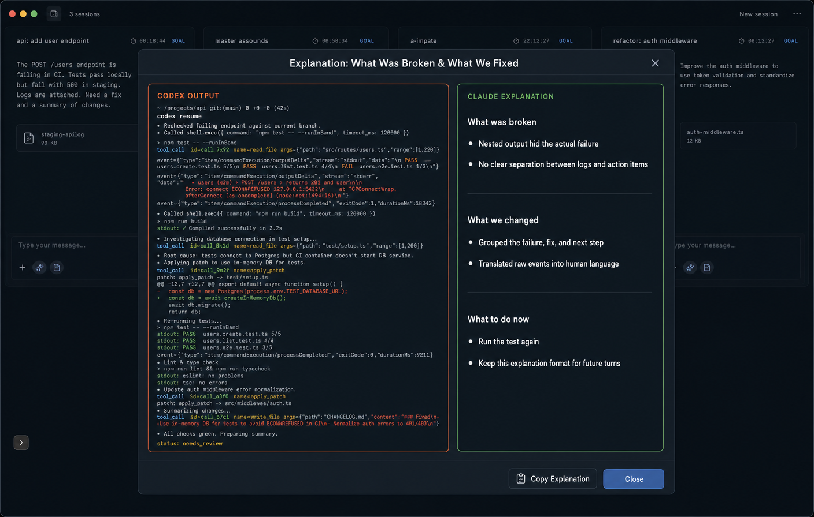

For months I used Codex like everyone else: one terminal, one session, one long output. Then I found `codex app-server`: the same engine exposed as JSON-RPC over stdio. It gave me a more useful idea: building my own interface for the work I actually do.

## What a super-app means today

OpenAI has been pretty explicit about this: a [**unified AI superapp**](https://openai.com/index/next-phase-of-enterprise-ai/) is a place where agents, tools, context, and history live together. Instead of jumping from chat to terminal, from terminal to browser, from browser to docs, everything happens in one working surface.

Theo built a very concrete version of that intuition with [T3 Chat](https://t3.chat): he got tired of waiting for the perfect chat app and built his own. My version started from a similar feeling, Codex was already great, but the way I actually work needed a different interface on top.

## I built my own super-app

Some context first. Over the last months I've been building a desktop app that wraps Codex. It runs several agent sessions in parallel in a grid, improves my prompts before the agent sees them, explains the agent's output in plain language, and spawns subagents with one click.

I never planned a product. I automated my own frictions, one at a time, until the wrapper became the place where I actually work. Theo did the same thing with [T3 Chat](https://t3.chat): no existing AI chat fit him, so he built his own.

My point is that you can build yours too. The engine is already exposed, sitting on your machine. You just need to find the door.

## The super-app starts with a small door

Most people use Codex the way it's marketed, an agent chatting in your terminal. But the same binary ships another mode:

```bash
codex app-server
```

That subcommand turns the CLI into a server that speaks **JSON-RPC over stdio**.

And you only need a little to do something real with it:

- `thread/start`: open a session
- `turn/start`: give it work
- `turn/steer`: inject a message into a turn that's already running

There are more like `thread/resume`, `turn/interrupt`, `thread/settings/update`.

## First need: subagents in ~10 lines

The feature I needed was simple: one click, and a fresh Codex instance inherits my session's context and chases a parallel idea while my main session keeps its focus.

```javascript
const context = packTimeline(parent.timeline, 48_000); // newest-first
const briefing = [
  "You are a sub-agent delegated from an active parent session…",
  "The parent keeps editing in parallel; inspect current files and preserve its changes.",
  houseRules,
  context,
  newTask,
].join("\n\n");

const child = await rpc("thread/start", { cwd });
await rpc("turn/start", { threadId: child.id, input: briefing });
```

The important part was turning one of my frictions into a button I could press.

That's the mental shift, a super-app can be small and concrete; it gathers the operations that used to be scattered across your head, your terminal, your notes, and your prompts.



_Example: one main session keeps focus while a delegated subagent inherits context and tests edge cases._

## Context is everything

Spawning a second agent is easy. The hard part is giving it enough context to work without stepping on the parent session.

The briefing packs project name, working directory, current focus, and a snapshot of the parent's timeline capped at **48,000 characters**, newest entries first. The child's window shows only the task you typed; the runtime receives the full context.

The briefing also tells the child something that matters a lot in practice: you are not alone in this repository. The parent session is still working next to you. Inspect the current file state, respect parallel changes, and keep your scope tight.

And the door swings both ways. When the child is created, the parent gets a coordination note with `turn/steer` or `turn/start`. When the child finishes or gets stuck, it reports back explicitly: `task_completed`, `blocked`.

## The timeline became the backbone

The next shift was quieter.

`app-server` gives you a stream of structured events: user messages, agent messages, commands, file changes, tool calls, approvals, status changes. My wrapper turns those events into a timeline and treats that timeline as working state.

The real object is boring in the best way:

```js
const timelineItem = {
  id,
  itemType,
  thread_id: threadId ?? null,
  turn_id: turnId ?? null,
  title: null,
  text: null,
  command: null,
  cwd: null,
  output: null,
  status: null,
  changes: [],
  awaiting_approval: false,
};
```

From there, features share the same source of truth. The explainer receives the timeline as context, so it reads the session from the actual sequence of events:

```ts
const timelineContext = buildExplainerTimelineContext(codexNativeTimeline, explanationLlm);
contextText: hasTimelineContext ? timelineContext.text : null,
contextSource: hasTimelineContext ? "app_server_timeline" : null,
```

Subagents use the same backbone. The child gets the parent's recent timeline packed into its first task, so it starts with the real session state: what was asked, what Codex tried, which commands ran, which files changed.

```ts
const timelineContext = buildTimelineContext(codexNativeTimeline, SUBAGENT_CONTEXT_MAX_CHARS);
const contextText = timelineContext.text || buildSubagentHistoryContext();
contextText ? `COPIED SESSION CONTEXT:\n${contextText}` : null,
```

That detail is where the app starts to feel alive. Codex keeps being the engine. The product lives around the session: shared context, explanations, approvals, delegation, recovery. The timeline is the backbone that lets all of those features talk about the same work.

## Needs that appear once the wrapper exists

Subagents were the first one. Then I looked at the rest of my day and saw the same pattern: small repeated frictions that no tool was going to prioritize for me.



**My prompts get improved before Codex ever sees them.** When I hit send, a dedicated investigator digs through the repo and extracts high-signal context. Then another model rewrites my messy draft into a precise prompt and shows me why it rewrote it that way.

**Codex does the work; Claude translates around it.** Codex is great at moving through code, but its output often comes back raw: dense, literal, closer to a log than to an explanation. Claude sits one layer above. It explains Codex back to me, and it also explains my messy ideas to Codex before the turn starts.



_Example: how the transformer restructures a vague prompt into clarity._



_Example: how Claude explains what Codex output was missing and how to improve it._

That is the pattern I kept seeing: one model executes, another model translates, and the wrapper keeps the loop together. I can write rough intent, Claude turns it into something sharper, Codex executes, and Claude helps me understand what came back.

## Build yours

Start with a friction before thinking about a platform.

1. Launch `codex app-server`.
2. Talk to it over JSON-RPC.
3. Pick one action you repeat every day.
4. Turn that action into an interface.

The big version of the AI world is moving toward super-apps: one place where agents, tools, and context mix. But the useful version can start on your machine, with a button that solves something that bothered you yesterday.

A year ago I wrote that [agents are just loops](https://dev.to/cloudx/forget-the-hype-agents-are-loops-1n3i). Here's this year's version: **a super-app is loops, context, and the right model in the right place**.

Next time you think "I wish Codex could do this", it probably can. You just have to wrap it.

Questions? Leave a comment below.
