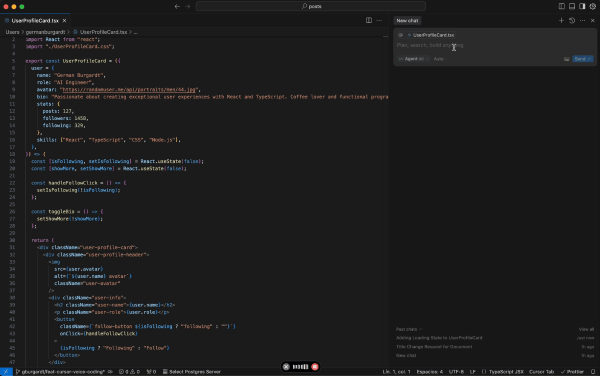

## The Problem: The Keyboard Bottleneck

For AI to work well, it needs **context** and **clarity**. Vague instructions lead to mediocre or wrong results. But writing _really_ detailed and long prompts is tedious.

  
   
  <em>Caption: Writing detailed prompts manually can be slow.</em>

The bottleneck _is_ our keyboard. Typing is slow compared to speaking. It limits the amount of detail that can be easily included in a prompt before fatigue sets in or the train of thought is lost.

## The Solution: Dictate with Whisper

Here's the trick: use **Whisper** to dictate prompts directly into Cursor. Speaking is ~5x faster than typing. This enables:

1. **Creating Very Long Prompts:** It's easy to dictate 50 lines of detailed instructions, explaining _exactly_ what's needed, which files to consider, what logic to follow, and what to avoid. Typing that amount would be torture.
2. **Increasing Detail Exponentially:** When speaking, it's natural to add more context and examples. It's possible to "think out loud," rambling a bit. The AI is often good at filtering noise and extracting the crucial info from the monologue.
3. **Reducing Friction:** The process is almost instantaneous. Using an app like **WisprFlow** ([https://wisprflow.ai/](https://wisprflow.ai/)) allows mapping dictation to a key (e.g., `Fn`). Press the key, speak, release the key. The text _magically_ appears in Cursor's Composer. Then just hit `Enter`.

  
   
  <em>Caption: Dictating a prompt quickly using WisprFlow and Cursor.</em>

## The Biggest Mistake: Lack of Information

In AI-assisted programming, the biggest mistake is **lack of information in the prompt**. Cursor isn't a mind reader. Telling it "fix this bug" will probably lead to failure. However, if you _dictate_ a detailed monologue explaining:

- What the code should do.
- What it's doing wrong now.
- Which file(s) contain the problem.
- What approach might work.
- What libraries or patterns are being used.
- ...and any other relevant detail that comes to mind...

...the chances of getting a useful solution skyrocket.

### Example Comparison

  

    <strong>Typical Prompt (Vague):</strong>
    <pre style="background-color: #1e1e1e; padding: 10px; border-radius: 4px; margin: 10px 0; overflow: auto;">Add a search filter to the user list.</pre>
    <em style="color: #ff9999;">Result: Might do it frontend-only, or inefficiently.</em>
  

  

    <strong>Dictated Prompt (Detailed):</strong>
    <pre style="background-color: #1e1e1e; padding: 10px; border-radius: 4px; margin: 10px 0; overflow: auto;">Okay, need to add a name filter to the user list in UserList.tsx. It gets data from /api/users. Want a simple text input above the table. On typing, debounce for 300ms and call /api/users?search=term. Make sure the backend in server.ts (Prisma) modifies the query with WHERE name ILIKE '%term%'. Don't filter on the frontend, it's inefficient. Update the users state with the response. Placeholder: 'Search by name...'.</pre>
    <em style="color: #99ff99;">Result: Much more likely to be what you need.</em>
  

_Dictating the second prompt takes seconds. Typing it, much longer._

## Precise Vibe Coding?

Some talk about "Vibe Coding" with AI, just going with the flow. This approach is similar in fluency – dictation keeps the _momentum_ – but insists on **absolute clarity**. You flow, yes, but explaining _everything_ with surgical detail as you flow.

To explain something clearly, one needs to understand it (at least broadly). Dictating "forces" verbalization of the plan, which often clarifies one's own thoughts.

## Give It a Try

If you use Cursor (or similar), try this technique:

1. Set up a dictation app like WisprFlow with a convenient shortcut.
2. Next time you're about to type a prompt, _stop_.
3. Take a breath, press the dictation key, and _explain_ to the AI what's needed, with all the details that come to mind. Don't worry if it's not perfect, just talk.
4. Release the key, quickly review the text, and hit `Enter`.

This approach can make a **significant difference**, leading to richer prompts and better results when coding with AI.
