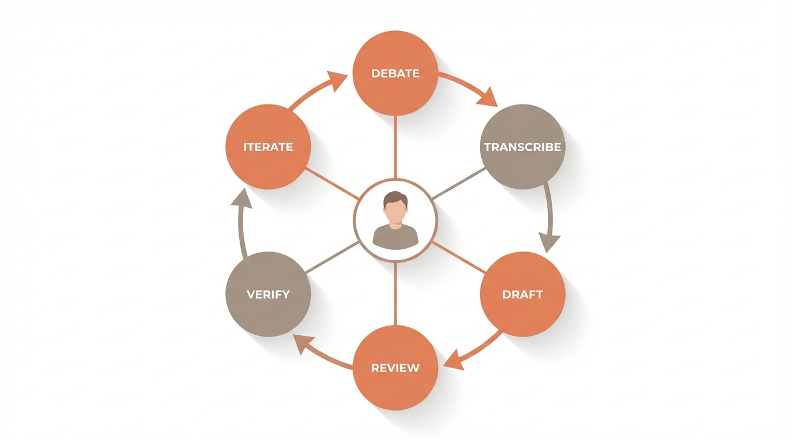
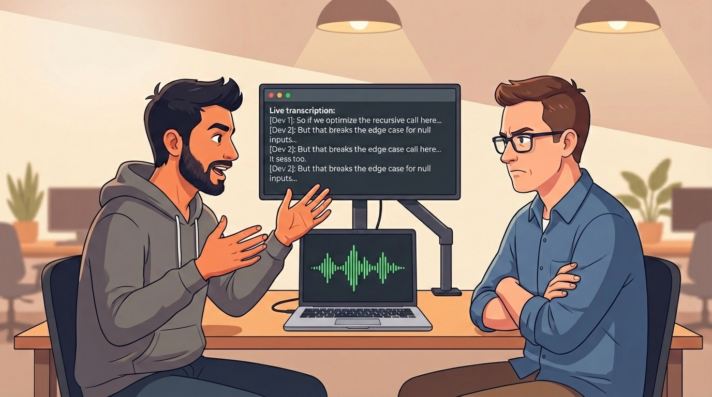
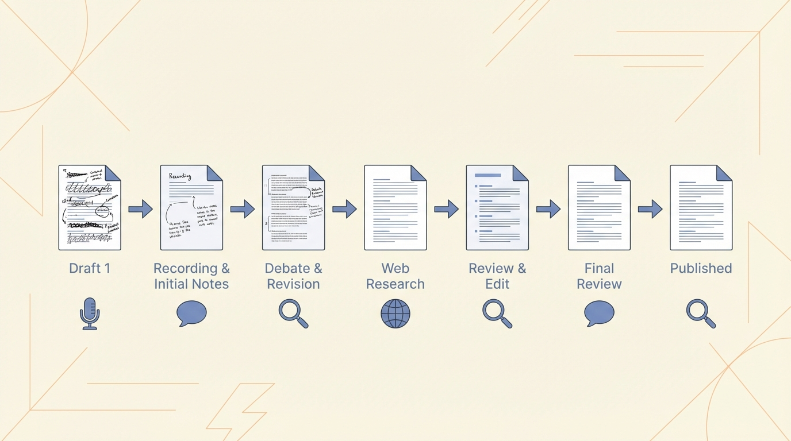
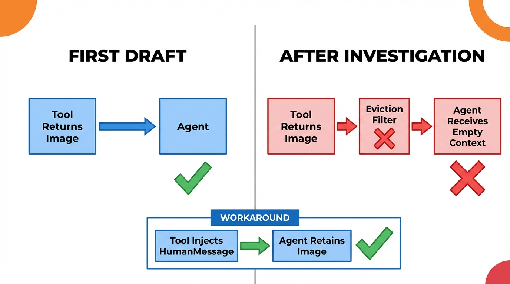
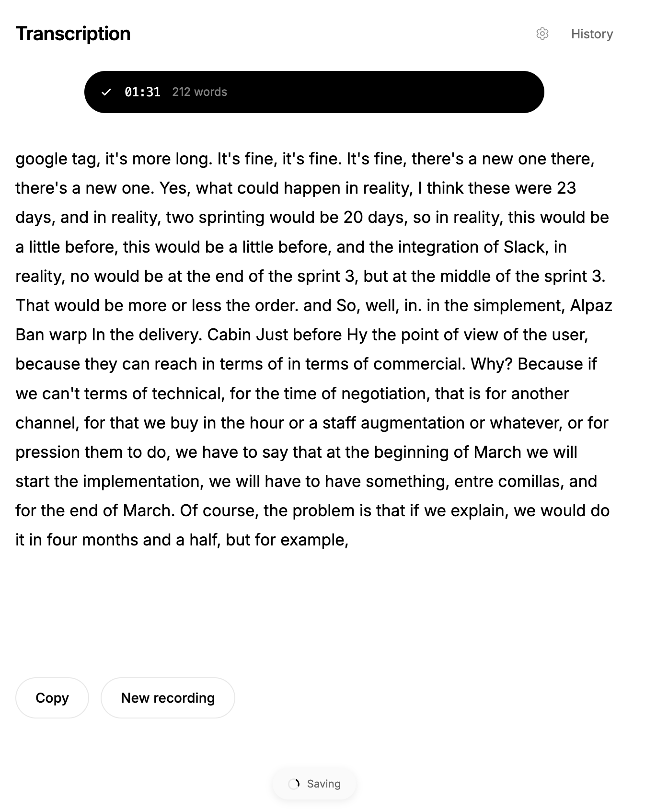
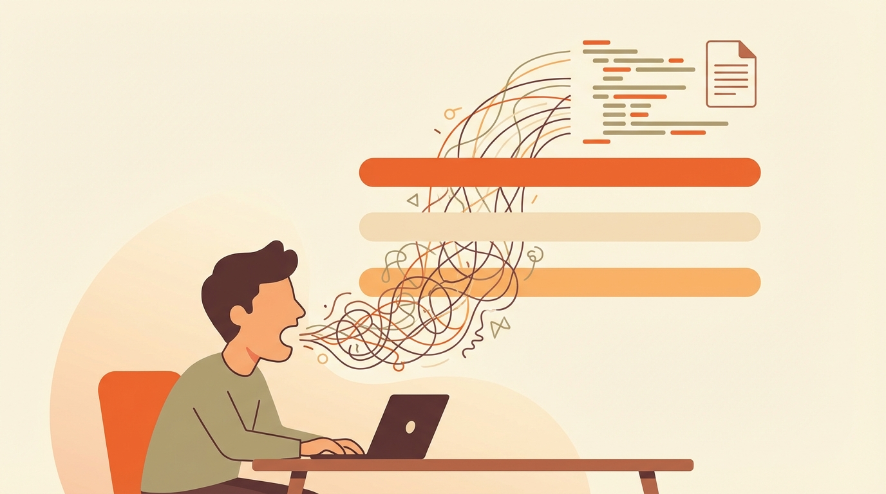
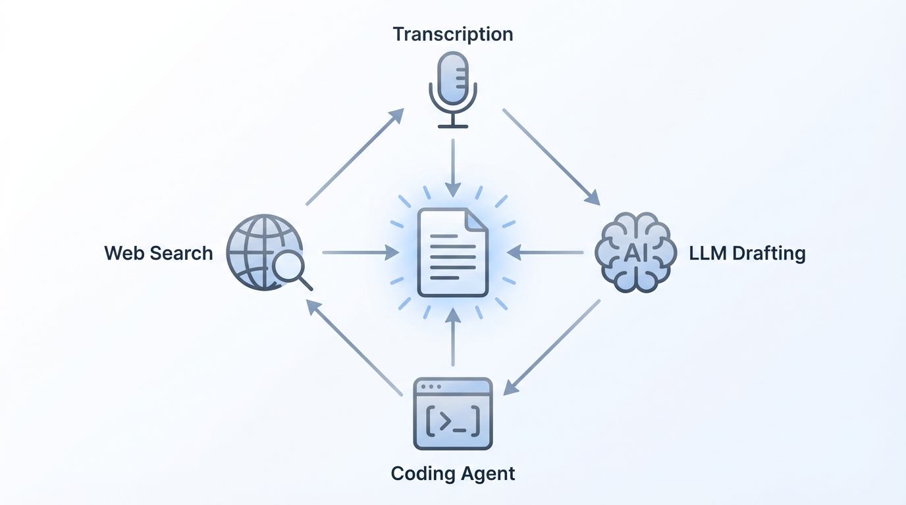

We recently built a 70-page implementation document for a multi-agent system. It covers agent architecture, tool design, integration patterns, and evaluation frameworks. It has working code, verified assumptions, and design decisions debated from multiple angles.

We didn't write it the traditional way. We used AI tools at every step. The key insight: **iteration is everything**.

## Careful: AI Is Confidently Wrong

Most AI-generated documents look good on the first pass. They read well, they're structured, they sound confident. But they're full of assumptions that were never checked, code patterns that were never validated, and design decisions that were never questioned.

We saw this firsthand. You ask a model to write about how a framework works, it writes something plausible. Sounds perfect. But many of those claims are wrong, or partially correct, or apply to a previous version.

One-shot generation produces documents that _look_ correct. The only way they actually end up correct is when the human stays in the middle of the process: iterating with intention, actively verifying, acting as the quality filter on every pass.

## How We Actually Built It

Here's what we actually did, section by section, for the entire document.

### Step 1: Start with a Real Technical Debate

Two people sit down and debate the topic. Not a casual conversation, a real technical discussion where ideas get challenged and assumptions surface.

We record everything. For this we built a custom transcription tool that became key to the entire process (more on that below). The recording runs, we talk, the transcription happens in real time.

These debates are messy. There's noise, tangents, half-formed thoughts. But buried in there is signal. Real insights that come from two people challenging each other's assumptions. Things that would never come out of a solo writing session.

### Step 2: Turn the Debate into a Usable Draft

The raw transcription goes to an LLM, but not with a generic instruction. The prompt is specific: "We're working on the Observability section of the implementation document. Here's the rest of the document for context. And here's the transcription of the debate we had about this section. Generate a draft for this section based on the transcription and keep it coherent with the rest of the document."

That level of context makes the difference. It's not "clean this up", it's "understand the full document, understand what we discussed, and produce a draft that fits."

The model is good at filtering noise. It pulls the structure out of a messy debate and produces something readable. Not perfect, but a solid starting point.

### Step 3: No Free Passes: Review Line by Line

This is where it gets serious. We read the draft line by line. Every claim gets questioned:

- "Does DeepAgents actually behave this way?"
- "Is this the right pattern for this use case?"
- "This assumption about state persistence, did we verify it?"

We debate again. New points come up. Corrections happen. The discussion gets recorded again.

### Step 4: Iterate Until It Holds Up

The cycle repeats: debate → transcribe → clean up → review → debate again.

Each section or paragraph went through this cycle **6 to 7 times**. Sounds extreme. Before these tools, it would have been impossible. The overhead of transcribing, cleaning up, and iterating manually would have killed the process.

With AI tools, each cycle takes minutes instead of hours.

### Step 5: Verify Against Official Sources

Something we used a lot and that makes a huge difference: the web search tool built into the models. In our case we used Claude, but any AI with web search access works.

We'd tell the model: "these claims about how DeepAgents works and how it handles state, go search the official documentation and verify if they're correct." The model searches, cross-references with real documentation, and reports discrepancies. We found several claims we had written based on assumptions or partial information.

### Step 6: Proof of Concept On The Fly

Here's where another AI tool comes in: a coding agent. Could be Claude Code, could be Codex, could be Cursor. What matters is what it enables.

Whenever the debate hit a point where we weren't sure something would actually work, we opened a coding agent and built a proof of concept right there. On the spot. The agent writes the code, we run it, validate the behavior, and if it works, that same code goes directly into the document.

All of this in 20 minutes, without leaving the workflow. What used to require a separate mini-project taking days now happened on the fly, and the result was integrated into the document immediately. That completely changes the speed and confidence with which you write a technical document.

## One Finding That Changed the Document

To make this tangible, a concrete example of how this methodology saved us.

In the first draft, the AI wrote with full confidence that you could attach images and PDFs to an agent's context and they'd naturally persist throughout the conversation. Sounded logical. We didn't question it on the first pass.

On the second iteration, during the debate, the doubt surfaced. We asked the AI to search the official documentation. What we found was that the situation is considerably more complicated than the initial draft suggested. It depends heavily on the framework. In Google ADK, attachments don't persist in the history, they disappear after the first turn. In DeepAgents (the framework we use), there's a state persistence mechanism, but with a catch: there's an eviction system that removes heavy content from context after a certain token threshold.

We built several proofs of concept on the fly with a coding agent. We tried overriding the eviction middleware. We tried injecting attachments as HumanMessage directly into the state. We verified each approach with real code, running the agent and observing whether the image persisted after multiple turns. We ended up choosing the HumanMessage approach because it's more robust, simpler, and doesn't depend on middleware ordering.

That finding, with the verified workaround and working code, would have been a bug discovered in production if it weren't for the iterative process.

## We Built the Tools We Needed

When we started this process, we needed to capture debates without friction. Recording was easy. The problem was converting that into usable text fast.

Thanks to coding agents like Claude Code or Cursor existing today, we built a transcription tool in a few hours that came straight out of necessity. It transcribes in real time as you speak, generates chunks every ~20 seconds, and when you stop you can select the last few minutes and process them with an LLM right there.

_The tool transcribing in real time during a debate session. Text appears as you speak._

The tool became central to the entire process. Before, it was unthinkable to build something like this for a particular workflow. Now we needed it, we built it in hours, and it changed how we work. That in itself is part of what this article is trying to show: how easy it is today to create custom tools that adapt to how you work.

## The Compounding Effect of Combined Tools

**Real-time transcription**: The custom tool described above. For capturing debates, loose ideas, and everything that feeds the iteration cycle.

**LLMs for drafting and cleanup**: Claude, GPT, whatever handles the current task best. The model takes the transcription noise and produces clean drafts. It also runs the verification passes against documentation.

**Coding agents**: Claude Code, Cursor, Codex. For building proofs of concept on the fly when you need to validate a technical claim mid-discussion. And for inserting verified code directly into the document.

**Web search**: For the verification passes. The model identifies claims, searches official documentation, and cross-references.

The value is in the combination of tools. It's a compounding effect: each tool amplifies the others. Transcription feeds the LLM, the LLM generates drafts that get verified with web search, doubts get resolved with coding agents, and the validated result goes back into the document. Each pass through the cycle produces a better result than the last.

## Hard Lessons from the Process

A few things that weren't obvious at the start:

**The model takes your assumptions as truth.** If you say "I think DeepAgents works like this," the model will run with it. It won't question you. You need explicit verification passes where you tell it: "These are claims in the document. Go verify each one against official sources." Without that instruction, it produces confident-sounding content built on your mistakes.

**Models are eager to resolve, not to doubt.** Especially Claude, it wants to start coding, start writing, start producing. That energy is useful but dangerous. You have to build doubt into the process deliberately. The iteration cycles are how you inject that doubt.

**The debate format surfaces things solo work doesn't.** When two people challenge each other, wrong assumptions get caught early. "Wait, are you sure that's how eviction works?" is a question that doesn't come up when you're writing alone.

**Transcription removes the bottleneck.** Writing detailed technical content by typing is slow and painful. Speaking is natural. Transcription tools convert that natural flow into raw material that LLMs can process. This single change made the entire methodology viable.

## What We Delivered

The document we produced covers agent architecture, framework selection with verified trade-offs, integration patterns for Snowflake, Google Drive and Slack, tool design with actionable error patterns, and an evaluation framework with concrete metrics.

Everything was debated, verified against official documentation, and validated with real proofs of concept.

Without this methodology, producing something at this depth would have taken 10x longer. Not an estimate, a felt reality after years of writing technical documents the traditional way.

## Run This Workflow Yourself

The process is simple: record yourself debating or thinking out loud, transcribe it, pass the transcription to an LLM with the full document context, review line by line, verify with web search, validate with a coding agent when there are doubts, and iterate as many times as needed.

The difference between "AI-generated content" and "AI-assisted content that's actually good" is iteration with the human in the middle. That's the whole point.
