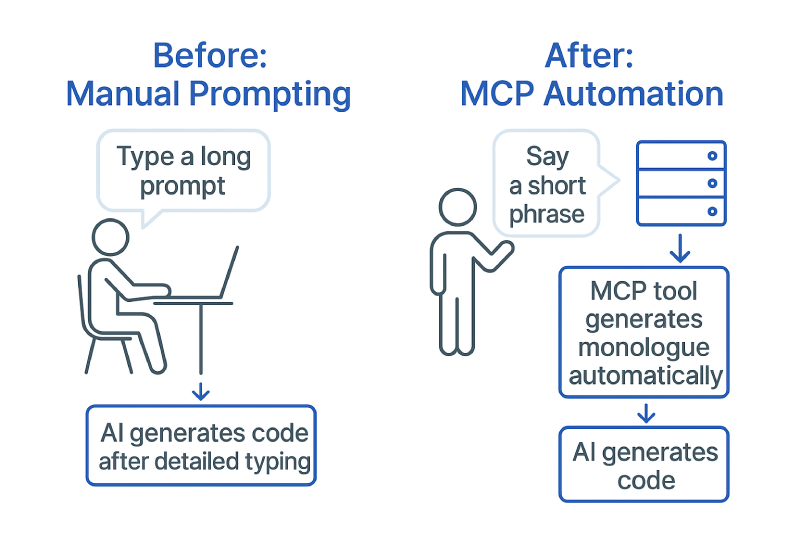
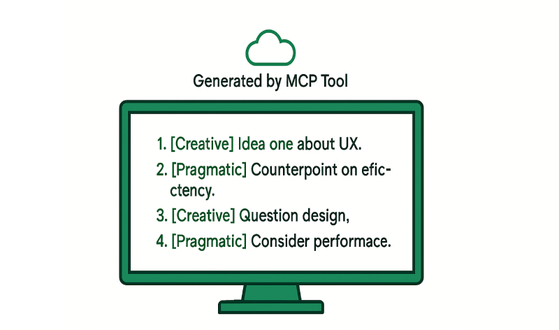

20+ times a day. That's how often I type the same 200-word prompt.

## The Problem: Repetitive Detailed Prompting

Every time I start a new task in Claude Code / Cursor, I type a detailed prompt to guide the AI through an internal monologue before proceeding. For example:

"You will generate an internal monologue of 200 numbered lines where two thinkers debate the approach:

- Pragmatic focuses on functionality and efficiency
- Creative on innovation and elegance
- Follow these rules: exactly 200 lines, each starting with [Pragmatic] or [Creative]
- Be specific about code without abstractions
- Reflect and question without solutions
- Mention files/functions/variables
- Consider edge cases/performance/maintainability/user experience
- Debate simplicity vs functionality
- Question decisions, no repeats, end without conclusion
- Then address the task: [actual task here]."

Typing this repeatedly 20+ times a day wastes time and disrupts focus.

As someone researching practical AI applications, we can fix that.

```javascript
// Before: 200+ word prompt every time
// After: "internal monologue 200 lines - implement auth system"
```

## Enter MCPs: The Missing Link

Model Context Protocols (MCPs) allow extending AI agents with custom tools. While common examples include fetching data, web browsing, or integrating with Slack, I used it in a novel way to automate my repetitive prompt.

## From Repetition to Automation

I built an MCP server in my Remix app (essentially the same as plain Node.js) that generates these monologues on demand. Now, Claude detects the trigger and handles it automatically.

Here's a glimpse of what it generates:

```text
1. [Pragmatic] We need to implement auth - start with basic JWT in middleware.js
2. [Creative] But what about OAuth? Users expect social login nowadays...
3. [Pragmatic] OAuth adds complexity - first nail down password flow, then extend
...
```



The difference:

- **Before:** Type the full detailed prompt each time, then describe the task.
- **After:** Simply say "internal monologue 200 lines about X - [task]", and Claude generates the monologue via the tool, then proceeds.

**Time saved:** ~2 minutes per task  
**Characters typed:** 300+ → 40

---

## Building Your Own Monologue MCP

Here's how to implement it in a Node.js server (adaptable from my Remix example).

### Step 1: Install Dependencies

```bash
npm install @modelcontextprotocol/sdk zod @anthropic-ai/sdk
```

### Step 2: Create the MCP Server Handler

Create `app/lib/mcp-server.ts`:

```typescript
import { Server } from "@modelcontextprotocol/sdk/server/index.js";
import { SSEServerTransport } from "@modelcontextprotocol/sdk/server/sse.js";
import { z } from "zod";
import Anthropic from "@anthropic-ai/sdk";

const anthropic = new Anthropic({
  apiKey: process.env.ANTHROPIC_API_KEY,
});

export function createMCPServer() {
  const server = new Server(
    {
      name: "monologue-mcp",
      version: "1.0.0",
    },
    {
      capabilities: {
        tools: {},
      },
    }
  );

  // Define the monologue tool
  server.setRequestHandler("tools/list", async () => ({
    tools: [
      {
        name: "generate-monologue",
        description:
          "Generate a reflective internal monologue in the style of Pragmatic vs Creative thinker",
        inputSchema: {
          type: "object",
          properties: {
            lines: {
              type: "number",
              description: "Number of lines in the monologue (default: 100)",
              default: 100,
            },
            context: {
              type: "string",
              description: "Current conversation context",
            },
            task: {
              type: "string",
              description: "Description of the task to perform",
            },
          },
          required: ["task"],
        },
      },
    ],
  }));

  // The actual tool implementation
  server.setRequestHandler("tools/call", async (request) => {
    if (request.params.name === "generate-monologue") {
      const {
        lines = 100,
        context = "",
        task,
      } = request.params.arguments as {
        lines?: number;
        context?: string;
        task: string;
      };

      try {
        const systemPrompt = `You are two thinkers having an internal dialogue about programming.
Pragmatic is focused on functionality and efficiency.
Creative is obsessive about innovation and elegance.

STRICT RULES:
1. Generate EXACTLY ${lines} numbered lines
2. Each line must start with [Pragmatic] or [Creative]
3. NO abstractions - be specific about the code
4. NO complete solutions - REFLECT and QUESTION
5. Mention specific files, functions, variables when relevant
6. Think about: edge cases, performance, maintainability, user experience
7. Debate simplicity vs functionality
8. Question every technical decision
9. NO repeated ideas - each line must add new value
10. End without a definitive conclusion - it's reflection, not decision`;

        const userPrompt = `${
          context ? `Previous context:\n${context}\n\n` : ""
        }Current task: ${task}

Generate an internal monologue of EXACTLY ${lines} numbered lines where the two thinkers debate the best way to approach this task.`;

        const response = await anthropic.messages.create({
          model: "claude-opus-4-20250514",
          max_tokens: 32000,
          temperature: 1,
          system: systemPrompt,
          messages: [
            {
              role: "user",
              content: userPrompt,
            },
          ],
        });

        const monologue = response.content[0].text;

        return {
          content: [
            {
              type: "text",
              text: monologue,
            },
          ],
        };
      } catch (error: any) {
        return {
          content: [
            {
              type: "text",
              text: `Error generating monologue: ${error.message}`,
            },
          ],
          isError: true,
        };
      }
    }

    throw new Error(`Unknown tool: ${request.params.name}`);
  });

  return server;
}
```

### Step 3: Create the API Route

Create `app/routes/api.mcp.ts`:

The MCP server needs to be exposed as an HTTP endpoint. We use Bearer authentication to secure it. Only Claude (or other authorized clients) with the correct API key can access your server. This prevents random people from using your tools.

```typescript
import type { LoaderFunctionArgs } from "@remix-run/node";
import { createMCPServer } from "~/lib/mcp-server";
import { SSEServerTransport } from "@modelcontextprotocol/sdk/server/sse.js";

// SSE (Server Sent Events) keeps an open connection between Claude and your server
// This allows Claude to call your tools in real time without polling

// Simple auth check
function verifyAuth(request: Request): boolean {
  const authHeader = request.headers.get("Authorization");
  const expectedKey = process.env.MCP_API_KEY || "your-secret-key";
  return authHeader === `Bearer ${expectedKey}`;
}

export async function loader({ request }: LoaderFunctionArgs) {
  if (!verifyAuth(request)) {
    return new Response("Unauthorized", { status: 401 });
  }

  const responseHeaders = new Headers({
    "Content-Type": "text/event-stream",
    "Cache-Control": "no-cache",
    Connection: "keep-alive",
    "Access-Control-Allow-Origin": "*",
    "Access-Control-Allow-Headers": "Authorization, Content-Type",
  });

  const server = createMCPServer();

  const transport = new SSEServerTransport({
    endpoint: "/api/mcp",
    requestHeaders: Object.fromEntries(request.headers.entries()),
    responseHeaders: Object.fromEntries(responseHeaders.entries()),
  });

  const stream = new ReadableStream({
    async start(controller) {
      try {
        await server.connect(transport);

        // Keep connection alive (SSE connections timeout after 30 seconds of silence)
        const keepAlive = setInterval(() => {
          controller.enqueue(new TextEncoder().encode(": keepalive\n\n"));
        }, 30000);

        request.signal.addEventListener("abort", () => {
          clearInterval(keepAlive);
          controller.close();
        });
      } catch (error) {
        controller.error(error);
      }
    },
  });

  return new Response(stream, {
    headers: responseHeaders,
  });
}
```

### Step 4: Configure Environment Variables

Add to your `.env`:

```bash
ANTHROPIC_API_KEY=your-anthropic-api-key
MCP_API_KEY=a-secret-key-for-your-mcp
```

The `ANTHROPIC_API_KEY` lets your server call Claude's API to generate monologues. The `MCP_API_KEY` is your own secret, it's what Claude will use to authenticate with your server.

### Step 5: Deploy and Connect

Deploy your changes (I use Vercel, but any platform works):

```bash
git add .
git commit -m "Add MCP server for internal monologues"
git push
```

Then connect from Claude:

```bash
claude mcp add --transport sse monologue https://yourdomain.com/api/mcp --header "Authorization: Bearer your-secret-key"
```

The `sse` transport tells Claude to use Server Sent Events (the streaming connection type we set up). Replace `your-secret-key` with the same MCP_API_KEY from your `.env` file.

---

## How It Works in Practice

Now, when working in Claude:

```text
> internal monologue 150 lines - design user experience for login flow
```

Claude detects the phrase, calls the MCP tool, generates the detailed monologue (e.g., a debate on intuitive interfaces vs secure processes, navigation logic, etc.), and uses it to design the feature thoughtfully.

A sample monologue excerpt:

```text
1. [Creative] Login flow should be innovative and seamless – perhaps biometric integration for delight?
2. [Pragmatic] Biometrics add complexity; focus on reliable password handling in auth.js first.
3. [Creative] But user experience suffers with forms – question if we can animate transitions smoothly.
4. [Pragmatic] Animations might impact performance on mobile; consider edge cases in responsive design.
...
```



---

## Why This Matters

This MCP setup boosts programming efficiency by leveraging AI tools for consistent planning and productivity gains, while experimenting with a non-typical application to explore MCPs more creatively and deeply.

## What's Next?

One could build other creative tools, such as one that fetches and analyzes server logs directly, or another that integrates with external APIs for real-time data checks.

## Your Turn

What repetitive tasks do you deal with in your daily work? Maybe you can create an MCP. The code is ready to adapt and build something that streamlines your everyday tasks.

---

Questions? Leave a comment below and I'll be happy to help!
