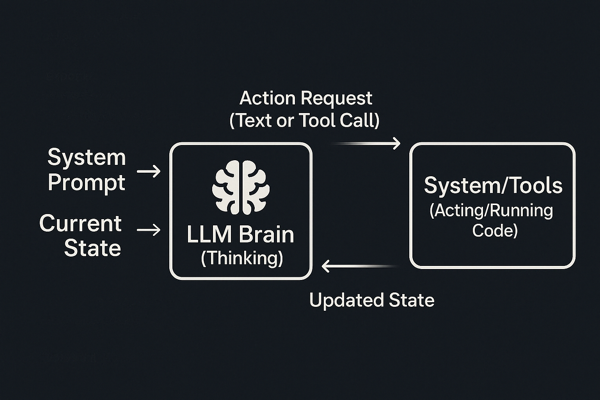

## What's an Agent?

"AI Agent" sounds complex, but often, the core is simpler than you think. An **AI Agent typically runs a Large Language Model (LLM) inside a loop.**

This pseudocode captures the essence in JavaScript:

```javascript
// Environment holds state/context
const env = { state: initialState }; // Simple object state
// Tools available to the agent
const tools = new Tools(env);
// Instructions for the LLM
const system_prompt = `Your main mission, goals, constraints...`;

// The main agent loop
while (true) {
  // (Needs a real break condition!)
  // 1. LLM Brain: Decide action based on prompt + state
  const action = llm.run(`${system_prompt} ${env.state}`);

  // 2. System Hands: Run the actual code for the requested tool
  env.state = tools.run(action); // Update state with result
}
```

_This simple loop is the heart of an Agent._



_Simplified cycle: Think -> Act -> Update State -> Repeat._

## Quick Breakdown

1. **`llm.run(...)`**: The "brain". Uses instructions (`system_prompt`) + current situation (`env.state`) to decide the next `action`.
2. **`tools.run(action)`**: The "hands". If `action` requests a tool, this executes the **real code** for that tool and updates `env.state`.

The loop repeats, feeding the new state back to the LLM.

## Why Tools? Because LLMs Just Talk

The `LLM` only outputs text. **It can't _do_ things directly** – no browsing, no file editing, no running commands. It needs "hands".

**Tools** are those hands. They are functions the system executes _for_ the `LLM` when asked, allowing it to interact with the world.

## Defining and Using a Tool

How does the `LLM` know about tools and when to use them?

### 1. What it is: The Tool Definition

Each tool needs a clear definition passed to the `LLM`, detailing:

- **Name:** Unique ID (e.g., `runLinter`).
- **Description:** What the tool _is_ and _does_ (e.g., "Runs ESLint on JS code/file...").
- **Input Parameters:** The _exact_ inputs needed (name, type, description for each).

This definition tells the `LLM` the tool's capabilities and how to structure a request for it.

```javascript
// Example Tool Definition passed to the LLM API
{
  type: "function",
  function: {
    name: "runLinter", // Unique Name
    description: "Runs ESLint on JS code/file, returns JSON errors or success message.", // Description
    parameters: { /* Input Parameters Schema */ }
  }
}
```


_A Tool is defined for the `LLM` by its Name, Description, and Parameters._

### 2. When to Use It: The System Prompt

The main `system_prompt` gives the agent its core instructions and strategy.

Crucially, it tells the `LLM` **when** and **how** to use its tools. It lists available tools and sets the rules for using them.

> _Example:_ "You have the `runLinter` tool. _Always_ run it first. If it finds errors, fix the code, then run `runLinter` _again_ to verify before finishing."

This ensures the `LLM` uses tools effectively within the loop.

## Hands-On: Building a Simple Linter Agent

Let's see it in action. We'll walk through the key parts of a simple, working Node.js agent that fixes JavaScript linting errors using **one single tool**.

You can find the _complete, runnable code_ (including the full System Prompt) for this example here:
**[simple-linter-agent](https://github.com/cloudx-labs/simple-linter-agent)**

Here are the crucial pieces:

### 1. The System Prompt (`src/config.js` - Abbreviated)

This snippet shows the structure and key instructions of the agent's programming.

```javascript
// src/config.js - System Prompt (Abbreviated)
const config = {
  model: "gpt-4o",
  systemPrompt: `
You are an expert JavaScript assistant that helps fix linting errors...

AVAILABLE TOOLS:
- runLinter({ codeContent?: string, filePath?: string }): Executes ESLint...

PROCESS TO FOLLOW:
1. Receive code/path.
2. **ALWAYS** use 'runLinter' first...
3. Analyze errors...
4. If no errors, return code...
5. If errors:
    a. Modify code...
    b. **IMPORTANT:** Call 'runLinter' AGAIN to verify...
    c. If verified, return corrected code...
    d. If still errors after retry, return best effort...

FINAL RESPONSE:
Your final response MUST contain only the complete corrected code... strictly wrapped between <final_code>...</final_code>...

// (Full details including TOOL CALL and FINAL RESPONSE examples in the repository code)
`,
};

export default config;
```

### 2. The Tool (`src/tools/linter.js` - Function Snippet)

This shows the core logic of the _actual_ `runLinter` function executed by the system, omitting some boilerplate for clarity.

```javascript
// src/tools/linter.js - Core Tool Function (Simplified)
import { ESLint } from "eslint";
import fs from "fs"; // Still needed for context

const runLinter = async ({ codeContent, filePath }) => {
  // --- Determine code source and handle temporary file logic ---
  // ... code to get codeToLint and manage useFilePath ...
  // ... includes fs.readFileSync/writeFileSync logic ...

  try {
    // --- Core ESLint Execution ---
    const eslint = new ESLint({ fix: false, useEslintrc: true });
    const results = await eslint.lintFiles([
      /* determined file path */
    ]);

    // --- Process Results ---
    const errors = results.flatMap(/* ... map results to error objects ... */);

    // --- Cleanup & Return ---
    // ... unlink temporary file if used ...
    return errors.length === 0
      ? { result: "No linting errors found!" }
      : { errors: JSON.stringify(errors) };
  } catch (err) {
    // --- Error Handling & Cleanup ---
    // ... unlink temporary file ...
    console.error("Error running ESLint:", err);
    return { error: `ESLint execution error: ${err.message}` };
  }
};

// --- The Definition Exported for the Agent/LLM ---
export default {
  name: "runLinter",
  description: "Runs ESLint on JS code/file...",
  parameters: {
    /* ... parameter schema ... */
  },
  function: runLinter, // Link to the actual function above
};
```

### 3. The Loop (`src/agent/agentInvoker.js` - Core Logic Snippet)

This snippet highlights the agent's execution flow: calling the `LLM`, handling tool calls, and updating the state.

```javascript
// Inside src/agent/agentInvoker.js (Simplified Core Loop)
import linterTool from "../tools/linter.js";
import config from "../config.js";
import memory from "./memory.js";
// ... other functions: callLLM(messages), handleToolCall(toolCall) ...

const tools = [/* ... tool definition structure using linterTool ... */];

const invokeAgent = async (conversationId, inputs) => {
  // ... setup initial user message in memory ...

  const MAX_ITERATIONS = 3;
  let finalCode = null;

  // === THE AGENT LOOP ===
  for (let i = 0; i < MAX_ITERATIONS; i++) {
    const messages = memory.getMessages(conversationId); // Get state

    // --- 1. LLM Brain: Decide action ---
    const llmResponse = await callLLM(messages);
    const assistantMessage = llmResponse.choices[0].message;
    memory.addMessage(conversationId, assistantMessage); // Store thought

    if (assistantMessage.tool_calls) {
      // --- 2. System Hands: Execute Tool ---
      for (const toolCall of assistantMessage.tool_calls) {
        if (toolCall.function.name === linterTool.name) {
           const toolResult = await handleToolCall(toolCall); // Run runLinter
           const toolResultContent = /* ... format result ... */ ;
           // --- 3. Update State ---
           memory.addMessage(conversationId, { role: "tool", /*...*/ content: toolResultContent });
        }
      }
    } else if (assistantMessage.content) {
      // --- LLM provided final answer ---
      const match = /* ... check for <final_code> ... */ ;
      if (match) { finalCode = match[0]; break; } // Goal achieved!
    } else { /* ... handle error ... */ break; }
  } // === END LOOP ===

  // ... handle loop finish ...
  return finalCode;
};
```

This structure demonstrates the **`LLM` (planning) + Loop (repetition) + Tool (action)** pattern.

## Connecting to More Complex Agents (like Cursor)

Our simple linter agent uses just one tool, but it shows the fundamental pattern. Real-world agents like the **Cursor** operate on the exact same principle, just scaled up.

Imagine asking Cursor to "Refactor `ComponentA.jsx` to use the new `useDataFetching` hook and update its tests in `ComponentA.test.js`." Cursor's `LLM` brain, guided by its own complex system prompt, might orchestrate a sequence like this within its loop:

1. **Loop 1:** `LLM` thinks: "Need `ComponentA.jsx`." -> **Action:** Calls `readFile(path="...")`. System runs it.
2. **Loop 2:** `LLM` thinks: "Need `ComponentA.test.js`." -> **Action:** Calls `readFile(path="...")`. System runs it.
3. **Loop 3:** `LLM` thinks: "Plan JSX changes." -> **Action:** Calls `editFile(path="...", changes=[...])`. System runs it.
4. **Loop 4:** `LLM` thinks: "Plan test changes." -> **Action:** Calls `editFile(path="...", changes=[...])`. System runs it.
5. **Loop 5:** `LLM` thinks: "Verify changes." -> **Action:** Calls `runTests(path="...")`. System runs it.
6. **Loop N:** (Continues...)

It's the same **Think -> Act (Tool) -> Update State -> Repeat** cycle, just with more tools (`readFile`, `editFile`, `runTests`, etc.) and a more complex strategy. The core **`LLM` + Loop + Tools** architecture remains the same.

## The Pragmatic Takeaway

Forget the complex hype around "AI Agents." The core is usually that straightforward **`LLM` + Loop + Tools** pattern:

1. **`LLM` Thinks** (using System Prompt + Tool definitions + Current State)
2. **System Acts** (running actual code for requested Tools)
3. **Repeat**

It's a simple, yet powerful, way to make `LLM`s accomplish real-world tasks.

---

_Check out this related video for more perspective:_
[AI Agents = LLM + Loop + Tools? (YouTube)](https://www.youtube.com/watch?v=D7_ipDqhtwk&ab_channel=AIEngineer)
