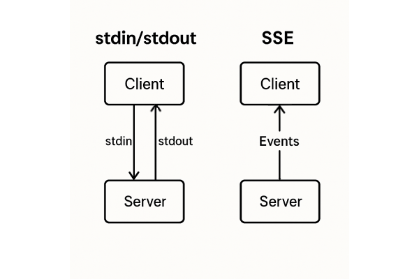
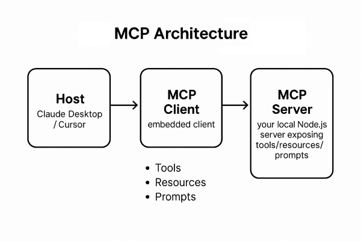
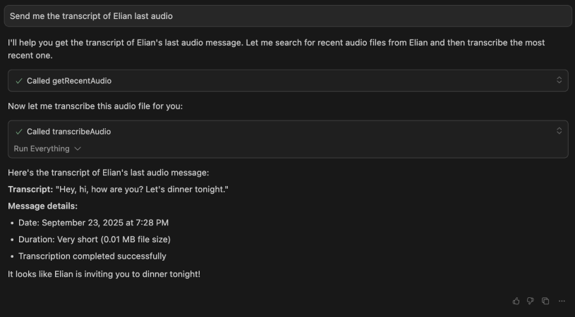

## Introduction

MCP (Model Context Protocol) can look complicated until you ship something real with it. Let's use it on something practical: expose your WhatsApp voice notes with your own MCP server and turn them into transcripts.

## What is MCP?

MCP is a connection standard that connects AI agents with external systems.

It has a server and a client, and they have two different ways to talk to each other:

- stdio (stdin/stdout): the standard Unix mechanism for a process to receive or send data to the environment or another process.
- Server-Sent Events (SSE): an HTTP mechanism where the server keeps the connection open and streams events to the client (one-way).



_Quick comparison of stdio and SSE transports in MCP._

## MCP architecture

- Host: Claude Desktop / Cursor / any AI agent. It coordinates the LLM, spins up MCP clients, and shows results.
- MCP Client: an implementation embedded in the host that connects to your server. It speaks the protocol, opens/manages the connection, and sends/receives requests.
- MCP Server: your program that exposes tools. It runs actions and returns data/events to the client.

An MCP server can expose different capabilities, but in this project we stick to **tools** (actions like transcribing audio). MCP also supports resources or prompts; we skip them here to keep the flow simple.



_Diagram of the Host → MCP Client → MCP Server flow._

## Building the WhatsApp MCP

WhatsApp Desktop on macOS stores everything locally: an SQLite database with chats and folders containing the media files.

Our MCP server will:

1. Read the WhatsApp database
2. Find audio files per contact
3. Transcribe them with Whisper
4. Send the text back to the Client (Cursor in this case)

The working code lives in the repository: [mcp-whatsapp-whisper](https://github.com/GBurgardt/mcp-whatsapp-whisper). Let's walk through the key pieces.

### The STDIN/STDOUT connection

```typescript
import { StdioServerTransport } from "@modelcontextprotocol/sdk/server/stdio.js";

const transport = new StdioServerTransport();
await this.server.connect(transport);
```

With that the server listens to every client request on STDIN and replies through STDOUT.

We pick stdio because this MCP server runs locally. It's the simplest and most stable transport on desktop/CLI: no open ports, no HTTP dependency, avoids CORS/firewalls, and hosts (Claude Desktop/Cursor) support it natively. SSE makes sense when the server lives remotely behind HTTP.

### Exposing capabilities

```typescript
this.server = new Server(
  {
    name: "whatsapp-audio-mcp",
    version: "1.0.0",
  },
  {
    capabilities: {
      tools: {}, // We will expose actions
    },
  }
);
```

### Designing the tools

The server lives on three tools each with a specific role:

- `getRecentAudio(contactName, count?)`: pulls the latest audio paths for a contact.
- `searchAudios(query, date?)`: narrows the list by name or date when the history is large. We get filtering without touching SQLite directly.
- `transcribeAudio(audioPath)`: turns a path into text with Whisper. It finishes the loop by delivering the result we care about.

The goal was a minimal set: find, refine, transcribe. Every tool maps to that path.

```typescript
{
  name: 'transcribeAudio',
  description: 'Transcribe an audio file using OpenAI Whisper (SDK)',
  inputSchema: {
    type: 'object',
    properties: {
      audioPath: {
        type: 'string',
        description: 'Path to the audio file',
      },
    },
    required: ['audioPath'],
  },
}
```

The schema follows JSON Schema. With it, Cursor knows which parameters to send.

## Accessing WhatsApp

WhatsApp Desktop keeps everything under predictable paths:

```typescript
this.dbPath = path.join(
  homeDir,
  "Library/Group Containers/group.net.whatsapp.WhatsApp.shared/ChatStorage.sqlite"
);
this.mediaPath = path.join(
  homeDir,
  "Library/Group Containers/group.net.whatsapp.WhatsApp.shared/Message/Media"
);
```

The database is SQLite:

```typescript
const query = `
  SELECT DISTINCT 
    ZCONTACTJID as jid,
    ZPARTNERNAME as name,
    ZLASTMESSAGEDATE as lastMessageDate
  FROM ZWACHATSESSION
  WHERE ZPARTNERNAME IS NOT NULL
  AND ZCONTACTJID NOT LIKE '%@g.us'  -- Exclude groups
`;
```

Audio files are organized per contact. We scan recursively:

```typescript
const audioExtensions = [".opus", ".m4a", ".mp3", ".aac", ".wav"];

async function scanDirectory(dir: string): Promise<void> {
  const entries = await fs.readdir(dir, { withFileTypes: true });

  for (const entry of entries) {
    if (audioExtensions.some((ext) => entry.name.endsWith(ext))) {
      // Found an audio file
      audioFiles.push({
        path: fullPath,
        filename: entry.name,
        modifiedDate: stats.mtime.toISOString(),
      });
    }
  }
}
```

## The transcription: FFmpeg + Whisper

WhatsApp ships audio in Opus, but OpenAI Whisper prefers MP3. We use FFmpeg:

```typescript
const ffmpeg = spawn("ffmpeg", [
  "-i",
  inputPath, // WhatsApp Opus audio
  "-acodec",
  "mp3",
  "-b:a",
  "128k",
  outputPath, // Temporary MP3
]);
```

Then we transcribe with OpenAI Whisper (SDK):

```typescript
import OpenAI from "openai";
import fs from "node:fs";

const openai = new OpenAI({ apiKey: process.env.OPENAI_API_KEY });

const transcription = await openai.audio.transcriptions.create({
  file: fs.createReadStream(outputPath), // Temporary MP3
  model: "whisper-1",
});

const transcriptionText = transcription.text;
```

## Configuring Cursor (the client)

In the Cursor config (`~/.cursor/mcp.json`) we add:

```json
{
  "mcpServers": {
    "whatsapp": {
      "command": "node",
      "args": ["/path/to/mcp-whatsapp-whisper/dist/server.js"],
      "env": {
        "OPENAI_API_KEY": "YOUR_OPENAI_KEY"
      }
    }
  }
}
```

Cursor can now invoke our server whenever it needs to.

## MCP in action

The user asks Cursor:

> "Send me the transcript of Elian's last audio."

Cursor automatically:

1. Calls `getRecentAudio(contactName: "elian")`
2. Receives the audio file path
3. Calls `transcribeAudio(audioPath: "/path/to/audio.opus")`
4. Receives the transcription
5. Summarizes or shows the full text

The transcription flows through the OpenAI API; the temporary MP3 is sent to get the text back. Cursor orchestrates; your server prepares the file and makes the call.



_Cursor showing the transcription returned by the WhatsApp MCP server._

## Limitations: macOS only

This server is macOS only. The WhatsApp paths are specific to Mac.

It depends on:

- WhatsApp Desktop installed
- FFmpeg (`brew install ffmpeg`)
- OpenAI SDK (`npm i openai`) with `OPENAI_API_KEY` configured
- Internet connection

We also skip Prompts and Resource Templates.

Security depends on the host. Cursor can ask for approval before it runs tools.

## Keep it running with PM2

Build the project once (`npm run build`) and keep the server alive with `pm2 start ecosystem.config.cjs`. The provided config watches the compiled `dist/server.js` and restarts it if it crashes.

## Conclusion

Your AI agent can now reach your data, use your tools, work in your context.

The WhatsApp server is just one idea. Once you realize any program that speaks STDIN/STDOUT can be an MCP server, the possibilities get wild.

Next time you think "I wish Cursor could access...", remember: it probably can. You just need to build the bridge.
