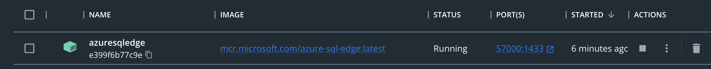
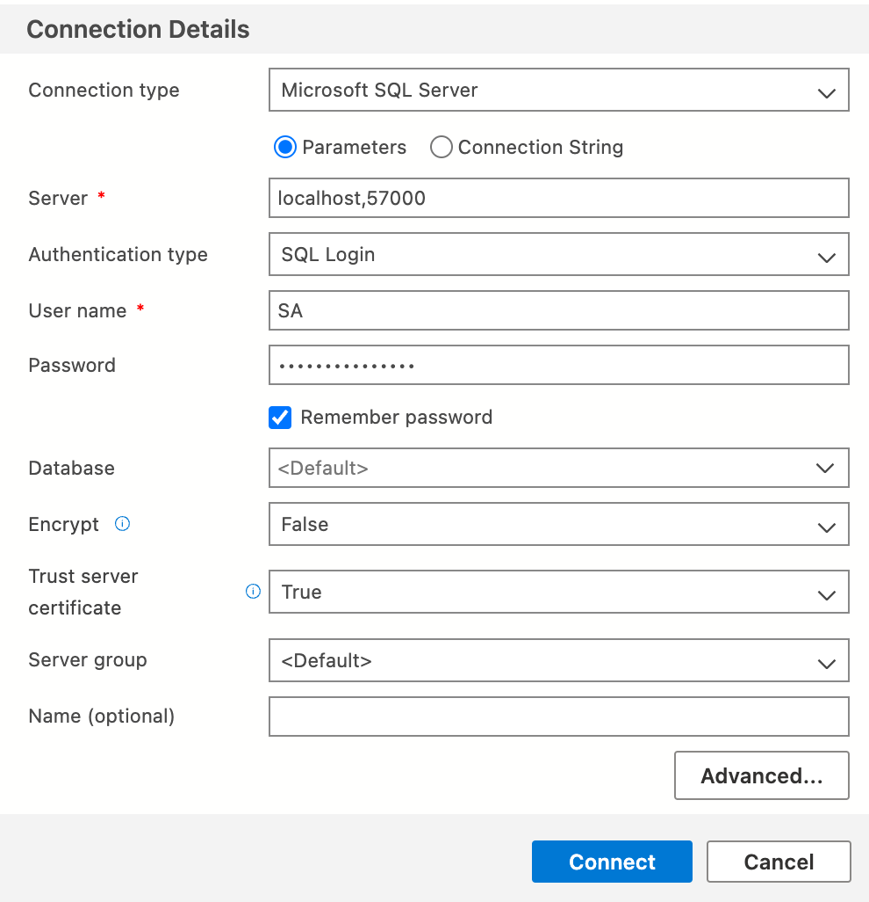
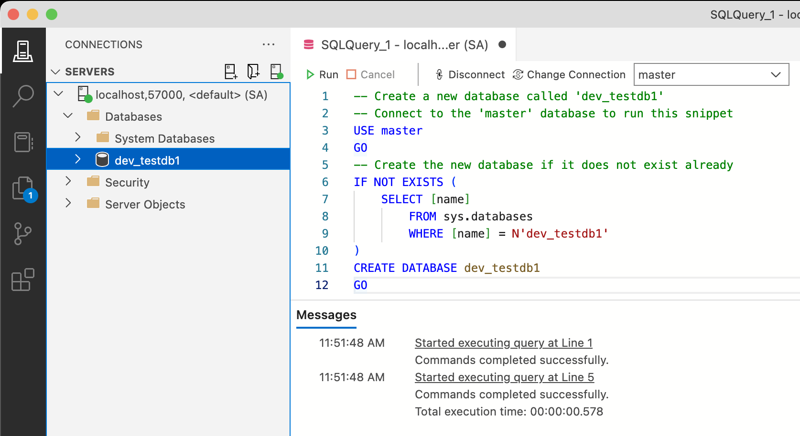
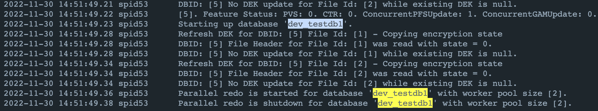

In 2020 Apple decided to replace the Intel chipsets with one of their own making, that have been leading performance benchmarks ever since. But these chips are based on the **ARM architecture** instead of the widespread x64 used by its predecesor so, if we want to run software natively and take advantage of all of its power, programs should be ARM ready. This also goes to **Docker** images.

Unfortunately, as of November 2022, Microsoft hasn't released yet a fully fledged SQL Server Docker image for ARM processors. What can we do about it?

## Enter Azure SQL Edge

The alternative is [Azure SQL Edge](https://azure.microsoft.com/en-us/products/azure-sql/edge/), a lighter version of the popular database engine based on the ARM architecture. Even though this version is limited in order to run better on IoT devices, it comes with some additional features like built-in machine learning and data streaming capabilities. Let's see how to run a container with it.

## Install Docker

There are many ways to install Docker. I prefer downloading Docker for Desktop from their [official site](https://www.docker.com/products/docker-desktop/). Remember to choose the **Apple Chip** version.


After the installation is done, open Docker For Desktop. You'll be welcomed by a home page that shows no containers running.


## Running Azure SQL Edge on a container

Open your favorite terminal and run the following commands.

Pull the image from the registry.

```bash
docker pull mcr.microsoft.com/azure-sql-edge
```

Run the container.

```bash
docker run -d --name azuresqledge --cap-add SYS_PTRACE \
  -e 'ACCEPT_EULA=1' \
  -e 'MSSQL_SA_PASSWORD=Str#ng_Passw#rd' \
  -p 57000:1433 \
   mcr.microsoft.com/azure-sql-edge
```

Important parameters to notice here:

- **ACCEPT_EULA**: accepts the license agreement.
- **MSSQL_SA_PASSWORD**: sets the password for the sa user.
- **p**: publishes the container's port to the host, in this case 1433 where SQL runs.
- **name**: any name you want to use to identify this container.

After running these commands successfully, go to Docker For Desktop again and you'll see the newly created container up and running.



## Connecting to the server

In order to connect to the database server, download [Azure Data Studio](https://learn.microsoft.com/sql/azure-data-studio/download-azure-data-studio#download-azure-data-studio) **Apple Silicon** version.

Click on `New Connection` and fill in the details.



- **Connection type**: Microsoft SQL Server
- **Server**: localhost,57000 (where 57000 is the port that the container published)
- **Authentication type:** SQL Login
- **User name**: sa
- **Password**: Str#ng_Passw#rd (the password you set previously)
- **Encrypt**: False
- **Trust server certificate**: True

The **connection** has been successfully **established**!


## Creating a database

Open a new query window and run the following query:

```sql
-- Create a new database called 'dev_testdb1'
-- Connect to the 'master' database to run this snippet
USE master
GO
-- Create the new database if it does not exist already
IF NOT EXISTS (
  SELECT [name] FROM sys.databases WHERE [name] = N'dev_testdb1'
) CREATE DATABASE dev_testdb1
GO
```

On the left side, **right** **click** on **databases** and click on **refresh** to see the newly created database.



Finally, open Docker For Desktop once more, click on the container and go to the **logs** tab to confirm that the database has been created on it.


Almost at the bottom, the message **Starting up database 'dev_testdb1'** can be read. Excellent!

That's all!
