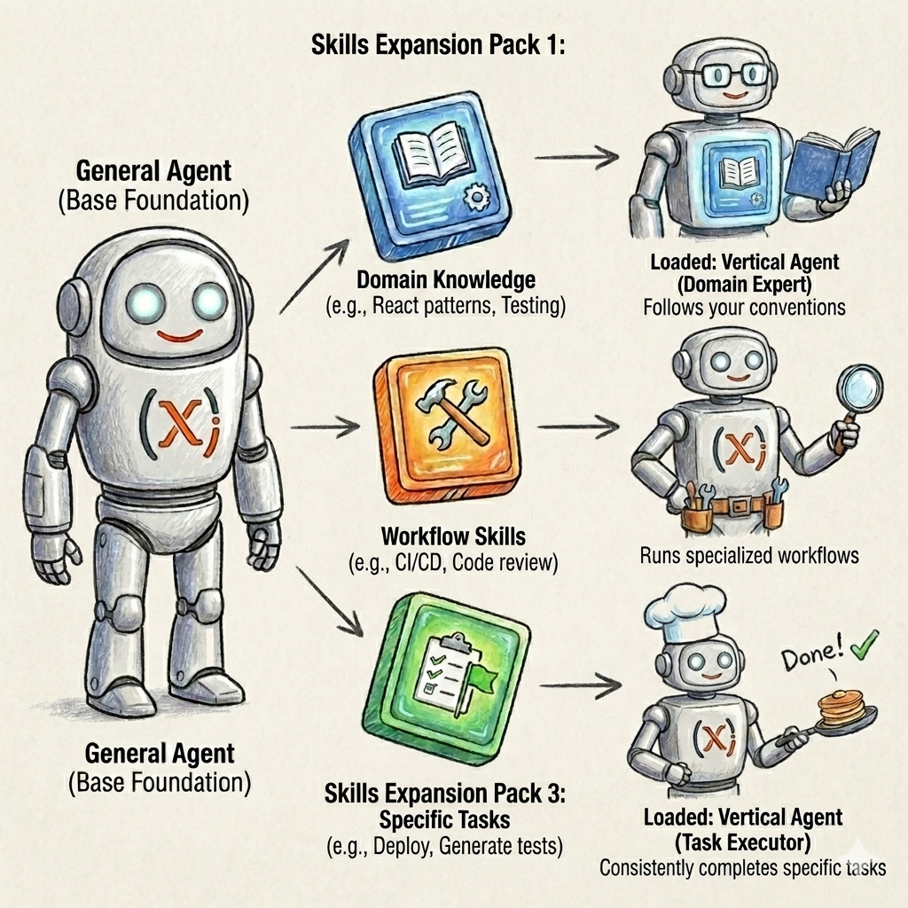

## The Problem

You use Copilot. You ask it to build something, and it does — sort of. It follows your prompt, generates working code, and you ship it.

Then you do it again the next day. And the day after.

A month later, your codebase has class names in PascalCase next to camelCase functions, three different error handling styles, two ways to structure the same kind of module, and hooks that work differently from each other for no clear reason.

All of it generated by Copilot. All of it reviewed and accepted by you.

The problem isn't that Copilot generates bad code. It generates *generic* code. It doesn't know your stack, your team's decisions, or the patterns you settled on six months ago. It works from its training data. And your codebase slowly starts to look like it was written by the internet.

---

## What are Agent Skills?

Agent Skills are Markdown files that tell Copilot what *your* conventions are — for a specific domain, task, or workflow. Persistent context the agent reads before generating anything in that area.

They live in your repo at:

```text
.github/
└── skills/
    └── your-skill-name/
        └── SKILL.md
```

That's the entire setup. No config files, no registration, no CLI step. The file being there is enough for VS Code to discover it.

When you mention the skill in a chat prompt — `"Use the component-structure skill to create a new button"` — Copilot reads that SKILL.md first, then generates code that follows your conventions.

This is what separates skills from regular prompts: **they're reusable, versioned, and shared through the repo.** Your conventions stop living in someone's head or a doc nobody reads — they live next to the code they govern.

> VS Code added native skill support and the `/create-skill` command in [version 1.110](https://code.visualstudio.com/updates/v1_110). In [version 1.113](https://code.visualstudio.com/updates/v1_113), a dedicated Chat Customizations editor was added — a centralized UI to manage skills, instructions, and agents from a single place.

---

## A minimal SKILL.md

Here's the minimum a skill needs to actually work:

**`.github/skills/component-structure/SKILL.md`**

````markdown
---
name: component-structure
description: Creates React components following team conventions — named exports, props interface, no inline JSX logic.
---

# Component Structure Skill

## When to use
Creating new React components or reviewing component patterns.

## Conventions
- One component per file
- Props interface defined above the component
- Named exports only — no default exports
- No inline logic in JSX — extract to handlers or custom hooks
- Error boundaries at page level, not inside components

## Pattern
```typescript
interface ButtonProps {
  label: string;
  onClick: () => void;
  disabled?: boolean;
}

export function Button({ label, onClick, disabled = false }: ButtonProps) {
  const handleClick = () => {
    if (!disabled) onClick();
  };

  return (
    <button onClick={handleClick} disabled={disabled}>
      {label}
    </button>
  );
}
```

## Never do this
- Default exports
- Logic directly in JSX
- Props without an explicit interface
````

The `name` field must match the directory name exactly. The `description` is what Copilot reads to decide whether to load the skill — be specific. Full frontmatter reference: [SKILL.md file format](https://code.visualstudio.com/docs/copilot/customization/agent-skills#_skillmd-file-format).

Four sections. One pattern. A few explicit don'ts.

When Copilot reads this before generating a component, it follows the same structure every time — not because it guessed right, but because you told it.

The skill doesn't need to be exhaustive. **It needs to be specific.** A skill that covers one thing well beats one that tries to cover everything and ends up covering nothing.

---

## Creating a skill from a conversation

One of the more useful additions in VS Code 1.110 is `/create-skill`. After debugging a problem across several chat turns and landing on the right approach, you type:

```bash
/create-skill
```

The agent extracts the pattern from your conversation and scaffolds a SKILL.md for you. You review, adjust, commit.

This is how skills actually get created in practice. **You don't design a skill from scratch** — you solve a problem, recognize you'll solve it the same way every time, and capture that. `/create-skill` removes the friction of doing the capture manually.

---

## The Ecosystem

Skills are one piece of a larger customization system. Here's a quick map:



- **Instructions** (`copilot-instructions.md` / `.github/instructions/`): always-on context loaded in every session. Good for project-wide rules.
- **Skills** ← you're here: domain-specific, activated on demand when mentioned in chat.
- **Hooks**: scripts that run at specific points in the agent lifecycle — before a response, after a file write, on session start.
- **MCP Servers**: external tools that give the agent capabilities your codebase doesn't have natively — database access, browser automation, external APIs.
- **Plugins**: installable bundles that package all of the above together.

Each of these has its own post coming. Skills are the easiest starting point — entirely local to your repo, zero infrastructure, and the effect on the agent is immediate.

---

## What I Learned

**The model doesn't know your stack. You have to teach it.**

Copilot is trained on public code. Your team's specific decisions aren't in that data. Skills are the mechanism for closing that gap.

**One good skill beats ten prompts.**

A well-written skill invoked consistently produces better results than re-explaining your conventions in each prompt. The repeatability is the point.

**The skill itself is documentation.**

Writing a SKILL.md forces you to articulate things that previously existed informally. Once it's committed, the team has a shared reference — not just Copilot.

**The real value shows up at review time.**

When everyone uses the same skill, code review stops being about style. You argue about logic instead. That's the conversation worth having.

---

*This is the first post in a series on VS Code agent customizations — Skills, MCP Servers, CLI, Hooks, and Plugins.*

*Official docs: [Agent Skills — VS Code](https://code.visualstudio.com/docs/copilot/customization/agent-skills)*
