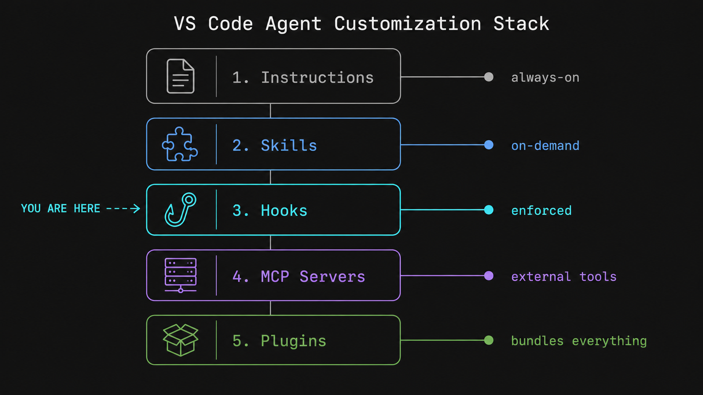

## Hooks over flowers

Instructions suggest. Skills guide. Hooks **enforce**.

That's the whole story, but it took me a while to understand why it matters.

You've set up your agent well. Custom instructions for coding standards. Skills for your team's specific patterns. Copilot knows your stack, follows your conventions, generates code that looks like yours.

Then one day it decides to run `rm -rf dist/` before rebuilding. Or it edits a file and moves on without running the formatter. Or it completes a task without touching the test suite. All technically valid moves. All not what you wanted.

The problem isn't instructions or skills failing. It's that they *guide* the agent. They inform its decisions. But an agent that's informed can still decide differently. Instructions are context. They're not guarantees.

Hooks are guarantees.

## What are Agent Hooks?

Agent Hooks are shell commands that VS Code runs at specific lifecycle points during an agent session. Not suggested. Not requested. Run.

They live in your repo at:

```text
.github/
└── hooks/
    └── hooks.json
```

The filename can be anything. VS Code loads all `*.json` files inside `.github/hooks/`.

A hook that auto-formats every file the agent edits looks like this:

```json
{
  "hooks": {
    "PostToolUse": [
      {
        "type": "command",
        "command": "npx prettier --write \"$TOOL_INPUT_FILE_PATH\""
      }
    ]
  }
}
```

Save the file. VS Code picks it up automatically. The next time the agent edits any file, Prettier runs. No prompt needed, no skill invocation, no agent cooperation required.

> VS Code added agent-scoped hooks in [version 1.111](https://code.visualstudio.com/updates/v1_111) (March 2026). Workspace hooks via `.github/hooks/` were available earlier. Use `/create-hook` in chat to scaffold a hook configuration.

## Meet the eight

This is where hooks get interesting. VS Code exposes eight points in an agent session where your code can run:

| Event | When it fires | What you can do |
|---|---|---|
| `SessionStart` | User submits the first prompt | Inject context, validate project state |
| `UserPromptSubmit` | User submits any prompt | Audit requests, add system context |
| `PreToolUse` | Before the agent invokes any tool | Block dangerous operations, require approval |
| `PostToolUse` | After a tool completes | Run formatters, trigger follow-up actions |
| `PreCompact` | Before conversation context is compacted | Export state before it gets truncated |
| `SubagentStart` | A subagent is spawned | Initialize subagent resources |
| `SubagentStop` | A subagent completes | Aggregate results, clean up |
| `Stop` | Agent session ends | Run tests, generate reports, send notifications |

Most people, when they first hear about hooks, think `PostToolUse`: run a formatter. That's valid and immediately useful.

But look at `PreToolUse`. That's where you can *stop* the agent before it does something.

And `SessionStart`. That's where you can inject context that the agent doesn't have yet: current branch, environment, version, whether production deploys are frozen.

`PreCompact` is the one nobody talks about. When a long session gets too big for the context window, VS Code compacts it. You can hook into that moment to export state, save important context to a file, or log what's about to be truncated.

## Stop. Before anything happens

`PreToolUse` fires before every tool invocation. Your hook receives the tool name and its input via stdin as JSON:

```json
{
  "hookEventName": "PreToolUse",
  "tool_name": "run_in_terminal",
  "tool_input": { "command": "rm -rf dist/" }
}
```

Your hook can return one of three `permissionDecision` values:

- `"allow"`: proceed without asking the user
- `"deny"`: block the operation entirely
- `"ask"`: stop and require explicit user confirmation

A simple shell script that blocks destructive commands:

```bash
#!/bin/bash
input=$(cat)
command=$(echo "$input" | jq -r '.tool_input.command // ""')

if echo "$command" | grep -qE '(rm -rf|DROP TABLE|git push --force)'; then
  echo '{"hookSpecificOutput": {"hookEventName": "PreToolUse", "permissionDecision": "deny", "permissionDecisionReason": "Destructive command blocked by policy"}}'
  exit 0
fi

echo '{"hookSpecificOutput": {"hookEventName": "PreToolUse", "permissionDecision": "allow"}}'
```

Wire it up:

```json
{
  "hooks": {
    "PreToolUse": [
      {
        "type": "command",
        "command": "./scripts/validate-command.sh"
      }
    ]
  }
}
```

The agent never sees the operation. It doesn't try to negotiate. The hook returns `deny`, the tool call stops.

There's also a simpler way to block without writing any JSON at all. Every script, when it finishes, returns a number to whoever called it. That's an exit code. `0` means success. VS Code specifically watches for exit code `2` as a "stop this right now" signal. You just write your reason to stderr and exit:

```bash
echo "Production deploys are frozen" >&2
exit 2
```

VS Code passes that message to the model as context and blocks the tool call. No JSON, no `hookSpecificOutput`, no ceremony.

One more thing worth knowing: `continue: false` in the JSON output stops the entire agent session, not just one tool call. Think of exit code `2` as hitting the brakes on a single operation. `continue: false` is turning off the engine. Use the second one carefully.

If you define more than one hook for the same event, VS Code runs all of them. When multiple `PreToolUse` hooks return conflicting `permissionDecision` values, the most restrictive wins: `deny` beats `ask`, and `ask` beats `allow`. You can stack a validation hook and a logging hook on the same event without worrying about one canceling the other.

*Full protocol reference: [Hook input and output, VS Code docs](https://code.visualstudio.com/docs/copilot/customization/hooks#_hook-input-and-output)*

## The morning briefing

Instructions are static. They were written at the time you created the file. But some context only exists at runtime: the current git branch, which environment is active, whether the CI pipeline is currently broken.

`SessionStart` fires before the agent does anything. Your hook can inject that information directly into the session:

```bash
#!/bin/bash
branch=$(git branch --show-current)
node_version=$(node -v)
env_name=${NODE_ENV:-development}

jq -n \
  --arg branch "$branch" \
  --arg node "$node_version" \
  --arg env "$env_name" \
  '{
    hookSpecificOutput: {
      hookEventName: "SessionStart",
      additionalContext: ("Branch: " + $branch + " | Node: " + $node + " | Env: " + $env)
    }
  }'
```

Every session the agent starts, it already knows what branch it's on and what environment it's working in. No need to tell it.

## Not every hook is for everyone

Workspace hooks apply to every agent interaction. But sometimes you want a hook that only runs for a specific agent.

Since VS Code 1.111, you can define hooks directly in a custom agent's frontmatter. The `hooks` field here uses YAML syntax because it lives inside the `.agent.md` frontmatter, but the structure maps directly to what you'd write in a JSON config file.

```markdown
---
name: "PM Explainer"
description: "Explains to your PM why it's taking longer. Also formats code."
hooks:
  PostToolUse:
    - type: command
      command: "./scripts/format-and-lint.sh"
---

You are a code editing agent. After making changes, files are formatted and linted automatically.
```

Enable `chat.useCustomAgentHooks` to use this. The hook only runs when this specific agent is active, either selected by the user or invoked as a subagent.

## The part everyone skips (don't)

Hooks run shell commands with the same permissions as VS Code. That's the *power* and the *responsibility*.

***Before enabling hooks from any source, read the scripts***. Hooks receive JSON input from the agent. Validate and sanitize that input before using it. Never hardcode secrets in hook scripts; use environment variables.

***One specific risk***: if the agent has access to edit scripts that your hooks run, it can modify those scripts during a session and execute code it writes. Use [`chat.tools.edits.autoApprove`](https://code.visualstudio.com/docs/copilot/customization/hooks#_safety) to prevent the agent from editing hook scripts without manual approval.

## When your hook does nothing

If a hook runs but nothing seems to happen, check the **GitHub Copilot Chat Hooks** output channel. Open the Output panel in VS Code, select that channel from the list, and you'll see which hooks were loaded, which fired, their exit codes, and any stdout or stderr output.

Hook scripts that exit with code `1` produce a non-blocking warning: the agent continues, but the issue shows up in the channel. Exit code `2` is the one that blocks and surfaces the message to the model. If your hook is supposed to stop something and it isn't, check which exit code your script is returning.

## Already have Claude hooks? You're closer than you think

If you're coming from Claude Code, VS Code reads hook configurations from `.claude/settings.json` and `.claude/settings.local.json` by default. The format is the same, with two differences to watch for:

- **Tool input property names**: Claude Code uses `snake_case` (e.g. `tool_input.file_path`), VS Code uses `camelCase` (e.g. `tool_input.filePath`)
- **Tool names**: different. Claude uses `Write`/`Edit`, VS Code uses `create_file`/`replace_string_in_file`

## Where Hooks Fit

Hooks are the third piece of a larger customization system:

- **Instructions** (`copilot-instructions.md` / `.github/instructions/`): always-on context. Good for project-wide rules.
- **Skills** (`.github/skills/`): domain-specific, activated on demand. Good for encoding your conventions.
- **Hooks** *← you're here*: ***deterministic*** automation at lifecycle points. Good for guarantees.
- **MCP Servers**: external tools: database access, browser automation, external APIs.
- **Plugins**: installable bundles that package all of the above together.



Instructions tell the agent ***how*** to work. Skills tell the agent ***what patterns to follow***. Hooks make sure certain things happen regardless of what the agent decides.

They're not interchangeable. They're complementary.

## Takeaways

**The difference between guidance and guarantee matters.**

Instructions and skills are ***probabilistic***. They shift the agent's behavior in the right direction. Hooks are ***deterministic***. Your code runs, period. Both have their place. Knowing which to reach for is the skill.

**Start with one hook.**

One `PostToolUse` Prettier hook that auto-formats on every file edit. Ship it, live with it for a week, see what else you want to automate. The scope expands naturally.

*This is the second post in a series on VS Code agent customizations: Skills, Hooks, MCP Servers, CLI, and Plugins.*

*Previous post: [I stopped fighting Copilot's conventions. I taught it mine instead.](https://dev.to/cloudx/stop-getting-generic-output-from-copilot-teach-it-your-patterns-1358)*

*Official docs: [Agent Hooks (VS Code)](https://code.visualstudio.com/docs/copilot/customization/hooks)*
