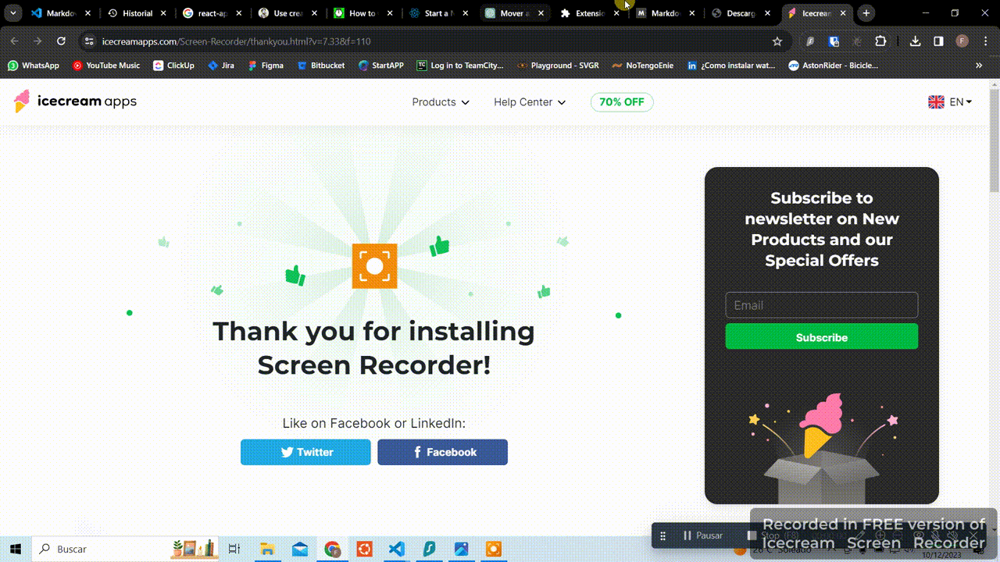
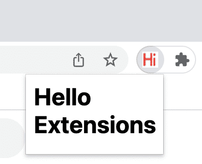

# Create an chrome extension with React, Typescript and Sockets

Before you i give you the context of what were my particular needs for this chrome extension, now i going to give you a How to create it.

I don't need to explain you why someone would prefer to work with react and not with vanilla html, css and javascript instead in the extensions's UI. **But Why to use Sockets?**

First of all, here you have how to config the project, you can read the explanation here **after**

## Project configuration

yarn create react-app my-extension --template typescript

### 1 - Project creation

```
### with yarn
yarn create react-app my-extension --template typescript
```

```
### npm
npx create-next-app@latest my-extension --template typescript
```

### 2 - Dependencies

```
yarn add webextension-polyfill
yarn add -D @types/webextension-polyfill
yarn add -D @types/chrome
yarn add -D customize-cra react-app-rewired
```

### 3 - Main files configuration

You have to move everything from create-react-app `App.*` to popup src/

src/
├── popup/
├── ├── App.css
├── ├── App.test.js
├── ├── App.tsx
├── ├── index.css
├── ├── index.tsx
├── ├── logo.svg
├── ├── reportWebVitals.js
├── ├── setupTests.js
├── background/
│ ├── index.ts
├── content/
│ ├── index.ts
├── config-iverrudes.js
└── public/
└── manifest.json
Create folder structure

```
mkdir popup
cd src && mv * ../popup && cd .. && mv popup src

touch src/index.ts
echo "import './popup/index'" > src/index.ts

mkdir -p src/background
touch src/background/index.ts
echo "console.log('hello from background'); export {}" > src/background/index.ts
mkdir -p src/content
touch src/content/index.ts
echo "console.log('hello from content'); export {}" > src/content/index.ts
touch config-overrides.js
```

***

Create `rootApp/config-overrides.js`

```
const { override } = require('customize-cra')

const overrideEntry = (config) => {
  config.entry = {
    main: './src/popup', // the extension UI
    background: './src/background/index.ts',
    content: './src/content/index.ts',
  }

  return config
}

const overrideOutput = (config) => {
  config.output = {
    ...config.output,
    filename: 'static/js/[name].js',
    chunkFilename: 'static/js/[name].js',
  }

  return config
}

module.exports = {
  webpack: (config) => override(overrideEntry, overrideOutput)(config),
}
```

***

Modify `rootApp/public/manifest.json`

```
{
  "short_name": "React App",
  "name": "Create React App Sample",
  "icons": {
    "16": "favicon.ico",
    "192": "logo512.png",
    "512": "logo512.png"
  },
  "manifest_version": 3,
  "version": "1.0",
  "background": {
    "service_worker": "./static/js/background.js"
  },
  "content_scripts": [
    {
      "matches": ["<all_urls>"],
      "js": ["./static/js/content.js"]
    }
  ],
  "action": {
    "default_popup": "index.html"
  },
  "permissions": ["storage", "tabs", "activeTab", "scripting","nativeMessaging"]
}
```

***

Modify Scripts in `package.json`

```
"scripts": {
    "build": "INLINE_RUNTIME_CHUNK=false react-app-rewired build",
}
```

***

Modify Popup layout size `src/popup/index.css`

```
html {
  width: 720px;
  height: 480px;
}
body {
  margin: 0;
  font-family: -apple-system, BlinkMacSystemFont, 'Segoe UI', 'Roboto', 'Oxygen',
    'Ubuntu', 'Cantarell', 'Fira Sans', 'Droid Sans', 'Helvetica Neue',
    sans-serif;
  -webkit-font-smoothing: antialiased;
  -moz-osx-font-smoothing: grayscale;
  width: 100%;
  height: 100%;
  padding: 2%;
}

code {
  font-family: source-code-pro, Menlo, Monaco, Consolas, 'Courier New',
    monospace;
}
```

After that build it

```
yarn build
```
And with that you are gonna have your extension configured with React


## Explanation
So... my head is bumping, i spend more than 3 hours writing this and i know you are gonna read it in 5 minutes or less, F*** me.

So, what we just did?

### What is an Extension
An extension is just a folder with a manifest.json file and some more stuff, but the basic things is the manifest.json.

folder/
└── logo.png
└── index.html
└── manifest.json

manifest.json
```
{
  "manifest_version": 3,
  "name": "Hello Extensions",
  "description": "Base Level Extension",
  "version": "1.0",
  "action": {
    "default_popup": "index.html",
    "default_icon": "logo.png"
  }
}
```

index.html
```
<html>
  <body>
    <h1>Hello Extensions</h1>
  </body>
</html>
```
***


After installed, you have your extension


But you want to create a react extension. So what you did was:
1. Change your React manifest.json to be valid as an extension
2. Move your CRA content to Popup
3. Create content and backend for the extension
4. Build everything separatly with customize-cra and react-app-rewired
5. Build and run
6. Also and PD. You install webextension-polyfill and some types to make typescript able to use Chrome API

### What is popup, content and backend and why build everything separtly?
1. The popup that you see when you click the icon in the toolbar.
2. The content scripts that run on top of an existing website.
3. The background scripts that run in the background of Google Chrome.

***
#### Popup
This is a webpage you can create and is going to run when user click in the extension icon in the toolbar, you can put js, css, html, and more types of files. With the popup you can interact with the chrome API also.

***
#### Backend
This is a script that is going to be running from the moment you install the extension, and you have all the control over it, it can comunicate with the popup and the content.

***

#### Content
This is also an script but in this case is isolated from the backend and the popup, in this case is the only one who is going to be able to run and interact with the web application running in the tab. In is limited but it can interact with the backend.

***

At least content and backend files cannot interact with each other so that's why we use react-app-rewired and customize-cra to separate Popup files from, Backend files and Content files.

## Why and how to use sockets in Chrome extensions?

Every change you make you have to build everything again. And this is going to cost you time, a lot of time so i prefer to do the less in the extension and have an external server and control everything with Websockets.

Imagine you have a list of objects saved in a DB and you what to scrappe, how are you going to interact with the WebPage UI with the extension from the server.

Short answer, by default you can't, you have to connect the content to the backend and the backend with sockets to the server.

The server code when you update it is going to run continusly and is not going to require to build again and again, also it gives you the chance to have all the pros of having an external application without the cons of the extension time consuming in the construction.

When you use sockets, you can connect the popup, the backend, the content and the server, fast and "easy" (is easy after you already implemented).

So, how to implement sockets? :) :) :) :) :) :) :)
I going to tell you in the next chapter...
