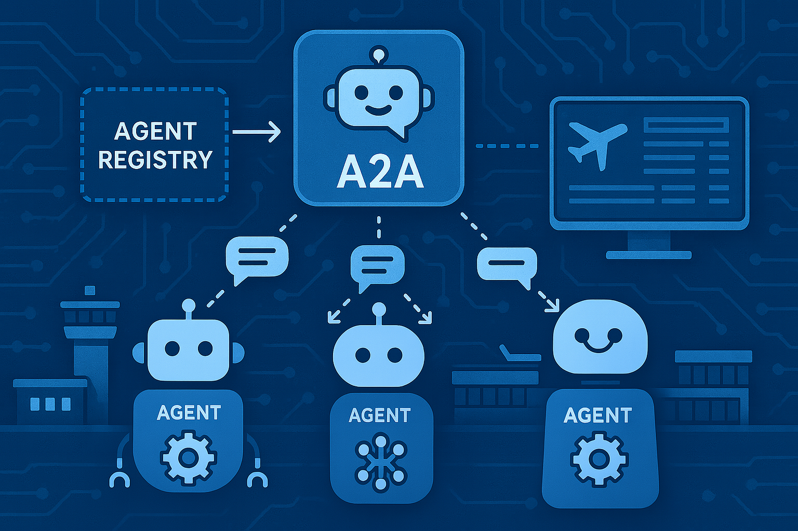

## 🌟 Introduction

Continuing with the context I shared in the previous article -[MCP - Understanding the Basics and Building a Research Paper Management Chatbot](https://dev.to/cloudx/mcp-understanding-the-basics-and-building-a-research-paper-management-chatbot-18le)-,
where I spotted the fact there's been a growing need for a standard way to enable communication between agents and give them richer context to handle complex tasks through natural language,
it's time to explore how to communicate agents or even complete agentic systems in a standard way.

That's where **Google's A2A (Agent-to-Agent) protocol** comes in.
Announced by Google on **April 9, 2025**, this emerging protocol standardizes how AI agents communicate with each other, enabling them to share context, delegate tasks, and collaborate on complex objectives that require multiple specialized capabilities.

In this post, we'll walk through building a command-line multi-agent system using the A2A protocol. We'll learn how to:

* Create A2A agents with their cards and skills
* Configure how agents will return information
* Use a centralized LangChain ReAct agent to call A2A agents

By the end, our chatbot will be able to:

* (**employee_flight_request_agent**) Know the status of corporate flight orders (pending purchase, purchased, and associated with a specific person)
* (**airport_knowledge_base_agent**) Obtain information about airports and cities
* (**flight_search_agent**) Search for real flight information departing from a specific airport
* Recommend airports for flights pending acquisition

Here's how we'll break it down:

1. Context
2. Local environment setup
3. What is A2A?
4. Core components
5. Communicating agents
6. Building A2A Agents
7. Our chatbot
8. Running our chatbot
9. Key features
10. Final thoughts
11. Resources

Let's get started! 🚀

_Important note: Only the most relevant function signatures and docstrings are shown in this post. You can find the full implementation in [ezequiroga/a2a-bases](https://github.com/ezequiroga/a2a-bases)._

## 🤝 Context

The main objective of the project is to recommend departure airports for corporate flights. For this, we will create a chatbot and three A2A agents:

* **employee_flight_request_agent**: Manages employee flight requests and booking status using an internal database. It returns results immediately: receives requests → processes → returns results.
* **airport_knowledge_base_agent**: Acts as a knowledge database that provides airport information and city-airport mappings. Since the main purpose of this article is to explore A2A, this agent uses fuzzy matching to retrieve information. It uses `streaming` to return its results.
* **flight_search_agent**: Performs real-time flight search using external aviation data from the `Aviation Stack API`. This agent uses a `ReAct Agent from LangChain` to create filters for the tool that interacts with the `Aviation Stack API`. It responds to requests by sending push notifications.

These three agents will be called through the chatbot, which uses a `ReAct Agent from LangChain` to interact with the user and decide which agent should be called.

Each agent uses a different communication method with our chatbot, so our chatbot needs to adapt to each of them.



## 🛠️ Local environment

🐍 Python `3.13.5`

Install the required packages from requirements.txt using the `uv add -r requirements.txt` command or `pip install -r requirements.txt`.

> **IMPORTANT NOTE**: The A2A protocol library must be installed using **UV** to avoid installation errors. This is the recommended approach according to the official A2A documentation. Using pip may result in dependency conflicts or incomplete installations.

_Pro tip: Use Python virtual environments for cleaner dependency management._

## 🤔 What Is Agent2Agent (A2A)?

Let's explore what the A2A protocol is and how it enables seamless agent-to-agent communication. For more details, check out the [Resources](#-resources) section at the end.

The A2A protocol was created by Google with the goal of standardizing and simplifying both communication and interoperability between AI Agents or even complete Agentic Systems.

As the [official documentation](https://a2aproject.github.io/A2A/v0.2.5/specification/#11-key-goals-of-a2a) states, A2A's key goals are:

* **Interoperability**: Bridge the communication gap between disparate agentic systems.
* **Collaboration**: Enable agents to delegate tasks, exchange context, and work together on complex user requests.
* **Discovery**: Allow agents to dynamically find and understand the capabilities of other agents.
* **Flexibility**: Support various interaction modes including synchronous request/response, streaming for real-time updates, and asynchronous push notifications for long-running tasks.
* **Security**: Facilitate secure communication patterns suitable for enterprise environments, relying on standard web security practices.
* **Asynchronicity**: Natively support long-running tasks and interactions that may involve human-in-the-loop scenarios.

The communication is based on HTTP(S) as the transport protocol and defines that each server exposes its services through a URL included in its _AgentCard_. All data exchange is based on JSON-RPC 2.0, ensuring that requests and responses follow a consistent and standard format, always with Content-Type: application/json.

And, for real-time updates, A2A supports streaming using Server-Sent Events (SSE). In these cases, the server returns continuous events with embedded JSON-RPC responses, allowing agents to maintain open communication flows for long-duration messages or tasks.

### Official SDK

The official SDK allows us to abstract away from writing JSON code by using classes and methods that facilitate communication. The recommended way to install the SDK is using `UV` by running the following:

```bash
uv add a2a-sdk
```

**Important note**: You need to initialize the `uv` project since our A2A servers will run using `uv`

## 🧩 Core Components

A2A communication is built around several key components that define the message structure required for proper agent interaction.

* **A2A Client**: An application or agent that initiates requests to an A2A Server on behalf of a user or another system.
* **A2A Server (Remote Agent)**: An agent or agentic system that exposes an A2A-compliant HTTP endpoint, processing tasks and providing responses.
* **Agent Card**: A JSON metadata document published by an A2A Server, describing its identity, capabilities, skills, service endpoint, and authentication requirements.
* **Task**: The fundamental unit of work managed by A2A, identified by a unique ID. Tasks are stateful and progress through a defined lifecycle.
* **Message**: A communication turn between a client and a remote agent, having a role ("user" or "agent") and containing one or more Parts.
* **Part**: The smallest unit of content within a Message or Artifact (e.g., TextPart, FilePart, DataPart).
* **Artifact**: An output (e.g., a document, image, structured data) generated by the agent as a result of a task, composed of Parts.

**Important Note**: The protocol is based on JSON-RPC 2.0, which means all messages are sent in JSON format. To simplify development, we will use the official SDK.

## 📡 Communicating Agents

A2A specifies three different communication patterns for A2A Servers to interact with A2A Clients:

* **Standard HTTP(S) Communication**: The client sends a request and the server sends a response, completing the standard HTTP(S) protocol cycle
* **Streaming (SSE)**: Real-time, incremental updates for tasks (status changes, artifact chunks) delivered via Server-Sent Events
* **Push Notifications**: Asynchronous task updates delivered via server-initiated HTTP POST requests to a client-provided webhook URL, for long-running or disconnected scenarios

You can see a communication sequence diagram in [A2A Request Lifecycle](https://a2aproject.github.io/A2A/v0.2.5/topics/what-is-a2a/#a2a-request-lifecycle) and dive deeper into communication methods in [Streaming & Asynchronous Operations in A2A](https://a2aproject.github.io/A2A/v0.2.5/topics/streaming-and-async/).

The Agent's communication method is defined in its _Agent Card_. Our system has three A2A agents, each using a different communication approach. Let's go ahead and start creating our agents.

## 🏗️ Building A2A Agents

The first step in creating an A2A agent is defining its _Agent Card_. This card is essential as it describes the server's identity, capabilities, skills, service endpoint URL, and authentication requirements. Clients use the information in the _Agent Card_ to understand how to interact with the agent.

### [Agent Card](https://a2aproject.github.io/A2A/v0.2.5/specification/#5-agent-discovery-the-agent-card)

As described previously, the _Agent Card_ is a JSON metadata document published by the A2A Server, describing its identity, capabilities, skills, service endpoint, authentication and how clients should interact with it.

The recommended location for the _Agent Card_, following the well-known URI strategy, is `http(s)://{server_domain}/.well-known/agent.json`. Using the official SDK, the Agent Card will be available at that path automatically. Below, you can see the Agent Cards for each of our A2A Agents.

**Agent Card: Employee Flight Request** -> This card defines that our agent will respond to every request immediately. It also specifies that the agent has three skills: `list_pending_requests_skill`, `list_booked_requests_skill` and `check_employee_request_skill`. The protocol does not specify how the agent knows which skill should be performed upon a request - it's the agent's responsibility to determine which skill to execute.

```python
public_agent_card = AgentCard(
    name='Employee Flight Request Management Agent',
    description='Agent for managing and checking employee flight requests and bookings',
    url='http://localhost:9992/',
    version='1.0.0',
    defaultInputModes=['text'],
    defaultOutputModes=['text'],
    capabilities=AgentCapabilities(streaming=False),
    skills=[
        list_pending_requests_skill,
        list_booked_requests_skill,
        check_employee_request_skill
    ],
    supportsAuthenticatedExtendedCard=False,
)
```

**Agent Card: Airport Knowledge Base** -> Here, the card specifies that the agent will stream the response to the client using `streaming=True`.

```python
public_agent_card = AgentCard(
    name='Airport Knowledge Base Agent',
    description='Knowledge base agent for retrieving correct airport names and city-airport mappings',
    url='http://localhost:9991/',
    version='1.0.0',
    defaultInputModes=['text'],
    defaultOutputModes=['text'],
    capabilities=AgentCapabilities(streaming=True),
    skills=[airport_knowledge_skill],
)
```

**Agent Card: Flight Search** -> This agent, as its card describes by `pushNotifications=True`, will send push notifications to the clients.

```python
public_agent_card = AgentCard(
    name='Flight Search Agent',
    description='Real-time flight search agent with push notification capabilities for aviation data',
    url='http://localhost:9993/',
    version='1.0.0',
    defaultInputModes=['text'],
    defaultOutputModes=['text'],
    capabilities=AgentCapabilities(streaming=True, pushNotifications=True),
    skills=[flight_search_skill],
    supportsAuthenticatedExtendedCard=False,
)
```

_**NOTE:** Since the main purpose of this article and the project that implements the code explained here is to demonstrate the A2A Protocol, our chatbot knows beforehand how each agent will send the responses. However, in a real scenario, the client may need to implement a way to handle communications based on the agent cards._

### [Agent Skills](https://a2aproject.github.io/A2A/v0.2.5/specification/#554-agentskill-object)

An _Agent Skill_ is a specific capability, function, or area of expertise the agent can perform or address. An agent can define more than one skill - as our _Employee Flight Request Management Agent_ does - in its card. Nevertheless, the protocol says nothing about how the agent knows which skill the user is trying to execute. Thus, it is the responsibility of the agent to determine which skill to perform based on the client's message.

Below is the definition of one skill used by the _Employee Flight Request Management Agent_ - the other skills are defined in a similar fashion.

```python
list_pending_requests_skill = AgentSkill(
    id='list_pending_requests',
    name='List Pending Flight Requests',
    description='List all employee flight requests that are not yet booked',
    tags=['flight', 'requests', 'pending', 'left', 'available', 'not booked', 'employee'],
    examples=[
        'list pending flight requests',
        'show pending requests',
        'which flights are not booked',
        'display remaining requests'
    ],
)
```

### [Agent Executor](https://a2aprotocol.ai/docs/guide/google-a2a-python-sdk-tutorial#_3-implementing-the-agent-executor)

The _Agent Executor_ is the central component that handles the processing logic of A2A agents and is responsible for processing incoming requests and generating corresponding responses. The SDK provides an abstract base class `a2a.server.agent_execution.AgentExecutor` that we must implement to create our agent. This class defines two main methods:

* `async def execute(self, context: RequestContext, event_queue: EventQueue):` Handles incoming requests that expect a response or a stream of events.
* `async def cancel(self, context: RequestContext, event_queue: EventQueue):` Handles requests to cancel an ongoing task.

The `RequestContext` provides information about the incoming request, and the `EventQueue` is used to send events back to the client.

This is the Agent Executor implementation for our _Employee Flight Request Management Agent_:

```python
class EmployeeFlightRequestAgentExecutor(AgentExecutor):
    """Employee flight request management agent executor."""

    def __init__(self):
        self.agent = EmployeeFlightRequestAgent()

    async def execute(
        self,
        context: RequestContext,
        event_queue: EventQueue,
    ) -> None:
        query = context.get_user_input()

        response = await self.agent.invoke(query)
        
        await event_queue.enqueue_event(new_agent_text_message(response))

    async def cancel(
        self, context: RequestContext, event_queue: EventQueue
    ) -> None:
        await event_queue.enqueue_event(new_agent_text_message("❌ Flight request operation cancelled"))
```

This line `response = await self.agent.invoke(query)` calls and executes the actual logic of our agent, querying the mocked database and returning the data.

Notice the line `await event_queue.enqueue_event(new_agent_text_message(response))`. This is really important because it's how the protocol allows the server to respond to the clients. The `event_queue.enqueue_event` is the way to return messages even if `stream` is **False** in the _Agent Card_.

### Creating and sending messages

In this section we will explore how to create messages and send them to the clients. In the section [Our chatbot](#-our-chatbot) we will describe how it handles each kind of communication.

The simplest way to create a message to send to an A2A Client is using `a2a.utils.new_agent_text_message(text: str, context_id: str | None = None, task_id: str | None = None) -> Message:)`. This function returns the following object:

```python
return Message(
    role=Role.agent,
    parts=[Part(root=TextPart(text=text))],
    messageId=str(uuid.uuid4()),
    taskId=task_id,
    contextId=context_id,
)
```

Our _Employee Flight Request Management Agent_ uses this method to create messages in response to the client. The created message is sent using the `event_queue.enqueue_event` method. See the code below.

```python
class EmployeeFlightRequestAgentExecutor(AgentExecutor):
    
    ...

    async def execute(
        self,
        context: RequestContext,
        event_queue: EventQueue,
    ) -> None:
        query = context.get_user_input()

        response = await self.agent.invoke(query)
        
        await event_queue.enqueue_event(new_agent_text_message(response))
```

Our next agent, _Airport Knowledge Base_, streams messages to the clients. To achieve this, we need to use another class provided by the SDK: `a2a.server.tasks.TaskUpdater`. This class allows agents to publish updates to a task's event queue. Based on this, the messages to stream must contain the `task.id` and `task.contextId`.

This is the Agent Executor for that agent:

```python
class AirportKnowledgeBaseAgentExecutor(AgentExecutor):
    """Airport knowledge base agent executor."""

    def __init__(self):
        self.agent = AirportKnowledgeBaseAgent()

    async def execute(
        self,
        context: RequestContext,
        event_queue: EventQueue,
    ) -> None:
        query = context.get_user_input()
        task = context.current_task
        if not task:
            task = new_task(context.message)

        updater = TaskUpdater(event_queue, task.id, task.contextId)
        await self.agent.invoke(task, updater, query)
```

Note the creation of the `TaskUpdater` instance: it takes the event_queue, the task id and the context id from the task. Then, within the method `self.agent.invoke(...)` we use the updater object to stream messages as follows:

```python
async def invoke(self, task: Task, updater: TaskUpdater, query: str = None) -> None:
    """
    Retrieve airport information using fuzzy matching by name and municipality.
    
    Args:
        context: Request context
        event_queue: Event queue for streaming messages
        query: Search string (city or airport name)
        
    Returns:
        String with top 5 airport names and top 5 cities with their airports
    """
    if self.airport_knowledge.empty:
        await updater.update_status(
            TaskState.failed,
            new_agent_text_message(
                "Airport knowledge base not loaded. Please check the database files.",
                task.contextId,
                task.id,
            ),
            final=True
        )
        return
    
    await updater.update_status(
        TaskState.working,
        new_agent_text_message(
            "📚 Accessing airport knowledge base...",
            task.contextId,
            task.id,
        ),
    )
    
    ...

    part = TextPart(text=result_lines)
    message = Message(
        role=Role.agent,
        parts=[part],
        messageId=str(uuid.uuid4()),
    )
    await updater.complete(message=message)
```

Throughout this code we can also introduce some useful classes from the SDK (package `a2a.types`):

* _TaskState_: enum representing the possible states of a Task
* _Role_: enum representing a message sender's role
* _TextPart_: represents a text segment within parts
* _Message_: class that represents a single message exchanged between user and agent.

So far we've seen how agents respond in a single timeline: from receiving the request until sending their response, either through a single message or by streaming multiple messages until completing the cycle.

But if a task could take a long time to finish, it's not a good idea to make the client wait until the end while keeping a connection alive. For these cases, we can use push notifications. The last agent we will create does exactly this.

As a requirement imposed by the protocol, a client that wants to receive push notifications should explicitly specify the `endpoint` enabled for that purpose. We will see how to do that in the section [Our chatbot](#-our-chatbot). Here, we describe how the push notification process works.

In the section [Building A2A Servers](#building-a2a-servers) we will see that we need to use a `request_handler` for creating an _A2A Server_. The SDK provides us with the following implementation: `a2a.server.request_handlers.DefaultRequestHandler`. At the time this article was written (Jul 2025), that handler does not properly manage push notifications. Therefore, you can extend that class and override the methods within it. The class [CustomRequestHandler](https://github.com/ezequiroga/a2a-bases/blob/main/flight_search_agent/custom_request_handler.py) does exactly that by overriding only one method: `on_message_send_stream`.

These are the most relevant parts of the new implementation

```python
class CustomRequestHandler(DefaultRequestHandler):
    """Custom request handler that extends DefaultRequestHandler.
    
    This handler maintains all default functionality while providing
    custom implementation for the streaming message send method.
    """

    async def on_message_send_stream(
        self,
        params: MessageSendParams,
        context: ServerCallContext | None = None,
    ) -> AsyncGenerator[Event]:
        """Custom handler for 'message/stream' (streaming).

        Starts the agent execution and yields events as they are produced
        by the agent.
        """
        task_manager = TaskManager(
            task_id=params.message.taskId,
            context_id=params.message.contextId,
            task_store=self.task_store,
            initial_message=params.message,
        )
        # Start new code #
        task = Task(
            id=params.message.taskId,
            contextId=params.message.contextId,
            status=TaskStatus(
                state=TaskState.submitted,
            )
        )
        task = await task_manager.save_task_event(task)
        task: Task | None = await task_manager.get_task()
        # End new code #

        if task:
            task = task_manager.update_with_message(params.message, task)

            if self.should_add_push_info(params):
                assert isinstance(self._push_notifier, PushNotifier)
                assert isinstance(
                    params.configuration, MessageSendConfiguration
                )
                assert isinstance(
                    params.configuration.pushNotificationConfig,
                    PushNotificationConfig,
                )
                await self._push_notifier.set_info(
                    task.id, params.configuration.pushNotificationConfig
                )
        else:
            queue = EventQueue()
            
        ...

        try:
            ...
            async for event in result_aggregator.consume_and_emit(consumer):
                ...
                if self._push_notifier and task_id:
                    latest_task = await result_aggregator.current_result
                    if isinstance(latest_task, Task):
                        await self._push_notifier.send_notification(latest_task)
                yield event
        except Exception as e:
            print(f"❌ {e}")
        finally:
            await self._cleanup_producer(producer_task, task_id) 
```

Moreover, to enable the ability to send push notifications in our agent, we need to add `push_notifier=InMemoryPushNotifier(httpx_client=httpx.AsyncClient())` when creating the `request_handler` for building the A2A Server. This is shown again in the section [Running A2A servers](#running-a2a-servers).

That's all. If `pushNotifications=True` in the _Agent Card_, the `PushNotifier` is set in the `request_handler` and the client provides the push notification endpoint, the SDK will automatically send messages to the provided endpoint each time a Task changes its status. It's important to mention that **an instance of the class `Task`** is being pushed. This is relevant because the endpoint our chatbot exposes for listening to notifications will receive that object as JSON and should be able to parse it.

Because of this, the _Agent Executor_ of our agent simply sends messages using the `updater` as follows:

```python
class FlightSearchAgentExecutor(AgentExecutor):
    """Flight search agent executor with ReAct capabilities."""

    def __init__(self):
        self.agent = FlightSearchAgent()

    async def execute(
        self,
        context: RequestContext,
        event_queue: EventQueue,
    ) -> None:
        """Execute flight search request."""
        query = context.get_user_input()

        updater = TaskUpdater(event_queue, context.current_task.id, context.current_task.contextId)
        await updater.update_status(
            TaskState.submitted,
            new_agent_text_message(
                "🤖 Flight Search Agent activated...",
                context.current_task.contextId,
                context.current_task.id
            )
        )

        message = await self.agent.invoke(context.current_task.id, context.current_task.contextId, query)

        await updater.update_status(TaskState.working, message)
        await updater.update_status(TaskState.completed)
```

The method `self.agent.invoke` returns the following object:

```python
push_notification_payload = {
    "flights": final_response,
    "source": "flight_search_agent",
    "metadata": {"task_id": task_id, "context_id": context_id}
}

part = TextPart(text=json.dumps(push_notification_payload))
message = Message(
    role=Role.agent,
    parts=[part],
    messageId=str(uuid.uuid4()),
    taskId=task_id,
    contextId=context_id,
)
return message
```

### Building A2A Servers

At this point we have already achieved:

1️⃣ Creating agent cards specifying their endpoint (`url`: where the A2A service can be reached), skills (`skills`) and capabilities (`capabilities`: communication methods) among other properties

2️⃣ Adding agent skills to the agent cards

3️⃣ Implementing the agent executor for each agent

4️⃣ Composing and sending messages depending on the agent's communication method

Now, it's time to build the [A2A servers](https://a2aprotocol.ai/docs/guide/a2a-sdk-currency-agent-tutorial#agentserver). For this purpose, the SDK provides us with the class `a2a.server.apps.A2AStarletteApplication`.

To create an A2A Server, it's mandatory to use an `AgentCard`, a `RequestHandler` (to route incoming A2A RPC calls to the appropriate methods on your executor), an `AgentExecutor` (to execute the core logic of how agents process requests and generate responses) and a `TaskStore` (to manage the lifecycle of tasks).

As can be seen in the code below, the SDK provides useful implementations of these classes.

```python
request_handler = DefaultRequestHandler(
    agent_executor=EmployeeFlightRequestAgentExecutor(),
    task_store=InMemoryTaskStore(),
)

server = A2AStarletteApplication(
    agent_card=public_agent_card,
    http_handler=request_handler,
)

uvicorn.run(server.build(), host='0.0.0.0', port=9992) 
```

_**Note**: Since `Starlette Application` and `uvicorn` are beyond the scope of this article, if you need more information, you can read about them in [Starlette](https://www.starlette.io/) and [uvicorn](https://www.uvicorn.org/) respectively._

### Running A2A servers

The recommended directory structure for the server is as follows:

```text
├── name_of_the_agent/
│   ├── __main__.py -> contains AgentSkill, AgentCard, CustomRequestHandler, A2AStarletteApplication and the line to start the uvicorn server
│   └── agent_executor.py -> the Agent Executor implementation with the actual logic for processing incoming requests and generating responses
│   └── ...
│   └── subdirectories/
│       └── ...
```

In the previous sections we already showed how to implement the _Agent Executor_. Below, you can see an example of the `__main__.py` file:

```python
# ...IMPORTS...

if __name__ == '__main__':

    flight_search_skill = AgentSkill(
        ...
    )

    public_agent_card = AgentCard(
        ...
    )

    request_handler = CustomRequestHandler(
        agent_executor=FlightSearchAgentExecutor(),
        task_store=InMemoryTaskStore(),
        push_notifier=InMemoryPushNotifier(httpx_client=httpx.AsyncClient()) # ONLY needed if the Agent will send push notifications
    )

    server = A2AStarletteApplication(
        agent_card=public_agent_card,
        http_handler=request_handler,
    )

    uvicorn.run(server.build(), host='0.0.0.0', port=9993) 
```

With all of that in place, we can run our A2A Server by:

```bash
cd name_of_the_agent/
uv run . --host 0.0.0.0
```

**Important Note**: To run the server this way, you need to initialize a `uv` project within the agent's folder. You can find more information in [UV Projects](https://docs.astral.sh/uv/concepts/projects/).

## 🤖 Our chatbot

The final piece of our AI system is our chatbot: the entry point for user interaction. Our chatbot has five important components that we'll analyze below and defines the `main` function that contains the logic to allow users to enter prompts and display responses from our _A2A Agents_.

The `*Tool(BaseTool)` classes implement `langchain.tools.BaseTool` since they are _tools_ that our LangChain Agent can invoke. They all override the methods `def _run(self, query: str) -> str` and `async def _arun(self, query: str) -> str` with the actual logic of the _tool_.

_Note: The `chat_agent.py` file needs to be refactored to move the classes declared in it to independent files._

### A2AAgentRegistry

A mock registry that manages A2A agent information, including their capabilities, base URLs, and initialized clients for communication.

To obtain the information present in the _Agent Cards_, we use `a2a.client.A2ACardResolver` which automatically calls the endpoint `http(s)://{server_domain}/.well-known/agent.json` and initiate communication with our _A2A Agents_ using `a2a.client.A2AClient`.

```python
class A2AAgentRegistry:
    """Mock registry for A2A agents. Later will be replaced with real discovery."""
    
    def __init__(self):
        self.agents = {
            "airport_knowledge_base": {
                ...
                "base_url": "http://localhost:9991",
                ..
            },
            "employee_flight_requests": {
                ...
                "base_url": "http://localhost:9992",
                ..
            },
            "flight_search": {
                ...
                "base_url": "http://localhost:9993",
                ...
            }
        }
    
    async def initialize_agents(self, httpx_client: httpx.AsyncClient):
        """Initialize A2A clients for all registered agents."""
        for _, agent_info in self.agents.items():
            try:
                resolver = A2ACardResolver(
                    httpx_client=httpx_client,
                    base_url=agent_info["base_url"]
                )
                
                try:
                    card: AgentCard = await resolver.get_agent_card()
                    client = A2AClient(httpx_client=httpx_client, agent_card=card)
                    
                    agent_info["card"] = card
                    agent_info["client"] = client
                    print(f"✅ Initialized {agent_info['name']} at {agent_info['base_url']}")
                    print(f"   📝 Description: {agent_info['description']}")
                    
                except Exception as e:
                    print(f"⚠️  Could not connect to {agent_info['name']} at {agent_info['base_url']}: {e}")
                    agent_info["card"] = None
                    agent_info["client"] = None
                    
            except Exception as e:
                print(f"❌ Failed to initialize {agent_info['name']}: {e}")
    
    def get_agent(self, agent_id: str) -> Optional[Dict[str, Any]]:
        """Get agent info by ID."""
        return self.agents.get(agent_id)
    
    def list_available_agents(self) -> List[str]:
        """List all agents that are available (have active clients)."""
        return [
            agent_id for agent_id, info in self.agents.items() 
            if info["client"] is not None
        ]
```

### EmployeeFlightRequestTool

A LangChain tool that checks the status of employee flight requests and booking information by communicating with the employee flight request agent. Our A2A Agent _Employee Flight Request Management Agent_ uses `capabilities=AgentCapabilities(streaming=False)`, so the message is sent and the response is awaited.

```python
class EmployeeFlightRequestTool(BaseTool):
    """
    ...
    """
    
    ...
    
    def __init__(self, agent_registry: A2AAgentRegistry):
        super().__init__(agent_registry=agent_registry)
    
    async def _arun(self, query: str) -> str:
        """Async implementation to call the employee flight request agent."""
        agent_info = self.agent_registry.get_agent("employee_flight_requests")
        
        if not agent_info or not agent_info["client"]:
            return "❌ Employee flight request agent is not available. Please check if the service is running."
        
        try:
            part = TextPart(text=query)
            message = Message(
                role=Role.user,
                parts=[part],
                messageId=str(uuid4()),
            )
            
            send_message_payload = MessageSendParams(message=message)

            request = SendMessageRequest(
                id=str(uuid4()), 
                params=send_message_payload,
            )
            
            print(f"\n📋 Checking flight requests for: {query}")
            client = agent_info["client"]
            return await client.send_message(request)
            
        except Exception as e:
            return f"❌ Error calling employee flight request agent: {str(e)}"
    ...

```

### AirportKnowledgeTool

A LangChain tool that retrieves airport information from the knowledge base agent when users ask about airport names or airports in specific cities. Our A2A Agent _Airport Knowledge Base Agent_ uses `capabilities=AgentCapabilities(streaming=True)`, so this tool must receive a `stream` of messages.

```python
class AirportKnowledgeTool(BaseTool):
    """
    ...
    """
    
    ...
    
    def __init__(self, agent_registry: A2AAgentRegistry):
        super().__init__(agent_registry=agent_registry)
    
    async def _arun(self, query: str) -> str:
        """Async implementation to call the airport knowledge base agent."""
        agent_info = self.agent_registry.get_agent("airport_knowledge_base")
        
        if not agent_info or not agent_info["client"]:
            return "❌ Airport knowledge base agent is not available. Please check if the service is running."
        
        try:
            part = TextPart(text=query)
            message = Message(
                role=Role.user,
                parts=[part],
                messageId=str(uuid4()),
            )
            
            streaming_request = SendStreamingMessageRequest(
                id=str(uuid4()), 
                params=MessageSendParams(message=message)
            )
            
            client = agent_info["client"]
            stream_response = client.send_message_streaming(streaming_request)
            
            full_response = ""
            print(f"\n📚 Looking up airport information for: {query}")
            
            async for chunk in stream_response:
                json_chunk = chunk.model_dump(mode='json', exclude_none=True)
                if json_chunk['result']['status']['state'] == TaskState.completed:
                    full_response = f"\n✅ Knowledge base lookup completed\n{json_chunk['result']['status']['message']['parts'][0]['text']}\n"
                    break
                else:
                    print(f"📨 {json_chunk['result']['status']['message']['parts'][0]['text']}\n")
            
            return full_response if full_response else "✅ Knowledge base lookup completed - check the streaming output above."
            
        except Exception as e:
            return f"❌ Error calling airport knowledge base agent: {str(e)}"
    ...

```

### FlightSearchTool

A LangChain tool that searches for scheduled flights using Aviation Stack API through the flight search agent and handles results via push notifications since our A2A Agent _Flight Search Agent_ uses `capabilities=AgentCapabilities(streaming=True, pushNotifications=True)`.

It's important to note how the message is created when using `a2a.types.SendStreamingMessageRequest` since in this case we need to tell our _A2A Agent_ which **endpoint** we make available to receive the _push notifications_.

```python
class FlightSearchTool(BaseTool):
    """
    ...
    """
    
    ...
    flight_search_callback_url: str = f"http://localhost:{HTTP_SERVER_PORT}{FLIGHTS_ENDPOINT_PATH}" # TODO: DO NOT hardcode the callback URL

    def __init__(self, agent_registry: A2AAgentRegistry):
        super().__init__(agent_registry=agent_registry)
    
    async def _arun(self, query: str) -> str:
        """Async implementation to call the flight search agent."""
        agent_info = self.agent_registry.get_agent("flight_search")
        
        if not agent_info or not agent_info["client"]:
            return "❌ Flight search agent is not available. Please check if the service is running."
        
        async def async_search():
            """Execute flight search asynchronously."""
            try:
                client: A2AClient = agent_info["client"]
                
                part = TextPart(text=query)
                message = Message(
                    role=Role.user,
                    parts=[part],
                    messageId=str(uuid4()),
                    contextId=str(uuid4()),
                    taskId=str(uuid4())
                )
                
                request = SendStreamingMessageRequest(
                    id=str(uuid4()),
                    params=MessageSendParams(
                        message=message,
                        configuration=MessageSendConfiguration(
                            acceptedOutputModes=["text"],
                            pushNotificationConfig=PushNotificationConfig(
                                url=self.flight_search_callback_url
                            )
                        )
                    )
                )
                
                response = client.send_message_streaming(request=request)
                
                async for chunk in response:
                    pass # we don't care about the stream since messages will be received through the exposed endpoint
                    
            except Exception as e:
                print(f"❌ Error in background flight search: {str(e)}")
        
        asyncio.create_task(async_search()) # here we decouple this tool's execution from the LangChain flow
        
        print(f"🛫 Flight search initiated in background for: {query}")
        
        return "✅ Flight search initiated - results will be sent via push notification once completed"
```

### ReactChatAgent

A LangGraph 'ReAct' Agent that orchestrates interactions between the user and our A2A agents through specialized tools. The most notable features are:

* Creates a FastAPI server that exposes an endpoint to receive _push notifications_
* Uses `langgraph.checkpoint.memory.MemorySaver` so our agent has short-term memory
* Defines the `setup_http_endpoints(...)` method to listen and process _push notifications_ sent by the _A2A Agent_
* Uses the `langgraph.prebuilt.create_react_agent` function -ReAct Agents are deprecated so this function creates a Graph that calls tools in a loop until a stopping condition is met- to create a _Compiled Graph_ from LangChain that acts as the "brain" of our chat
* Defines the `chat(self, user_input: str, thread_id: str = "default") -> str:` method that makes the call to the LLM

```python
class ReactChatAgent:
    """LangGraph ReAct agent that can interact with A2A agents through tools and receive external messages via HTTP."""
    
    def __init__(self):
        self.agent_registry = A2AAgentRegistry()

        api_key = os.getenv("ANTHROPIC_API_KEY")
        if not api_key:
            raise ValueError("ANTHROPIC_API_KEY environment variable must be set")
        
        self.model = ChatAnthropic(
            model="claude-3-5-sonnet-20241022",
            temperature=0,
            api_key=api_key
        )
        
        self.memory = MemorySaver()
        
        self.agent_graph = None
        
        self.external_message_queue = Queue()

        self.app = FastAPI(title="ReAct Chat Agent API", version="1.0.0")
        self.setup_http_endpoints()
    
    def setup_http_endpoints(self):
        """Setup HTTP endpoints for receiving external messages."""
        
        @self.app.post(FLIGHTS_ENDPOINT_PATH)
        async def receive_flight_findings(flight_finding: Task):
            """Receive flight findings and add them to the message queue."""
            try:
                # full implementation in the GitHub repository
                
            except Exception as e:
                raise HTTPException(status_code=500, detail=f"Error processing flight findings: {str(e)}")
        ...
        
    async def initialize(self, httpx_client: httpx.AsyncClient):
        """Initialize the agent and its tools."""
        print("🤖 Initializing LangGraph ReAct Chat Agent with Anthropic Claude...")
        
        await self.agent_registry.initialize_agents(httpx_client)
        
        tools = [
            AirportKnowledgeTool(self.agent_registry),
            EmployeeFlightRequestTool(self.agent_registry),
            FlightSearchTool(self.agent_registry)
        ]
        
        system_prompt = f"""You are a helpful assistant that manages employee flight requests in a corporate environment and can search for scheduled flights.
        ...
        """

        self.agent_graph = create_react_agent(
            model=self.model,
            tools=tools,
            checkpointer=self.memory,
            prompt=system_prompt
        )
        
        available_agents = self.agent_registry.list_available_agents()
        print(f"✅ LangGraph ReAct Agent initialized with {len(available_agents)} available A2A agents: {available_agents}")
        print("🧠 Using Anthropic Claude as the reasoning engine")
        print(f"📡 HTTP endpoint available at: http://localhost:{HTTP_SERVER_PORT}{FLIGHTS_ENDPOINT_PATH}")
    
    async def process_external_message(self, external_msg: InternalMessage, thread_id: str | None = None) -> str:
        """Process an external message and add it to agent memory."""
        # full implementation in the GitHub repository
    
    async def chat(self, user_input: str, thread_id: str = "default") -> str:
        ...
        try:
            config = {"configurable": {"thread_id": thread_id}}
            
            messages = [("user", user_input)]
            
            last_message = ""
            async for chunk in self.agent_graph.astream(
                {"messages": messages},
                config=config
            ):
                print(chunk)
                last_message = chunk
            
            return last_message if last_message else "Response completed - check the output above."
            
        except Exception as e:
            return f"❌ Error processing request: {str(e)}"
```

### `main` function

When the function starts, it creates and initializes our `ReactChatAgent()` which in turn calls the Agent Registry and creates our **A2A Clients** to communicate with our **A2A Servers** (A2A Agents).

It also runs the FastAPI server in a separate execution thread, which allows listening to push notifications as they arrive.

The code inside the `while` loop is a bit complex since it processes the message queue from push notifications, interleaved with responses to user prompts, as they arrive.

```python
async def main():
    """Main CLI loop for the chat agent with HTTP endpoint integration."""
    print("🚀 Starting LangGraph ReAct Chat Agent with A2A Integration")
    print("🧠 Powered by Anthropic Claude")
    print("📡 HTTP API Server Enabled")
    print("=" * 60)
    
    logging.basicConfig(level=logging.WARNING)
    
    async with httpx.AsyncClient() as httpx_client:
        agent = ReactChatAgent()
        await agent.initialize(httpx_client)
        
        print(f"🌐 Starting HTTP server on port {HTTP_SERVER_PORT}...")
        http_thread = threading.Thread(target=run_http_server, args=(agent,))
        http_thread.daemon = True
        http_thread.start()
        
        print("\n💬 Chat Agent Ready! (Type 'quit' to exit)")
        ...
        
        thread_id = "console_session_" + str(uuid4())[:8]
        prompt_shown = False
        should_exit = False
        
        while not should_exit:
            try:
                while not agent.external_message_queue.empty():
                    external_msg = agent.external_message_queue.get()
                    await agent.process_external_message(external_msg)
                    prompt_shown = False
                
                if not prompt_shown:
                    print("\n👤 You: ", end="", flush=True)
                    prompt_shown = True
                
                if sys.stdin in select.select([sys.stdin], [], [], 0.1)[0]:
                    user_input = input().strip()
                    prompt_shown = False
                    
                    if user_input.lower() in ['quit', 'exit', 'bye']:
                        try:
                            loop = asyncio.get_event_loop()
                            if loop.is_closed():
                                print("⚠️  Event loop is closed - cleaning up gracefully...")
                            else:
                                print("✅ Event loop is healthy")
                        except RuntimeError:
                            print("ℹ️  No event loop available in current context")
                        
                        print("👋 Goodbye!")
                        should_exit = True
                    
                    if user_input:
                        print("🤖 LLM: ...", end="\n", flush=True)
                        response = await agent.chat(user_input, thread_id)
                        
                        if isinstance(response, dict):
                            for chunk_type, chunk_data in response.items():
                                if isinstance(chunk_data, dict) and 'messages' in chunk_data:
                                    for message in chunk_data['messages']:
                                        if hasattr(message, 'content'):
                                            print(f"\n**** 🤖 Agent pretty print *****\n{message.content}\n" + "*" * 31)
                                            break
                
            except KeyboardInterrupt:
                print("\n👋 Goodbye!")
                should_exit = True
            except Exception as e:
                ...

        sys.exit(0)
```

Finally, to run our _chatbot_ we execute:

```bash
python3 chat_agent.py
```

## 🚀 Running our chatbot

It's time to run our chatbot. But first, we need to start each of our _A2A Agents_.

```bash
# Start the airport knowledge base agent
cd airport_knowledge_base_agent/
uv run . --host 0.0.0.0 &

---
✅ Initialized flight request database with 10 records
INFO:     Started server process [53208]
INFO:     Waiting for application startup.
INFO:     Application startup complete.
INFO:     Uvicorn running on http://0.0.0.0:9992 (Press CTRL+C to quit)
INFO:     127.0.0.1:60396 - "GET /.well-known/agent.json HTTP/1.1" 200 OK  # This shows that our chatbot called the agent card
```

```bash
# Start the employee flight requests agent 
cd ../employee_flight_requests_agent/
uv run . --host 0.0.0.0 &

---
✅ Loaded airport knowledge base: 8467 airports from 235 countries
INFO:     Started server process [53217]
INFO:     Waiting for application startup.
INFO:     Application startup complete.
INFO:     Uvicorn running on http://0.0.0.0:9991 (Press CTRL+C to quit)
INFO:     127.0.0.1:60394 - "GET /.well-known/agent.json HTTP/1.1" 200 OK  # This shows that our chatbot called the agent card
```

```bash
# Start the flight search agent
cd ../flight_search_agent/
uv run . --host 0.0.0.0 &

---
✅ Initialized Flight Search ReAct Agent with Aviation Stack API
INFO:     Started server process [53228]
INFO:     Waiting for application startup.
INFO:     Application startup complete.
INFO:     Uvicorn running on http://0.0.0.0:9993 (Press CTRL+C to quit)
INFO:     127.0.0.1:60398 - "GET /.well-known/agent.json HTTP/1.1" 200 OK  # This shows that our chatbot called the agent card
```

Now, we can run our chatbot:

```bash
python chat_agent.py

---
🚀 Starting LangGraph ReAct Chat Agent with A2A Integration
🧠 Powered by Anthropic Claude
📡 HTTP API Server Enabled
============================================================
🤖 Initializing LangGraph ReAct Chat Agent with Anthropic Claude...
✅ Initialized Airport Knowledge Base Agent at http://localhost:9991
   📝 Description: Knowledge base for airport information and city-airport mappings
✅ Initialized Employee Flight Request Agent at http://localhost:9992
   📝 Description: Check employee flight requests and booking status
✅ Initialized Flight Search Agent at http://localhost:9993
   📝 Description: Scheduled flight search using Aviation Stack
✅ LangGraph ReAct Agent initialized with 3 available A2A agents: ['airport_knowledge_base', 'employee_flight_requests', 'flight_search']
🧠 Using Anthropic Claude as the reasoning engine
📡 HTTP endpoint available at: http://localhost:9990/api/flights-findings
🌐 Starting HTTP server on port 9990...

💬 Chat Agent Ready! (Type 'quit' to exit)
You can ask about:
  - Airport knowledge base: 'find airports in Madrid'
  - Airport information: 'what airports are in Tokyo'
  - Employee flight requests: 'check pending flight requests'
  - Employee status: 'check John Smith flight request'
  - Flight search: 'search flights from AEP on 2025-11-20'
  - Real-time flights: 'find flights from JFK to LAX on 2025-12-01'

📡 HTTP Endpoints available:
  - POST http://localhost:9990/api/flights-findings
  - GET  http://localhost:9990/api/status
------------------------------------------------------------

👤 You: 
```

First, we ask our agent "What are the pending flight requests?". Our agent will use the `employee_flight_requests` tool to perform the search and display the results.

```bash
👤 You: What are the pending flight requests?
🤖 LLM: ...
{'agent': {'messages': [AIMessage(content=[{'text': "I'll help you check the pending flight requests using the employee_flight_requests tool."...
...
**** 🤖 Agent pretty print *****
Based on the results, there are 5 pending flight requests awaiting booking:

1. Robert Johnson: New York to Los Angeles (Dec 1, 2025)
2. Anna Thompson: London to Dublin (Oct 5, 2025)
3. Sophie Martin: Paris to Rome (July 12, 2025)
4. Elena Popov: Berlin to Amsterdam (Nov 18, 2025)
5. Lisa Anderson: Sydney to Melbourne (Aug 25, 2025)

All these requests are currently in "Awaiting booking" status. Would you like more specific information about any of these requests or would you like to check the status of booked flights as well?
*******************************
```

Since our agent has memory, we can ask: "Which airports can Anna depart from?". In this case, we see that it uses the `airport_knowledge_base` tool.

```bash
👤 You: Which airports can Anna depart from?
🤖 LLM: ...
{'agent': {'messages': [AIMessage(content=[{'text': "Since Anna's request is for a flight from London, I'll use the airport_knowledge_base tool to find the available airports in London."...
...
**** 🤖 Agent pretty print *****
For Anna's flight from London to Dublin, she can depart from any of these major London airports in the UK:

1. London Heathrow Airport (LHR) - The largest and most well-connected airport
2. London Gatwick Airport (LGW) - Second largest airport
3. London Stansted Airport (STN) - Major hub for low-cost carriers
4. London City Airport (LCY) - Convenient for business travelers, located in the city
5. London Biggin Hill Airport (BQH) - Smaller airport primarily for private aviation
6. RAF Northolt (NHT) - Military airport with limited civilian use

The most commonly used airports for commercial flights to Dublin would be Heathrow (LHR), Gatwick (LGW), or Stansted (STN). Would you like me to search for specific flights from any of these airports to Dublin for Anna's travel date (October 5, 2025)?
*******************************
```

As the final step, we ask our agent: "Yes, what flights are available from Heathrow?". As we can see, this time it uses the `flight_search` tool.

```bash
👤 You: "Yes, what flights are available from Heathrow?"
🤖 LLM: ...
{'agent': {'messages': [AIMessage(content=[{'text': "I'll search for flights from London Heathrow (LHR) to Dublin (DUB) for Anna's travel date of October 5, 2025, using the flight_search tool."...
...
**** 🤖 Agent pretty print *****
I've initiated the flight search from London Heathrow (LHR) to Dublin (DUB) for October 5, 2025. The search has been started and the results will be sent via push notifications. Once we receive the results, you'll be able to see all available flights for that route and date, including:
- Flight numbers
- Departure and arrival times
- Airlines
- Aircraft types
- Terminal information

Please wait for the push notification with the detailed flight results, and then we can help select the most suitable flight for Anna's travel.
*******************************
```

Since the _A2A Agent_ for flight search sends push notifications, our agent displays the messages as they arrive.

```bash
👤 You: 
🔍 External message

------------------------------------------------------------
🤖 Processing external message...
{'agent': {'messages': [AIMessage(content="I'll help summarize the flight findings received. ...
...
**** 🤖 Agent Response to External Message pretty print *****
I'll help summarize the flight findings received. These are flights departing from London Heathrow (LHR) Terminal 2 at 06:00. Here's a breakdown of the available routes:

1. London (LHR) to Zurich (ZRH):
- Swiss/Air Canada codeshare flight LX345/AC6756
- Departure: 06:00, Terminal 2, Gate A18
- Arrival: 08:40, Terminal 2
- Aircraft: Airbus A220-100

2. London (LHR) to Vienna (VIE):
- Austrian Airlines flight OS458 (codeshared by Air Canada, ANA, and Asiana)
- Departure: 06:00, Terminal 2
- Arrival: 09:10, Terminal 3
- Aircraft: Airbus A320-271N

3. London (LHR) to Lisbon (LIS):
- TAP Air Portugal flight TP1363 (codeshared by Air Canada, Azul, Air India, and Azores Airlines)
- Departure: 06:00, Terminal 2, Gate A17
- Arrival: 08:45, Terminal 1
- Aircraft: Airbus A320-251N

All flights depart at the same time (06:00) from different gates at Terminal 2. These are primarily operated by European carriers with various codeshare agreements with other airlines.
*************************************************************
```

We've achieved it! We've successfully searched for available flights for one of the requested trips. To exit our chatbot, we type `quit`.

```bash
👤 You: quit
✅ Event loop is healthy
👋 Goodbye!
🤖 LLM: ...
{'agent': {'messages': [AIMessage(content='Goodbye!...
...
**** 🤖 Agent pretty print *****
Goodbye! Let me know if you need any further assistance with flight requests, bookings, or airport information in the future.
*******************************
```

_Note: If you're interested, you can see the entire output of the chatbot as well as the output of each of our agents in this document 👉 [chatbot_responses.md](https://github.com/ezequiroga/a2a-bases/blob/main/chatbot_responses.md)._

## ✅ Key Features

* **Multi-Agent Communication**: Seamless coordination between specialized A2A agents using different communication patterns (standard HTTP, streaming, and push notifications)
* **Protocol Standardization**: Built on Google's A2A protocol ensuring interoperability and scalability across different agentic systems
* **Real-time Flight Data**: Integration with Aviation Stack API for live flight information and airport recommendations
* **Smart Agent Orchestration**: LangGraph ReAct Agent that intelligently routes user requests to the appropriate A2A agents
* **Flexible Communication Methods**: Demonstrates all three A2A communication patterns in a single system
* **Corporate Flight Management**: Complete workflow for managing employee flight requests from pending to booked status
* **Interactive Chat Interface**: Command-line interface powered by Anthropic Claude for natural language interactions
* **Push Notification Support**: Asynchronous task handling for long-running operations without blocking the user experience

## 💬 Final thoughts

This post demonstrates how the A2A protocol can be used to build sophisticated multi-agent systems that coordinate and collaborate effectively. By standardizing agent-to-agent communication, A2A opens up new possibilities for creating complex AI workflows where specialized agents can work together seamlessly.

The flight management system we built showcases the power of combining different communication patterns within a single application. From immediate responses for flight request status to streaming airport information and asynchronous flight searches, each agent operates optimally according to its specific requirements.

As AI systems continue to evolve toward more distributed and specialized architectures, protocols like A2A will become increasingly important for enabling the next generation of collaborative AI applications.

## 📚 Resources

Full code of this post 👉 [ezequiroga/a2a-bases](https://github.com/ezequiroga/a2a-bases)

Google A2A Official documentation 👉 [A2A Protocol](https://a2aproject.github.io/A2A/v0.2.5/)

Google A2A Protocol JSON Specification 👉 [A2A Protocol Specification](https://a2aproject.github.io/A2A/v0.2.5/specification/)

A2A Protocol Documentation 👉 [A2A Protocol Documentation](https://a2aprotocol.ai/docs/)

Agent2Agent (A2A) Python SDK Tutorial 👉 [A2A Protocol Documentation](https://a2aprotocol.ai/docs/guide/google-a2a-python-sdk-tutorial)

Google GitHub SDK examples repository 👉 [A2A Python SDK](https://github.com/google-a2a/a2a-python)

Google Python SDK Reference 👉 [Python SDK Reference](https://a2aproject.github.io/A2A/v0.2.5/sdk/python/)

Agent2Agent (A2A) Samples 👉 [A2A Samples](https://github.com/a2aproject/a2a-samples/blob/main/README.md)
