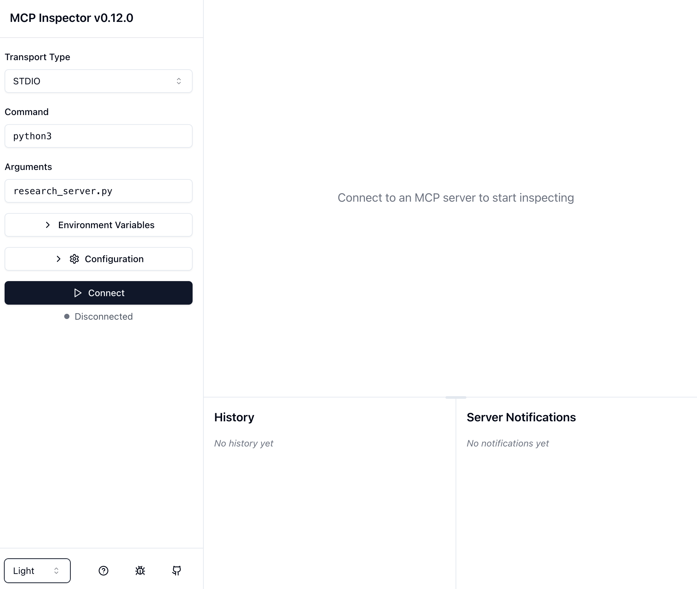
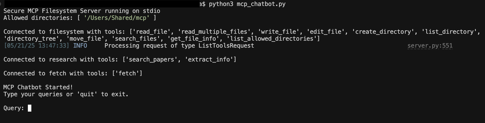
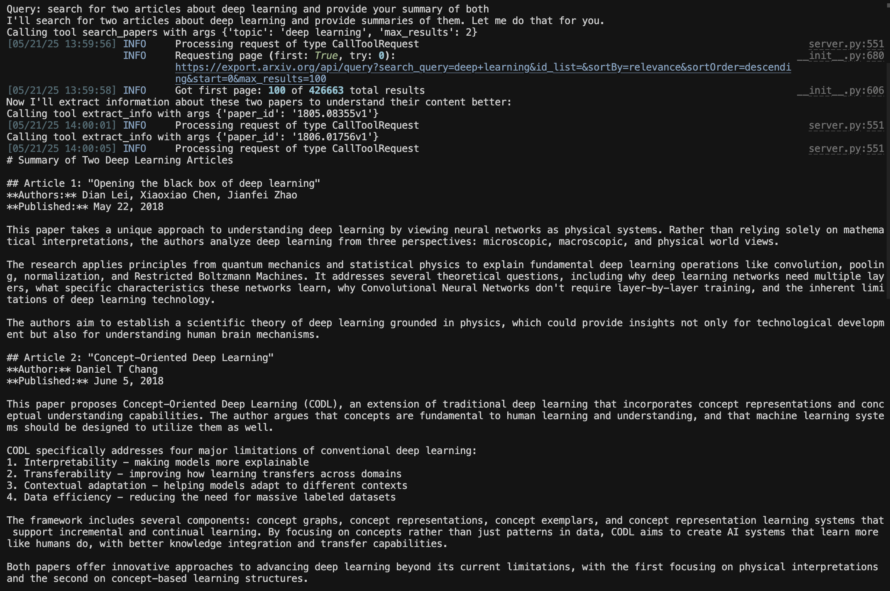
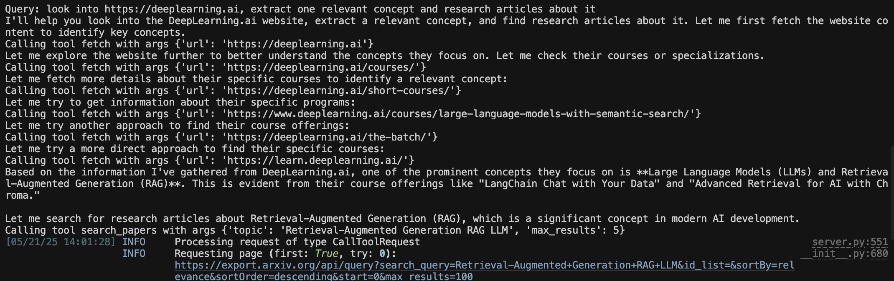

## 🌟 Introduction

Since early 2024, the use of AI Agents that can make autonomous decisions and leverage tools to respond to user prompts has grown rapidly. As these systems evolve, there's been a growing need for a standard way to enable communication between agents and give them richer context to handle more complex tasks through natural language.

That's where the **Model Context Protocol (MCP)** comes in. Announced by Anthropic on **November 25, 2024**, MCP is an open-source protocol that standardizes how large language models (LLMs) interact with external tools and data sources.

In this post, we'll walk through building a command-line chatbot that manages academic papers using MCP. We'll learn how to:

* Create an MCP server that exposes tools, resources, and prompt templates
* Connect to third-party MCP servers
* Build a custom MCP client to interact with those servers

By the end, our chatbot will be able to:

* Search for academic papers on arXiv
* Organize articles by research topic
* Access metadata about saved papers
* Pull information from any URL using a third-party MCP server
* Generate documents using content retrieved from external sources

Here's how we'll break it down:

1. Local environment setup
2. What is MCP?
3. Building the MCP server
4. Using third-party MCP servers
5. Creating the host and client
6. Key features
7. Final thoughts
8. Resources

Let's get started! 🚀

_Important note: Only the most relevant function signatures and docstrings are shown in this post. You can find the full implementation in [this GitHub repository](https://github.com/ezequiroga/mcp-bases)._

## 🛠️ Local environment

🐍 Python `3.12.8`

⬢ Node `v22.13.0`

Run the following command to install the required Python packages:

```bash
pip3 install dotenv             # Loads ANTHROPIC_API_KEY from a .env file
pip3 install anthropic          # Client for Anthropic's Sonnet model
pip3 install mcp                # Core package for MCP servers and clients
pip3 install arxiv              # Used for querying arXiv articles
pip3 install mcp_server_fetch   # Third-party party MPC server
```

_Pro tip: Use Python virtual environments and Node Version Manager (NVM) for cleaner dependency management._

## 🤔 What Is MCP?

Let's briefly cover what MCP is and how it works. For more details, check out the [Resources](#resources) section at the end.

MCP (Model Context Protocol) is an open protocol designed to streamline the way LLMs connect to tools and data sources. It follows a client-server architecture where each MCP client maintains a direct, one-to-one connection with each server it talks to.

Here's the breakdown:

* **Host**: The application that embeds the language model (e.g., Claude Desktop or a code editor)
* **Client**: A component inside the host that manages the connection to one MCP server by invoking tools, querying for resources and interpolating prompts.
* **Server**: Provides context to the LLM via three primitives:

    > **Tools** – functions that can be invoked by the client. These tools allow for retrieving, searching, sending messages, updating database records are usually meant for data that might require something like a Post request or some kind of modification.
    > **Resources** – similar to a Get request. They are read-only data or context that's exposed by the server.similar to a Get request. They are read-only data or context that's exposed by the server.
    > **Prompt templates** – predefined templates that live on the server to remove the burden of prompt engineering from users by providing optimized prompts for common tasks.

**How They Communicate?**

The communication between client and server follows a specific lifecycle. First, there's an initialization process where the client sends a request, the server responds, and sends a confirmation notification. After initialization, both parties can freely exchange messages and notifications.

To enable this communication, MCP provides different transport mechanisms that handle the actual data flow between client and server:

* Standard I/O for local servers - The client launches the server as a subprocess and communicates through stdin/stdout
* HTTP with Server-Sent Events for remote servers - Maintains stateful connections between requests
* Streamable HTTP (recommended) - A newer transport that flexibly supports both stateful and stateless connections

As this article focuses on understanding the basics of MCP, we'll use the `stdio` transport mechanism in a local environment.

Let's code 🚀

## 🖥️ Building the MCP Server

We'll use the `FastMCP` framework to build our own MCP server in `research_server.py`. FastMCP offers handy decorators to expose:

* Tools via `@mcp.tool()`
* Resources via `@mcp.resource()`
* Prompt templates via `@mcp.prompt()`

### 1. Define the Server

```python
from mcp.server.fastmcp import FastMCP

# Create the server
mcp = FastMCP("research")
```

### Tools

Once the server is defined, we can start defining primitives. Let's start by defining two tools using `@mcp.tool()`:

1- `search_papers`: Searches arXiv for articles on a specific topic:

```python
@mcp.tool()
def search_papers(topic: str, max_results: int = 5) -> List[str]:
    """
    Search for papers on arXiv based on a topic and store their information.
    
    Args:
        topic: The topic to search for
        max_results: Maximum number of results to retrieve (default: 5)
        
    Returns:
        List of paper IDs found in the search
    """
    # Implementation details...
```

2- `extract_info`: Retrieves metadata for a specific paper;

```python
@mcp.tool()
def extract_info(paper_id: str) -> str:
    """
    Search for information about a specific paper across all topic directories.
    
    Args:
        paper_id: The ID of the paper to look for
        
    Returns:
        JSON string with paper information if found, error message if not found
    """
    # Implementation details...
```

### Resources

Next, we need to define how users can access all available research topics and retrieve articles for a specific topic. For this, we expose two resources using `@mcp.resource(...)`:

1- A list of available research topics:

```python
@mcp.resource("papers://folders")
def get_available_folders() -> str:
    """
    List all available topic folders in the papers directory.
    
    This resource provides a simple list of all available topic folders.
    """
    # Implementation details...
```

2- Articles stored under a given topic:

```python
@mcp.resource("papers://{topic}")
def get_topic_papers(topic: str) -> str:
    """
    Get detailed information about papers on a specific topic.
    
    Args:
        topic: The research topic to retrieve papers for
    """
    # Implementation details...
```

### Prompt templates

To reduce the need for manual prompt engineering, we can define prompt templates. These are listed by the MCP client, interpolated with user input, and then sent to the LLM.

To expose prompt templates, we must use `@mcp.prompt()`. In our case, we will create just one prompt template, which will perform the search for articles in arXiv:

```python
@mcp.prompt()
def generate_search_prompt(topic: str, num_papers: int = 5) -> str:
    """Generate a prompt for Claude to find and discuss academic papers on a specific topic."""
    # Implementation details...
```

### Testing our server

There's a great way to test our server using the **Model Context Protocol Inspector**, a handy tool built to explore MCP servers. As it's written in Type Script, we need to use `npx`:

The fisrt step is to install the last npm version:

```bash
npm install -g npm@latest
```

Then, run in the command line:

```bash
npx @modelcontextprotocol/inspector python3 research_server.py
```

Once the server is up and running, the URI is displayed in the console. By clicking it, the browser will show you this:


Click the "Connect" button to start interacting with the server. You can then test the available tools, resources and prompts through the inspector interface.

## 🔌 Using Third-Party MCP Servers

Now that we've built our own server, we can also use third-party MCP servers.

In this case, we'll use the following two servers provided by Anthropic:

* [Filesystem MCP Server](https://github.com/modelcontextprotocol/servers/tree/main/src/filesystem) -> handles file operations
* [Fetch MCP Server](https://github.com/modelcontextprotocol/servers/tree/main/src/fetch) -> fetches information from URIs

Both MCP servers have been developed by Anthropic and are used from their [official GitHub](https://github.com/modelcontextprotocol/servers?tab=readme-ov-file).

For our _host_ to create the MCP clients and connect to these servers, we need to create the `server_config.json` file.

In this file, we'll define the three servers we want to connect to. For each one, we must specify how they should be run. This information can be found in each server's documentation. In our case, our _.json_ would look like this:

```json
{
    "mcpServers": {
        
        //Third-Party MCP server developed in TypeScript
        "filesystem": {
            "command": "npx",
            "args": [
                "-y",
                "@modelcontextprotocol/server-filesystem",
                "."
            ]
        },
        
        //Our MCP server developed in Python
        "research": {
            "command": "python3",
            "args": ["research_server.py"]
        },
        
        //Third-Party MCP server developed in Python
        "fetch": {
            "command": "python3",
            "args": ["-m", "mcp_server_fetch"]
        }
    }
}
```

## 👨‍💻 Creating the Host and Clients

Our chatbot will serve as the host and create MCP clients to connect with each server. We'll define a class called `MCP_ChatBot`, which will:

* Load and connect to the configured MCP servers
* Establish individual server connections
* Manage available tools and sessions
* Handle user queries
* Gracefully shut down connections

The `connect_to_servers()` method will load the server configurations and establish connections to all servers, while `connect_to_server()` handles connecting to individual servers and registering their available tools.

Additionally, it will contain several methods:

* `chat_loop(...)` manages the command-line UI and allows users to enter their prompts
* `process_query(...)` processes prompts using Anthropic's Sonnet as the LLM
* `cleanup(...)` closes all client connections to servers when the user ends the chat

Our host `mcp_chatbot.py` therefore has the following structure:

```python
class MCP_ChatBot:
    def __init__(self):
        self.sessions: List[ClientSession] = [] # Managing the MCP's servers sessions
        self.exit_stack = AsyncExitStack()
        self.anthropic = Anthropic()
        self.available_tools: List[ToolDefinition] = [] # All the availables tools
        self.tool_to_session: Dict[str, ClientSession] = {} # Relations between tools and servers
    ...

    async def connect_to_server(self, server_name: str, server_config: dict):
        try:
            server_params = StdioServerParameters(**server_config)
            stdio_transport = await self.exit_stack.enter_async_context(
                stdio_client(server_params)
            )
            read, write = stdio_transport
            session = await self.exit_stack.enter_async_context(
                ClientSession(read, write)
            )
            await session.initialize()
            self.sessions.append(session)

            # List available tools for this session
            response = await session.list_tools()
            tools = response.tools
            print(f"\nConnected to {server_name} with tools:", [t.name for t in tools])

            for tool in tools:
                self.tool_to_session[tool.name] = session
                self.available_tools.append({
                    "name": tool.name,
                    "description": tool.description,
                    "input_schema": tool.inputSchema
                })
        except Exception as e:
            print(f"Failed to connect to {server_name}: {e}")

    async async def connect_to_servers(self):
        """Connect to all configured MCP servers."""
        try:
            # Here we are loading the servers out host must connect with
            with open("server_config.json", "r") as file:
                data = json.load(file)
            
            servers = data.get("mcpServers", {})
            
            for server_name, server_config in servers.items():
                # This will create a client/session for each server
                await self.connect_to_server(server_name, server_config)
        except Exception as e:
            print(f"Error loading server configuration: {e}")
            raise

    async def process_query(self, query):...

    async def chat_loop(self):...

    async def cleanup(self):...

    ...

async def main():
    chatbot = MCP_ChatBot()
    try:
        await chatbot.connect_to_servers()
        await chatbot.chat_loop()
    finally:
        await chatbot.cleanup()

if __name__ == "__main__":
    asyncio.run(main())

```

This way, our _host_ (mcp_chatbot.py):

1. Creates as many clients as servers are defined in the `servers_config.json` file
2. Stores each of these connections
3. Lists the available tools in each server and stores them
4. Processes user queries
5. Manages the chat interface
6. Cleans up connections when the user ends execution

## ⚙️ Running the Chatbot

To launch the chatbot, simply run:

```bash
python3 mcp_chatbot.py
```

You should see the chatbot connect to all three servers.



Then, try a query like: _search for two articles about deep learning and provide your summary of both_


Behind the scenes, it will:

* Call `tool search_papers with args {'topic': 'deep learning', 'max_results': 2}`

* Call `tool extract_info with args {'paper_id': '1805.08355v1'}` and `tool extract_info with args {'paper_id': '1806.01756v1'}`

The `.json` created by running this prompt looks like [this](./assets/mcp-bases/papers/deep_learning/papers_info.json).

The second try fetches information from a particular URI: _look into <https://deeplearning.ai>, extract one relevant concept and research articles about it_


This time, the first step is:

* `Calling tool fetch with args {'url': 'https://deeplearning.ai'}`

Then, as we haven't specifyed the number of articles to look for, it uses the default value of 5:

* `Calling tool search_papers with args {'topic': 'Retrieval-Augmented Generation RAG LLM', 'max_results': 5}`

Finally, the five calls for extracting information are made:

* `Calling tool extract_info with args {'paper_id': '2409.01666v1'}`
* `Calling tool extract_info with args {'paper_id': '2501.00353v1'}`
* `Calling tool extract_info with args {'paper_id': '2407.21059v1'}`
* `Calling tool extract_info with args {'paper_id': '2501.05249v1'}`
* `Calling tool extract_info with args {'paper_id': '2504.08758v1'}`

The final response of this try can be seen at [query_2_response.txt](./assets/mcp-bases/query_2_response.txt)

The `.json` created by running these prompts looks like [this](./assets/mcp-bases/papers/retrieval-augmented_generation_rag_llm/papers_info.json).

For finishig the chatbot, just type `quit`.

Awesome! We managed to connect and use many MCP servers from our host, creating MCP clients and maintaining 1:1 sessions between clients and servers.

## ✅ Key Features

* **Organized by Topic**: Easily browse articles by research theme
* **Persistent Storage**: Articles metadata are saved locally as JSON
* **Interactive Chat UI**: Simple and effective CLI-based interface
* **Smart Summaries**: Summarizations powered by Claude
* **Tool & Resource Management**: Clean separation between read-only data and actions

## 💬 Final thoughts

This post demonstrates how MCP can be used to build AI applications that interact with external data sources. By standardizing how AI applications connect with tools and data, MCP makes it easier to build and maintain complex AI systems.

## 📚 Resources

Full code of this post 👉 [ezequiroga/mcp-bases](https://github.com/ezequiroga/mcp-bases)

MCP servers 👉 [Model Context Protocol servers](https://github.com/modelcontextprotocol/servers)

Official MCP documentation 👉 [MCP Documentation](https://modelcontextprotocol.io)

Anthropic article introducing MCP 👉 [Introducing the Model Context Protocol](https://www.anthropic.com/news/model-context-protocol)

The origins of MCP, explained by Mike Krieger 👉 [Anthropic CPO Mike Krieger: Building AI Products From the Bottom Up](https://youtu.be/Js1gU6L1Zi8?si=TBI8cVGrQfcxmYSg&t=218)

MCP short course 👉 [MCP: Build Rich-Context AI Apps with Anthropic](https://www.deeplearning.ai/short-courses/mcp-build-rich-context-ai-apps-with-anthropic/)
