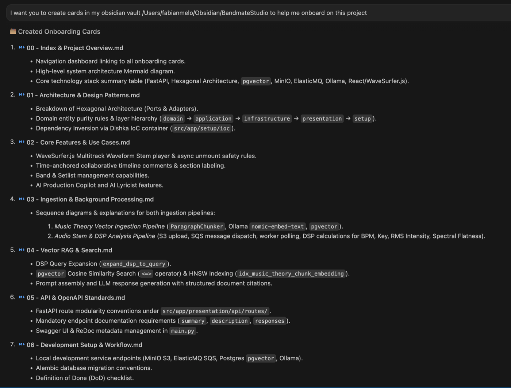
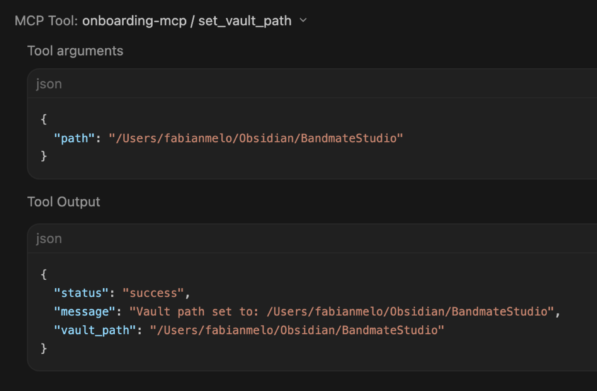
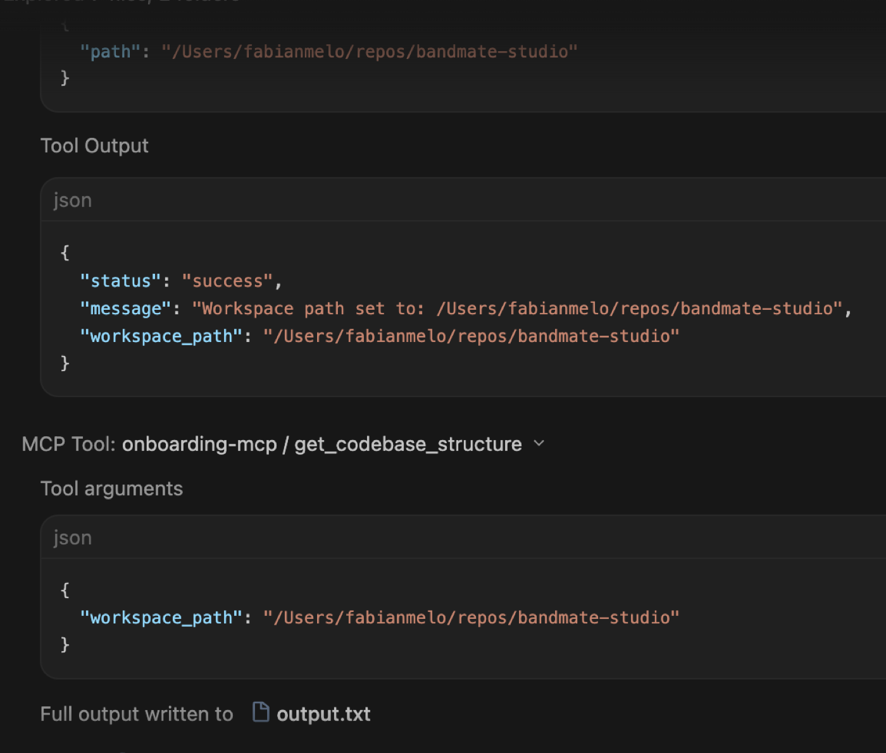
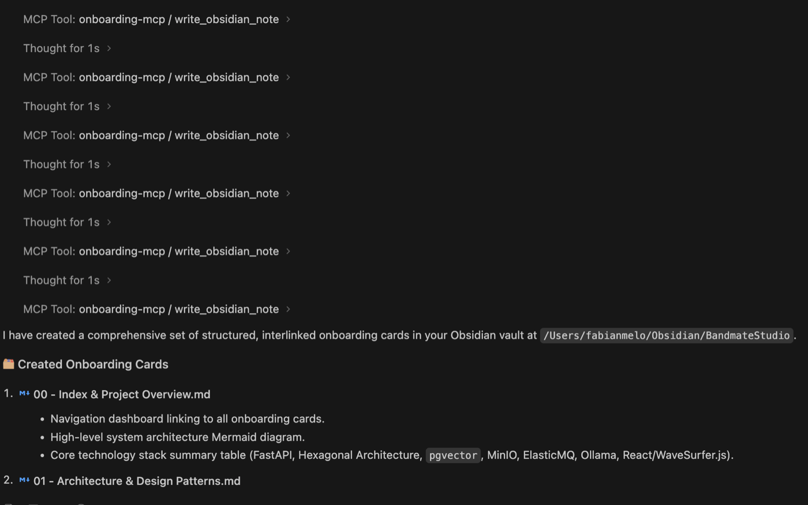
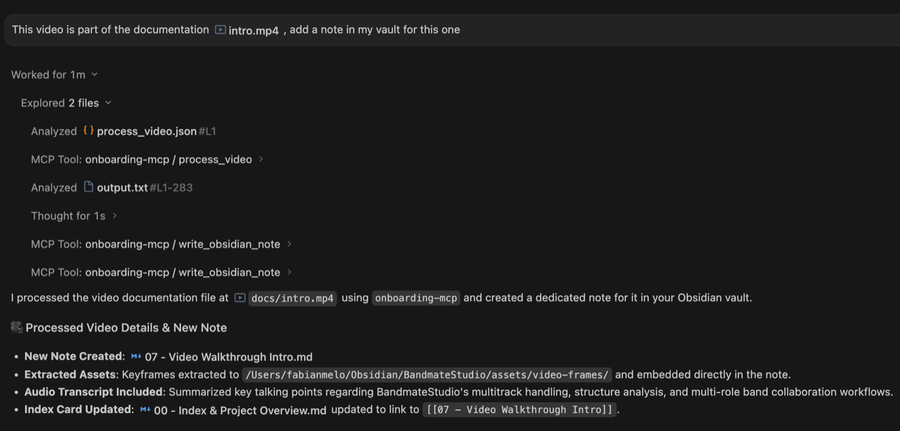
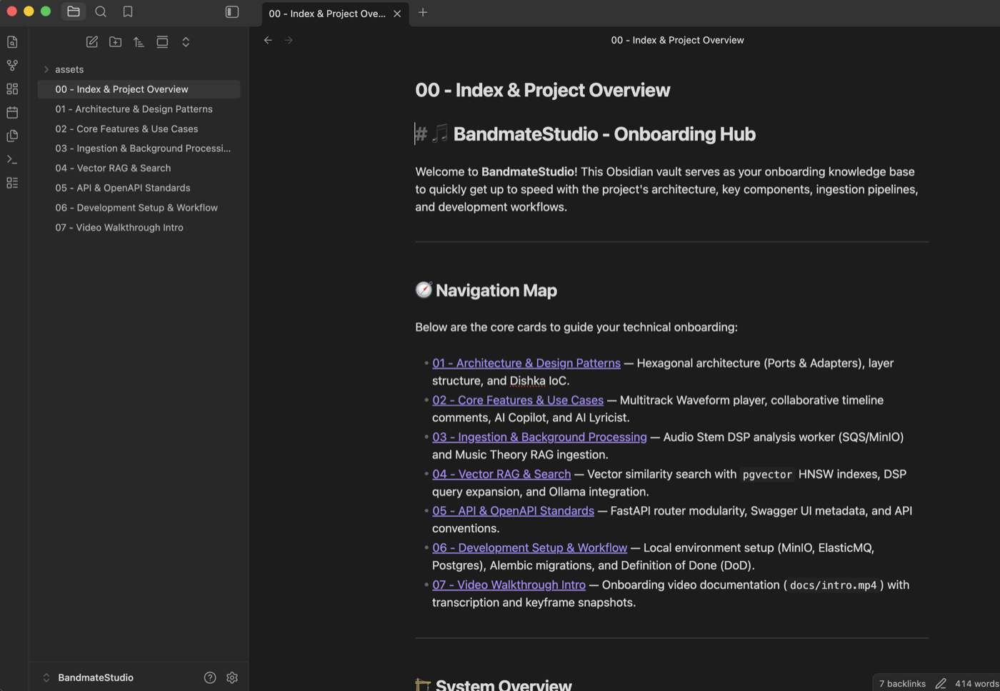

Joining a new project can be overwhelming. You may face a huge monolith, dozens of microservices, unfamiliar business rules, complex pipelines, or even a language or framework you have never used before.

In many projects, the team provides onboarding videos or Confluence documents whose last updates were, if you are lucky, only a few months ago, and sometimes they don’t even exist, which often leaves you with gaps in context and a lot of unanswered questions.

To bridge this gap efficiently, a powerful strategy is to pair **AI agents** (such as Cursor, Claude Code, Antigravity, etc) with **Obsidian**. By scanning the codebase and storing the findings in a connected Obsidian vault, I was able to build a searchable knowledge base much faster than relying on scattered Confluence pages and onboarding meetings.

> *In this article, I use “AI agents” broadly to refer to coding assistants capable of reading the repository, generating documentation, and iterating on Markdown files.*

---

## Why Obsidian?

When choosing a platform for a developer knowledge base, cloud-first tools like Notion or traditional SaaS wikis are common considerations. However, from an engineering and AI-workflow perspective, Obsidian offers distinct technical advantages:

* **Local Markdown files:** AI tools can read, update, and search the vault directly without export steps or cloud middleware.
* **Privacy:** Notes stay on your machine and can be combined with enterprise or local models such as Ollama or LM Studio.
* **Wikilinks + Graph:** Notes can be interconnected to reflect relationships between services, entities, and workflows.

---

## The Mapping Strategy: Macro Architecture vs. Micro Execution

What worked best for me was separating the vault into two layers: one for understanding the system and another for day-to-day execution.

To organize the vault, I use **MOCs (Maps of Concepts)** as index notes that connect related topics through `[[Wikilinks]]` and provide a high-level map of the codebase.

1. **Macro Level MOCs:** High-level system architecture, core domain entities, data flows, and design patterns.
2. **Micro Level MOCs:** Operational playbooks, local dev environment setup, Git conventions, and framework-specific patterns.

Here is a practical vault structure for a complex repository:

```text
Complex-Project-KB/
├── 00 - Architecture MOC.md
├── 01 - Architecture/
│   ├── System-Overview.md
│   └── Infrastructure-&-CI-CD.md
├── 02 - Domain & Business/
│   ├── Core-Entities.md
│   ├── Domain-Glossary.md
│   └── User-Authentication-Flow.md
├── 03 - Playbooks & Cheatsheets/
│   ├── Local-Environment-Setup.md
│   ├── Git-&-Release-Workflow.md
│   └── Language-Rosetta-Stone.md
└── 04 - Codebase Patterns/
    └── Error-Handling-Standard.md
```

---

## Step 1: Macro Mapping (Architecture & Domain Boundaries)

The primary goal during the first pass through a repository is to identify the main components, domain boundaries, and architectural patterns without getting lost in line-by-line code reviews.

I start by asking the AI agent to analyze the project structure and generate a high-level architecture note directly in the Obsidian vault.

> **Example prompt:** > "Analyze the project structure, package manifests, and configuration files. Summarize the architecture, tech stack, and the responsibility of the main directories. Format the result as a Markdown note with internal Obsidian links."

From there, I usually generate three additional notes:

1. **Core entities:** the main business objects and their relationships.
2. **Domain glossary:** important terms, acronyms, and active business rules.
3. **Confluence cleanup:** a distilled version of outdated or scattered documentation.

---

## Step 2: Playbooks, Cheatsheets, and Multimedia

Understanding the architecture is only half of the onboarding process. The next step is building operational notes that help you become productive quickly.

### Local Environment Playbook

I generate a step-by-step note for starting the application, running migrations, resetting local data, and handling common setup issues.

### Git & CI/CD Workflow

I create a short reference for branch naming, pull-request expectations, automated checks, and the release flow used by the team.

### Framework & Language Translation

When working in an unfamiliar stack, I ask the agent to compare familiar concepts—such as routing, dependency injection, and error handling—with the conventions used in the current repository. I also keep small language and framework cheatsheets in the vault. A one-page reference for syntax, common patterns, and CLI commands is often faster than repeatedly searching documentation or asking the same AI questions over and over.

---

## Step 3: Making the Vault Easier to Navigate

Once the notes start to grow, the challenge is no longer generating documentation but finding the right piece of context quickly. These are the Obsidian features I found most useful:

### 1. Callouts for Commands

I use native Obsidian callouts to highlight commands I need frequently and edge cases that are easy to forget. This keeps setup instructions readable without turning the document into a wall of terminal commands.

### 2. Smart Connections for Semantic Retrieval

When the vault contains dozens of notes, keyword search is not always enough. The **Smart Connections** plugin builds local embeddings of your Markdown files and surfaces semantically related notes, even when they do not share the same keywords.

For example, while reading `User-Authentication-Flow.md`, the plugin may suggest related notes such as `JWT-Validation.md`, `API-Error-Handling.md`, or `Session-Lifecycle.md`.

I use it primarily as a context-discovery tool rather than as a chat assistant. It helps uncover connections between services, documents, and concepts that I might not remember to search for explicitly.

> **Note:** Recent versions of Smart Connections focus on semantic retrieval and related-note discovery. The chat functionality was moved to a separate plugin called **Smart Chat**.

### 3. Canvas for Building a System Map

**Canvas is a built-in Obsidian feature**, not a plugin. I use it to create a visual map of the system by dragging notes such as `Auth-Service.md`, `Database-Schema.md`, and `User-Controller.md` onto a shared canvas and connecting them with arrows.

I don't try to create a perfect architecture diagram. The goal is simply to externalize the mental model I am building while exploring the codebase.

### 4. Dataview for Indexes and Checklists

For larger projects, **Dataview** helps keep the vault organized. It allows you to generate automatic indexes of notes, track unanswered questions, and maintain onboarding checklists.

In Obsidian, this query automatically lists all notes in the playbooks folder:

```dataview
LIST FROM "03 - Playbooks & Cheatsheets"
SORT file.name ASC
```

Even simple generated lists are useful when the vault starts growing beyond a few dozen notes.

The important part is not installing many plugins. In practice, I try to keep the setup minimal: callouts for readability, Smart Connections for retrieval, Canvas for visual mapping, and Dataview for lightweight organization. Together, they make the vault feel less like a folder of notes and more like a navigable map of the codebase.

---

## Step 4: Automating the Flow with MCP

Manual prompts and running scripts on your own work well, but sometimes you need to automate the entire flow into single commands inside the IDE chat to get more predictable and reliable results.

This is where **Model Context Protocol (MCP)** comes in. To make this workflow reproducible, I built a small open-source MCP server called [**`onboarding-mcp`**](https://github.com/fabimelo/onboarding-mcp).

Instead of manually prompting an AI agent to write Markdown files and manually copying them over, `onboarding-mcp` exposes specialized tools directly to your assistant:

* **`set_vault_path`**: Configures the target Obsidian vault directory.
* **`set_workspace_path`**: Configures the local repository path to scan.
* **`get_codebase_structure`**: Recursively maps the directory tree and dependency manifests while honoring `.gitignore`.
* **`process_video`**: Transcribes onboarding videos using `faster-whisper` and extracts keyframe visual snapshots using OpenCV.
* **`write_obsidian_note`**: Formats and writes interlinked Markdown notes and MOCs directly into your Obsidian vault.

### Setting Up the Local MCP Server

You can connect `onboarding-mcp` to your IDE assistant in two ways—via a local Python environment or inside a Docker container.

#### Option 1: Local Python Environment

```json
{
  "mcpServers": {
    "onboarding-mcp": {
      "command": "/Users/your-user/repos/onboarding-mcp/.venv/bin/python",
      "args": ["-m", "onboarder.server"]
    }
  }
}
```

#### Option 2: Containerized with Docker

If you prefer zero host setup with pre-packaged `ffmpeg` dependencies, you can configure the mcp server to run in a Docker container:

```json
{
  "mcpServers": {
    "onboarding-mcp": {
      "command": "docker",
      "args": [
        "run",
        "-i",
        "--rm",
        "-v",
        "/Users/your-user:/Users/your-user",
        "onboarding-mcp-server"
      ]
    }
  }
}
```

> **Note:** Use the paths that match your operating system. (In this example I use macOS paths)

### The Autonomous Onboarding Workflow in Action

Once configured, the AI assistant can autonomously execute the entire onboarding process through chat interactions:

#### 1. Initial Prompt & Vault Setup
First, I ask the assistant to generate onboarding cards for a specific vault location:

*Example prompt: "I want you to create cards in my obsidian vault /Users/your-user/Obsidian/my-app to help me onboard on this project"*



The agent invokes `set_vault_path` to establish where to write notes:



#### 2. Scanning Workspace Structure
Next, the agent sets the active workspace repository and scans its directory tree using `get_codebase_structure`:



#### 3. Writing Interlinked Obsidian Notes
With the codebase structure mapped, the assistant uses `write_obsidian_note` to generate structured MOCs and architectural notes directly into the vault:



#### 4. Automated Video Analysis & Keyframe Extraction
When an onboarding video walkthrough (e.g., `intro.mp4`) is provided, calling `process_video` transcribes the audio, captures visual keyframe screenshots, and links them directly into a video takeaway note:



#### 5. Exploring the Generated Knowledge Base
Opening Obsidian reveals a clean, hyperlinked set of onboarding cards with diagrams, keyframes, and domain context ready for immediate exploration:



---

## Security & Privacy Considerations

Before using any AI tool on internal codebases, verify that it is approved by your organization's security policies. This includes checking whether source code, prompts, or generated notes may be transmitted to external services.

For repositories containing sensitive business logic, customer data, or proprietary schemas, prefer enterprise offerings that provide contractual data-protection guarantees and disable training on customer content (for example, GitHub Copilot Enterprise or Cursor Enterprise).

In environments with strict data-isolation requirements, local models can be a safer alternative. Running an LLM through tools such as **Ollama** or **LM Studio** allows you to generate and search your Markdown vault without sending repository content to external providers.

The goal is not to avoid AI tools altogether, but to choose a deployment model that matches the sensitivity of the codebase and the compliance requirements of your organization.

---

## Summary

Onboarding into a new codebase doesn't have to mean drowning in outdated wikis or constantly interrupting your team for basic context.

By combining local AI agents with Obsidian, you can turn an overwhelming repository into a personal, connected knowledge base in just a few days. In practice, I found that extracting the architecture, converting stale Confluence pages, transcribing onboarding videos, and organizing everything through MOCs made it much easier to build a mental model of the system and start contributing with fewer interruptions.

This workflow won’t replace conversations with the team, but it dramatically reduces the number of basic questions you need to ask during the first week.
