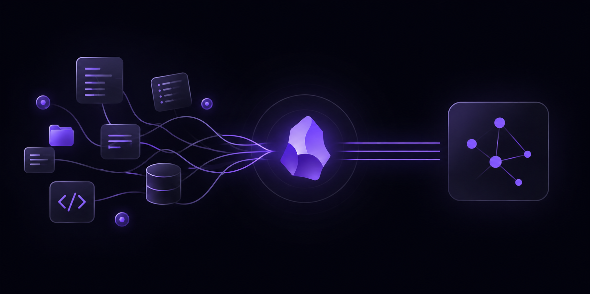

Joining a new project can be overwhelming. You may face a huge monolith, dozens of microservices, unfamiliar business rules, complex pipelines, or even a language or framework you have never used before.

In addition, the team provided you with videos or Confluence documents whose last updates were, if you are lucky, only a few months ago, and sometimes they don’t even exist, which often leaves you with gaps in context and a lot of unanswered questions.

To bridge this gap efficiently, a powerful strategy is to pair **AI agents** (such as Cursor, Claude Code, Antigravity, etc) with **Obsidian**. By scanning the codebase and storing the findings in a connected Obsidian vault, I was able to build a searchable knowledge base much faster than relying on scattered Confluence pages and onboarding meetings.

> *In this article, I use “AI agents” broadly to refer to coding assistants capable of reading the repository, generating documentation, and iterating on Markdown files.*

---

## Why Obsidian?

When choosing a platform for a developer knowledge base, cloud-first tools like Notion or traditional SaaS wikis are common considerations. However, from an engineering and AI-workflow perspective, Obsidian offers distinct technical advantages:

* **Local Plain-Text Markdown (`.md`) Files:** An Obsidian vault is simply a local directory of standard `.md` files on your hard drive. Because your notes live on the filesystem, local AI agents can read, update, and search your vault directly in real time, without requiring cloud API keys, middleware, or manual exports.
* **Privacy & Data Security:** Enterprise codebases and internal schemas contain sensitive Intellectual Property. Obsidian operates 100% offline. When paired with enterprise AI tools or local models (via Ollama or LM Studio), your architectural notes remain strictly on your machine.
* **Bi-directional Linking (`[[Wikilinks]]`) & Graph View:** Codebases are interconnected webs of services and business entities. Obsidian’s native `[[Wikilinks]]` allow your AI agent to interlink concepts dynamically (e.g., connecting `[[User-Service]]` to `[[Database-Schema]]`), generating a visual graph of system relationships.
* **Near-Zero Latency & Git Versioning:** Plain text opens instantly, works offline, and can be version-controlled effortlessly with git.

---

## The Mapping Strategy: Macro Architecture vs. Micro Execution

What worked best for me was separating the vault into two layers: one for understanding the system and another for day-to-day execution. I used **MOCs (Maps of Concepts)** to organize the vault.

In Obsidian PKM practices, a **Map of Concepts (MOC)** serves as an index hub that organizes related topics and links them together via `[[Wikilinks]]`. This gives you a top-level visual map of the entire codebase:

1. **Macro Level MOCs:** High-level system architecture, core domain entities, data flows, and design patterns.
2. **Micro Level MOCs:** Operational playbooks, local dev environment setup, Git conventions, and framework-specific patterns.

Here is a practical vault structure for a complex repository:

```text
Complex-Project-KB/
├── 00 - Architecture MOC.md
├── 01 - Architecture/
│   ├── System-Overview.md
│   └── Infrastructure-&-CI-CD.md
├── 02 - Domain & Business/
│   ├── Core-Entities.md
│   ├── Domain-Glossary.md
│   └── User-Authentication-Flow.md
├── 03 - Playbooks & Cheatsheets/
│   ├── Local-Environment-Setup.md
│   ├── Git-&-Release-Workflow.md
│   └── Language-Rosetta-Stone.md
└── 04 - Codebase Patterns/
    └── Error-Handling-Standard.md
```

---

## Step 1: Macro Mapping (Architecture & Domain Boundaries)

The primary goal during initial repository exploration is mapping main components and business rules without drowning in line-by-line code reviews.

Run targeted prompts with your AI agent from the root of the project to generate structured documentation directly inside your Obsidian vault.

### 1. Architectural Overview Prompt

> **Prompt:**  
> "Analyze the project structure, package manifests, and configuration files in this workspace. Write a Markdown summary explaining: 1) The high-level architectural pattern used (e.g., Clean Architecture, Microservices, Monolith), 2) Primary tech stack and core dependencies, 3) Overview of main directories and their responsibilities. Format with clear headers and internal Obsidian links like `[[Domain Entities]]` where relevant."

### 2. Domain Entities & Business Logic Prompt

> **Prompt:**  
> "Scan the data models, database schemas, and primary service interfaces in this codebase. Identify the core business entities and their relationships. Create a document titled `Core-Entities.md` explaining what each entity represents in the domain and how they interact."

### 3. Transforming Dense Confluence Docs into a Clean Glossary

If your team provides long, outdated Confluence pages, don't spend hours trying to read every obsolete detail. Copy-paste or export those docs into your local workspace and let your AI agent distill them:

> **Prompt:**  
> "Review these exported Confluence pages alongside the actual database schemas in the repo. Extract key domain terms, acronyms, and active business rules into a clean note titled `Domain-Glossary.md`. Filter out outdated deployment instructions and flag any discrepancies between the Confluence text and the current code."

---

## Step 2: Micro Playbooks (Operational Execution & Multimedia)

Understanding abstract architecture is crucial, but day-to-day productivity requires smooth operational execution: running local stacks, executing database migrations, and adhering to team conventions.

### 1. Local Environment Playbook

> **Prompt:**  
> "Inspect `docker-compose.yml`, `package.json` (or build scripts), and environment configs in this repository. Create a Markdown playbook titled `Local-Environment-Setup.md` detailing step-by-step terminal commands for: 1) Starting the local environment in debug mode, 2) Running and resetting database migrations, 3) Solutions for common setup edge cases (e.g., port conflicts, container resets)."

### 2. Git & CI/CD Release Workflow

> **Prompt:**  
> "Examine `.github/workflows`, pre-commit hooks, and recent commit patterns in this repository. Write a reference guide detailing the exact workflow a developer must follow from creating a feature branch to passing automated checks and opening a Pull Request."

### 3. Framework & Language Translation

When stepping into a project that uses a language or stack outside your primary expertise, ask the agent to map familiar concepts to the codebase's specific conventions.

I also keep small language and framework cheatsheets in the vault. When I need to become productive in an unfamiliar stack, having a one-page reference for syntax, common patterns, and CLI commands is often faster than repeatedly searching documentation or asking an AI assistant the same questions.

> **Prompt:**  
> "Analyze how HTTP routing, dependency injection, and error handling are implemented in this repository. Write a guide comparing how these concepts are structured in Node.js/TypeScript vs how they are implemented here, including real code snippets from the repo."

### 4. Transcribing Onboarding Videos into Vault Notes

Teams often record 1-hour onboarding sessions or architecture walk-throughs. Re-watching long recordings just to find a single command is inefficient.

You can transcribe the video audio locally using a Python script with `faster-whisper`:

```python
from faster_whisper import WhisperModel

video = "video.mp4"
model = WhisperModel("small", device="cpu", compute_type="int8")

segments, info = model.transcribe(video, beam_size=5)

def srt_time(seconds):
    h = int(seconds // 3600)
    m = int((seconds % 3600) // 60)
    s = int(seconds % 60)
    ms = int((seconds - int(seconds)) * 1000)
    return f"{h:02}:{m:02}:{s:02},{ms:03}"

with open("output.srt", "w", encoding="utf-8") as f:
    for i, seg in enumerate(segments, 1):
        f.write(f"{i}\n")
        f.write(f"{srt_time(seg.start)} --> {srt_time(seg.end)}\n")
        f.write(seg.text.strip() + "\n\n")

print("Saved output.srt")
```

Once you generate the transcript file, feed it to your AI agent to extract quick reference notes directly into your vault:

> **Prompt:**  
> "Analyze this transcript from our team's architecture walkthrough video. Extract key technical decisions, environment setup commands mentioned by the speaker, and architectural trade-offs into a structured note titled `Architecture-Video-Takeaways.md`."

---

## Step 3: Making the Vault Easier to Navigate

Once the notes start to grow, the challenge is no longer generating documentation but finding the right piece of context quickly. These are the Obsidian features I found most useful:

### 1. Callouts for Commands

I use native Obsidian callouts to highlight commands I need frequently and edge cases that are easy to forget. This keeps setup instructions readable without turning the document into a wall of terminal commands.

```markdown
> [!tip] Quick Start
> Run backend with local debug tracing enabled:
> `pnpm run dev --filter @service/core --debug`

> [!warning] Database Connection Reset
> If Postgres fails to accept local connections after a reset:
> `docker compose down -v && docker compose up -d`
```

### 2. Smart Connections for Semantic Retrieval

When the vault contains dozens of notes, keyword search is not always enough. The **Smart Connections** plugin builds local embeddings of your Markdown files and surfaces semantically related notes, even when they do not share the same keywords.

For example, while reading `User-Authentication-Flow.md`, the plugin may suggest related notes such as `JWT-Validation.md`, `API-Error-Handling.md`, or `Session-Lifecycle.md`.

I use it primarily as a context-discovery tool rather than as a chat assistant. It helps uncover connections between services, documents, and concepts that I might not remember to search for explicitly.

> **Note:** Recent versions of Smart Connections focus on semantic retrieval and related-note discovery. The chat functionality was moved to a separate plugin called **Smart Chat**.

### 3. Canvas for Building a System Map

**Canvas is a built-in Obsidian feature**, not a plugin. I use it to create a visual map of the system by dragging notes such as `Auth-Service.md`, `Database-Schema.md`, and `User-Controller.md` onto a shared canvas and connecting them with arrows.

I don't try to create a perfect architecture diagram. The goal is simply to externalize the mental model I am building while exploring the codebase.

### 4. Dataview for Indexes and Checklists

For larger projects, **Dataview** helps keep the vault organized. I use it to generate automatic indexes of notes, track unanswered questions, and maintain onboarding checklists.

In Obsidian, this query automatically lists all notes in the playbooks folder:

```dataview
LIST FROM "03 - Playbooks & Cheatsheets"
SORT file.name ASC
```

Even simple generated lists are useful when the vault starts growing beyond a few dozen notes.

The important part is not installing many plugins. In practice, I try to keep the setup minimal: callouts for readability, Smart Connections for retrieval, Canvas for visual mapping, and Dataview for lightweight organization. Together, they make the vault feel less like a folder of notes and more like a navigable map of the codebase.

---

## Security & Privacy Considerations

Before using any AI tool on internal codebases, verify that it is approved by your organization's security policies. This includes checking whether source code, prompts, or generated notes may be transmitted to external services.

For repositories containing sensitive business logic, customer data, or proprietary schemas, prefer enterprise offerings that provide contractual data-protection guarantees and disable training on customer content (for example, GitHub Copilot Enterprise or Cursor Enterprise).

In environments with strict data-isolation requirements, local models can be a safer alternative. Running an LLM through tools such as **Ollama** or **LM Studio** allows you to generate and search your Markdown vault without sending repository content to external providers.

The goal is not to avoid AI tools altogether, but to choose a deployment model that matches the sensitivity of the codebase and the compliance requirements of your organization.

---

## Summary

Onboarding into a new codebase doesn't have to mean drowning in outdated wikis or constantly interrupting your team for basic context.

By combining local AI agents with Obsidian, you can turn an overwhelming repository into a personal, connected knowledge base in just a few days. In practice, I found that extracting the architecture, converting stale Confluence pages, transcribing onboarding videos, and organizing everything through MOCs made it much easier to build a mental model of the system and start contributing with fewer interruptions.

This workflow won’t replace conversations with the team, but it dramatically reduces the number of basic questions you need to ask during the first week.
