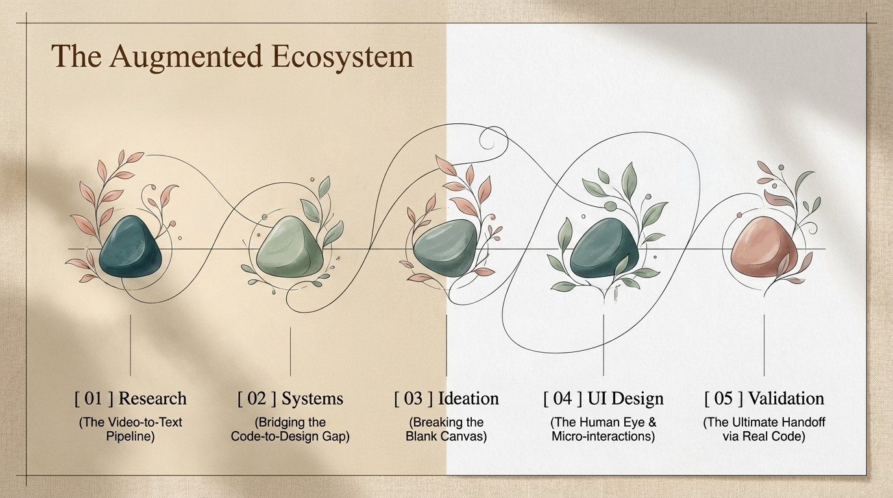
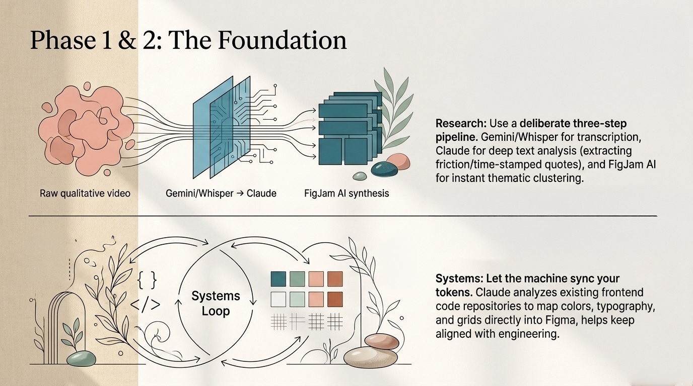
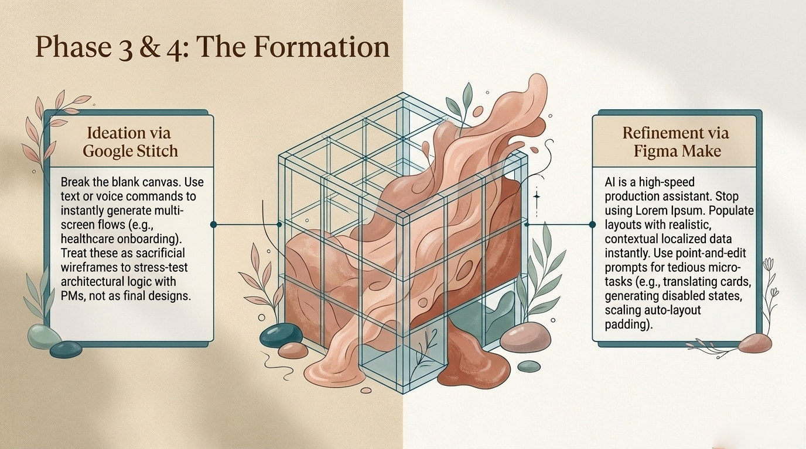
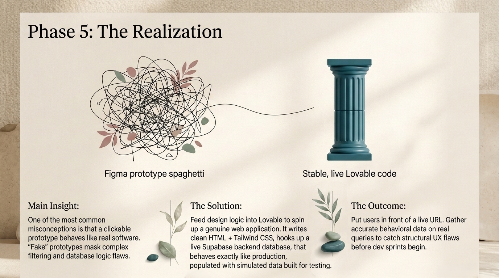

Let's be honest: the current anxiety surrounding AI in product design is completely justified. We've all seen the automated UI generators, the shifting job market, and the creeping fear that the skills we spent years perfecting are being commoditized.

If most of your daily work as a designer revolves around moving pixels, it's reasonable to feel the pressure. The craft pulls you toward execution, and the industry has always rewarded speed. AI can generate a polished dashboard layout in a few seconds.

However, looking at the situation realistically, panic won't change the direction. The survival strategy isn't to fight the automation of UI; it's to deliberately reallocate our time to the things AI still struggles with: deep human empathy, business strategy, structural logic, and critical decision-making.

The role of the designer is shifting from a mechanical builder to a product director. To survive this shift, we need to understand exactly where the current AI ecosystem fits into our workflow, not to replace our creativity, but to absorb the repetitive labor so we can focus on the hard, strategic problems.

Here is a realistic guide on implementing these instruments across every stage of the product cycle, paired with the vital warnings you must understand before diving in.

_The five phases of the workflow, from research to functional code._

## 1. UX Research & Strategy (The Video-to-Text Pipeline)

Effective design starts with understanding the user. But user testing and interviews leave you with hours of raw video footage: unstructured qualitative data that takes days to manually watch, transcribe, and tag while product managers push for immediate designs.

- The Tools: Gemini / Whisper (for transcription) + Claude (for deep text analysis) + FigJam AI (for mapping).
- The Reality: Claude cannot natively listen to video or audio files to transcribe them. If you drop a raw video recording into Claude, it will fail. You need a deliberate, three-step pipeline to extract and synthesize raw user data.

### How to make it work for you:

- Step 1a: The Transcription: Take your raw interview video file and run it through Google Gemini (via AI Studio or Advanced) or OpenAI Whisper (ideally using a local app like MacWhisper). These engines will natively parse the audio track and generate a highly accurate, time-stamped text transcript.
- Step 1b: The Core Analysis: Once you have the plain text, feed the transcript into Claude to act as your strategic sorting assistant: *"Analyze this interview transcript. Extract explicit mentions of user friction during the checkout flow, group them by severity, and pull the exact time-stamped quotes."*
- Step 1c: The Synthesis: Take those extracted pain points and drop them into FigJam. Use FigJam AI to instantly cluster hundreds of messy digital sticky notes into thematic groups, saving you hours of manual sorting.

_Turning raw video into structured insight, and code into design tokens._

## 2. Design System Definition (Bridging the Code-to-Design Gap)

A design system shouldn't just be a library of pretty components in Figma; it has to match what engineering actually deploys. Disconnects here cause endless friction and wasted development sprints.

- The Tools: Figma + Claude Design (and developer-facing tools like Claude Code).
- The Reality: Standardizing design tokens is tedious. Let the machine help sync them.

### How to make it work for you:

Advanced LLMs can inspect your engineering team's production code repositories. By utilizing Claude to analyze the existing frontend CSS/Tailwind variables, you can map your design tokens (color scales, typography, grid spacing) directly into Figma from day one, which helps keep them aligned with engineering.

Furthermore, when you need to document the design system for stakeholders who don't use Figma, Claude Design allows you to transform your system constraints into real-world business artifacts (like live documentation, interactive style guides, or presentation decks), helping the company's visual rules stay consistent across departments.

## 3. Ideation & Low-Fidelity Layouts (Breaking the Blank Canvas)

Staring at a blank canvas while trying to map out a multi-screen user flow is an energy drain. Spending hours building basic wireframes just to realize the logic is flawed is a waste of resources.

- The Tool: Google Stitch (powered by Gemini).
- The Reality: It generates generic UI, but it maps out structural logic incredibly fast.

### How to make it work for you:

Open Stitch's infinite canvas to engage in fast architectural exploration. Instead of manually drawing boxes for an onboarding flow, use text or real-time voice commands to wireframe concepts instantly:

> "Generate a 5-screen connected flow for a healthcare onboarding process, focusing on insurance intake and prescription management."

Stitch will generate a connected flow of screens. Don't consider this outcome the final design. Instead, treat it as a sacrificial wireframe and use your voice to refine the layout dynamically. (*"Remove that card, make the search bar prominent"*). You get a structural baseline to stress-test with your Product Manager before committing to high-fidelity design.

_From a blank canvas to a structural baseline ready for real UI polish._

## 4. UI Design & Refinement (The Human Eye)

This is where the automation hype usually falls short. AI can generate a generic layout, but it lacks nuance, brand identity, and the contextual understanding of micro-interactions. This is your domain.

- The Tool: Figma Make.
- The Reality: It is an accelerator for the tedious parts of UI production.

### How to make it work for you:

Bring your structural concepts into Figma and use Figma Make as a high-speed production assistant:

- Real Data: Stop using *Lorem Ipsum*. Use the tool to instantly populate lists, names, and prices with realistic, contextual localized data.
- Point-and-Edit: Select a specific component and use localized prompts for micro-tasks: *"Generate a disabled state for this button"* or *"Translate this card layout to German and automatically scale the Auto-layout padding to prevent text clipping."*

## 5. Functional Validation & Testing (The Ultimate Handoff)

One of the most common misconceptions in product design is that a clickable Figma prototype behaves like real software. Figma prototypes don't handle real database inputs or complex filtering. Testing on "fake" prototypes often leads to major UX blindspots discovered only after developers spend weeks coding it.

- The Tool: Lovable.
- The Reality: It builds real, functional code from your design logic.

### How to make it work for you:

Instead of trying to wire up 200 prototype spaghetti lines in Figma to simulate a complex search filter, feed your design logic into Lovable. Lovable spins up a genuine web application with clean frontend code (HTML + Tailwind CSS) and a live backend database (Supabase) that behaves exactly like production, populated with simulated data built for testing. It's not connected to your real systems, but it responds like the real thing: users can type actual queries, register test accounts, and break the system in real-time.

Now, put a real user in front of this live URL for your usability test. The behavioral data you gather here is accurate to software reality, allowing you to catch structural UX flaws before development begins.

_From a prototype that simulates working to an application that actually does._

Worth naming before moving on: none of these five tools talk to each other automatically. Moving data between Gemini, Claude, FigJam, Stitch, Figma Make, and Lovable is manual work, you're the one deciding what information matters and where it needs to go next. That translation layer between tools is part of the craft now, not an inconvenience waiting to be automated away.

## The Blind Spots: Where This Workflow Shatters

Relying too heavily on this workflow without critical oversight can seriously damage your product. AI operates purely on patterns, which means it has systemic blind spots worth keeping in mind:

- The "Say vs. Do" Contradiction: When synthesizing transcripts, Claude only reads what users *said*. It cannot see that a user hesitated for three minutes, sighed in frustration, or frowned while looking at a button before finally saying, *"Yeah, it looks fine."* If you skip the session videos entirely, you risk missing the behavioral cues that no transcript can capture.
- Flattening the Nuance: AI synthesis tends to average out data. It strips away the emotional subtext, sarcasm, or cultural context of a user interview, giving you a sanitized, clinical summary that might miss a breakthrough opportunity.
- Beyond the Happy Path: Tools like Lovable and Stitch tend to overlook edge cases (like slow network states, empty database returns, or accessibility scaling) unless you explicitly and exhaustively ask them to account for it.
- The Data Exposure Blind Spot: Whether it's a raw user interview or your team's production codebase, any information you upload to a public cloud LLM leaves your control the moment you hit send. Strip PII, company-confidential details, and financial figures before sending transcripts, and be just as cautious before feeding proprietary repositories into the same tools. Local, on-device transcription (like MacWhisper) is the safer default whenever the data is sensitive.
- The "Good Enough to Ship" Trap: Because Lovable's output looks and feels like real software, there's a real temptation, especially under deadline pressure, to reuse validation code as production code. Treat it as disposable, the same way you'd treat a Stitch wireframe.

## The Reality Check: Cost and Access

Let's address the elephant in the room: this workflow is premium, heavily gated, and expensive.

- Figma Make and advanced AI features require paid enterprise or premium tier seats within Figma's ecosystem.
- Google Stitch is notoriously difficult to get full access to, operating on strict, gated enterprise betas or tied deeply to premium Gemini token pricing.
- Lovable is brilliant, but it operates on a credit/token system. Building a complex app or running multiple iterations can quickly eat through free tiers, requiring robust monthly subscriptions that indie designers or small agencies might find hard to justify.

Before pitching this workflow to your leadership, you need to calculate the tooling overhead against the hours saved.

## The Realistic AI UX/UI Tooling Matrix

| Process Phase | The Tool | What It Handles (The Machine) | What You Handle (The Human) | Cost / Privacy Risk |
|---|---|---|---|---|
| 1. UX Research | Claude / FigJam AI | Transcribing, keyword tagging, sticky note clustering. | Empathy, finding the hidden narrative, strategic focus. | High privacy risk. Requires meticulous data scrubbing. |
| 2. Design System | Figma + Claude Design | Token mapping, repo syncing, documentation generation. | Defining visual constraints, brand identity, component logic. | Paid seats required for advanced repo syncing. |
| 3. Ideation | Google Stitch | Generating instant layout structures and multi-screen flows. | Critique, information architecture validation, flow logic. | Gated beta / premium. Limited universal access. |
| 4. UI Design | Figma Make | Data population, state variations, translation adjustments. | Aesthetic execution, micro-interactions, pixel refinement. | Paid subscription. Native to premium Figma plans. |
| 5. Validation | Lovable | Writing clean code, database provisioning, deployment. | Usability observation, behavioral analysis, product iteration. | Usage-based cost. Can scale in price rapidly. |

_What the machine handles, and what stays human, phase by phase._

## Conclusion: Play It Smart, Not Scared

The worry you might be feeling about AI isn't a sign to leave the industry; it's a signal to change how you work.

If you view these tools as a threat and refuse to touch them, you will eventually be outpaced by those who do. If you view them as magic solutions that will do your job for you, you will produce generic, legally vulnerable, and uninspired products that fail in the market.

Beyond the noise, tools will constantly change. Platforms mentioned here may look different or disappear in a year, while unknown ones will emerge to challenge our current workflows. This shift doesn't have to be a source of anxiety, it's simply the nature of our industry, and feeling uncertain about it is a fair response too. What remains vital is our capacity to adapt: critically evaluating what a new tool solves and integrating it without losing sight of the human problem. Thriving designers aren't necessarily those using the best tools, but those who understand and embrace change.

The sweet spot lies in using them to systematically automate execution speed, while keeping your human guardrails up regarding data privacy, cost control, and deep behavioral observation.

The nature of the design work is shifting. Whether that shift becomes an opportunity or a threat depends largely on how you choose to engage with it. Adapt the workflow… carefully.
