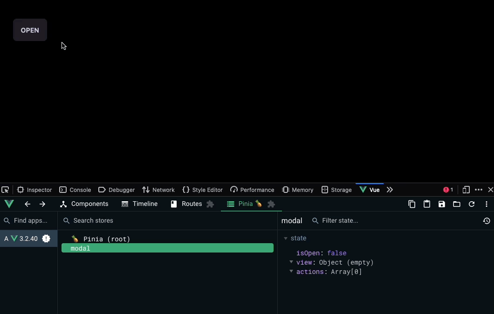

## Reusable dynamic modal on Vue 3

Most of the time on frontend development the best way to keep a consistent way of building components is to try to make them reusable every time we can, but sometimes the framework itself can make it a bit harder if we don’t have deep knowledge of its internal API, specifically the way it handle view instance and state component data.

What makes a good reusable modal?

- ✅ Dynamic views
- ✅ Customizable actions with callbacks (buttons)
- ✅ easy-peasy instantiation

For simplicity we will be using:

- [DaisyUI](https://daisyui.com) as component library ([modal](https://daisyui.com/components/modal/))
- [Pinia](https://pinia.vuejs.org/) as state management vue store
- [Vue 3](https://vuejs.org/) with the composition API [with typescript](https://vuejs.org/guide/typescript/overview.html)

Let’s start by defining a very basic modal template using daisy classes:

```html
<!-- @/components/x-modal.vue -->

<template>
  <div>
    <div class="modal modal-open">
      <div class="modal-box relative">
        <label class="btn btn-sm btn-circle absolute right-2 top-2">✕</label>
        <h1>Hey, it works 👏🏽</h1>
      </div>
    </div>
  </div>
</template>
```

To be able to access it from anywhere and render any type of view, the modal needs to be accessible from any component that wants to use it, for this reason the modal component needs to be placed on the root parent view where all the views will be rendered, assuming [Vue router](https://router.vuejs.org/) is being used:

```html
<template>
  <x-modal />
  <router-view />
</template>

<script lang="ts" setup>
  import XModal from "@/components/x-modal.vue";
</script>
```

👏🏽 You should be able to see our beautiful modal rendered!

## Setup the store (state management)

As is a reusable global modal, we need to keep _global_ track if this modal is opened or closed and also give the ability to control it from any other component, maintaining a unique instance, this is where Pinia comes in.

Lets define a new store specifically to interact with the modal:

```javascript
// @/store/modal.ts

import { markRaw } from "vue";
import { defineStore } from "pinia";

export type Modal = {
  isOpen: boolean,
  view: object,
  actions?: ModalAction[],
};

export type ModalAction = {
  label: string,
  callback: (props?: any) => void,
};

export const useModal = defineStore("modal", {
  state: (): Modal => ({
    isOpen: false,
    view: {},
    actions: [],
  }),
  actions: {
    open(view: object, actions?: ModalAction[]) {
      this.isOpen = true;
      this.actions = actions;
      // using markRaw to avoid over performance as reactive is not required
      this.view = markRaw(view);
    },
    close() {
      this.isOpen = false;
      this.view = {};
      this.actions = [];
    },
  },
});

export default useModal;
```

Now we have the store, lets connect it to our modal template to use its reactive references:

```html
<template>
  <div>
    <!-- isOpen is reactive and taken from the store, define if it is rendered or not -->
    <div v-if="isOpen" class="modal modal-open">
      <div class="modal-box relative">
        <!-- @click handles the event to close the modal calling the action directly in store -->
        <label
          class="btn btn-sm btn-circle absolute right-2 top-2"
          @click="modal.close()"
          >✕</label
        >

        <!-- dynamic components, using model to share values payload -->
        <component :is="view" v-model="model"></component>

        <div class="modal-action">
          <!-- render all actions and pass the model payload as parameter -->
          <button
            v-for="action in actions"
            class="btn"
            @click="action.callback(model)"
          >
            {{ action.label }}
          </button>
        </div>
      </div>
    </div>
  </div>
</template>

<script lang="ts" setup>
  import { reactive } from "vue";
  import { storeToRefs } from "pinia";
  import { useModal } from "@/stores";

  const modal = useModal();

  // reactive container to save the payload returned by the mounted view
  const model = reactive({});

  // convert all state properties to reactive references to be used on view
  const { isOpen, view, actions } = storeToRefs(modal);
</script>
```

> `<component>` is the way that `vue` handle dynamic components where `:is` receive the view that needs to be rendered, more info [here](https://vuejs.org/api/built-in-special-elements.html#component), it also support using the `v-model` directive to be able to share values dynamically, but how does this works?

Once we have the view mounted inside `<component>` we can make use of `v-model` to send and update reactive references emitting events from the view we are mounting, internally from the view we want to render: `emit` a `"update:modelValue"` event that will update the reference passed via `v-model` back, eg:

```html
<!-- MyViewToRender.vue -->
<script lang="ts" setup>
  import { watch } from "vue";

  // no need to import defineEmits
  const emit = defineEmits(["update:modelValue"]);

  // when someVar change, it will update the reference passed via v-model
  watch(someVar, (value) => {
    emit("update:modelValue", value);
  });
</script>
```

## Make use of the modal

To be able to control and populate data into the modal, we'll use the store defined as follow:

```html
<template>
  <div>
    <button class="btn" @click="handleOnClickOpenModal">Open</button>
  </div>
</template>

<script lang="ts" setup>
  import useModal from "@/stores/modal";
  import MyViewToRender from "@/views/MyViewToRender.vue";

  const modal = useModal();
  function handleOnClickOpenModal() {
    modal.open(MyViewToRender, [
      {
        label: "Save",
        callback: (dataFromView) => {
          console.log(dataFromView);
          // modal.close();
        },
      },
    ]);
  }
</script>
```

When an event click on the `button`, it will call `handleOnClickOpenModal` which will call the action `open` from the store, which change the `isOpen` variable from the state, and as the modal is observing this value it will render or not depending of the value as follow:

🎉 Hurra!!! you have made a reusable modal on top of composition API and pinia.



### What if we want to pass a payload to our view?

_Dependency injection is a programming technique / design pattern in which an object or function receives other objects or functions that it depends on._

Vue implement a mechanism natively to handle this pattern, this implementation is known as `Provide / Inject`, more info [here](https://vuejs.org/guide/components/provide-inject.html). A parent component can serve as a dependency provider for all its descendants. Any component in the descendant tree, regardless of how deep it is, can inject dependencies provided by components up in its parent chain. The issue with this approach is it only apples to direct descendants from parent, not parallel components and as the modal view is not strictly a child of the component invoking it, it wont work as intended.

The other way is to add another field property to the state of the modal on pinia (_payload_) and pass any reactive references from there, and then, receive that object from the view we render.

Hope it helps, cheers 🍻
