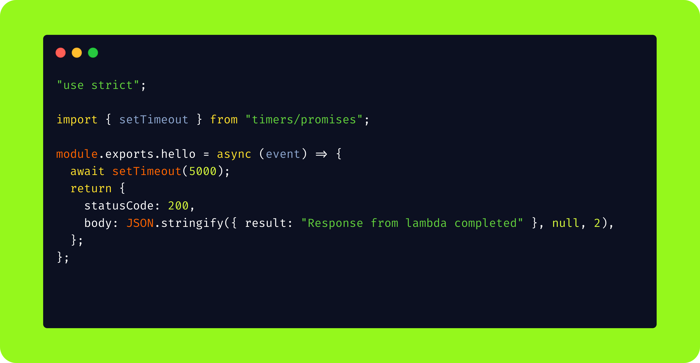
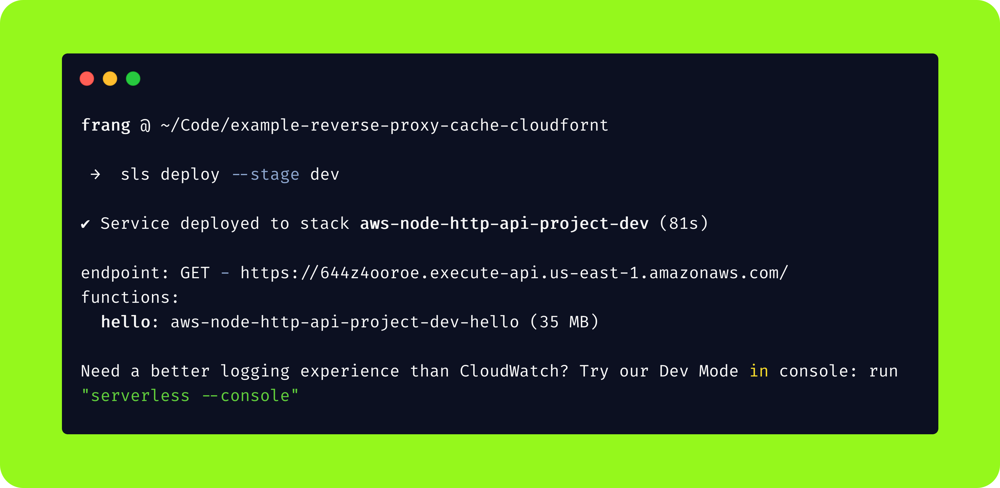
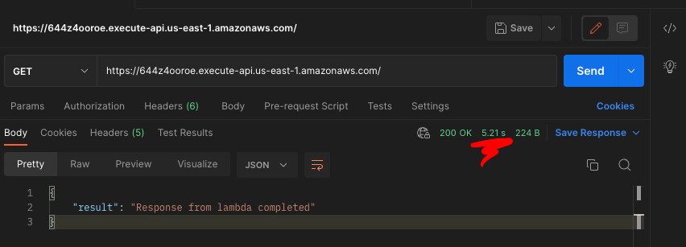
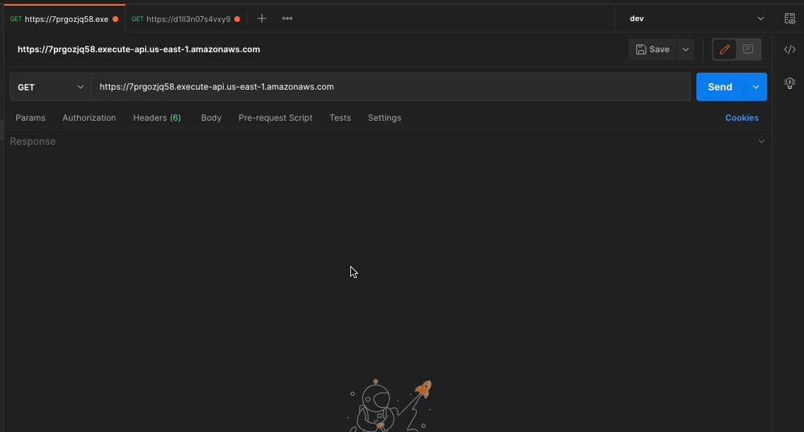

## How to implement a reverse proxy cache to any API using AWS CloudFront

> A reverse proxy is the application that sits in front of back-end applications and forwards client (e.g. browser) requests to those applications. Reverse proxies help increase scalability, performance, resilience and security. The resources returned to the client appear as if they originated from the web server itself.

[AWS CloudFront](https://docs.aws.amazon.com/AmazonCloudFront/latest/DeveloperGuide/Introduction.html) is a [CDN service](https://en.wikipedia.org/wiki/Content_delivery_network) for high performance and security convenience that offers a lot of advantages including a global edge network with a low latency and high throughput network connectivity (the one that matter to us).

One typical example where we could be needing a reverse proxy cache mechanism is when building HTTP APIs (API Gateway v2) on AWS, this type of APIs are designed with minimal features so that they can be offered at lower price, lacking options as edge optimization, support for api keys, throttling and cache, [more detailed comparison here](https://docs.aws.amazon.com/apigateway/latest/developerguide/http-api-vs-rest.html); not having support for cache means processing time load will increase on backend side on origin servers, resulting in high latency on every request.

As it turns out, CloudFront solves this problem nicely.

For simplicity we will be using [Serverless Framework v3](https://www.serverless.com/framework/docs) to handle AWS stack creation.

## Start by creating a HTTP API (_API Gateway v2_)

A very basic serverless api deployment should be working and usable to be able to configure CloudFormation distribution on top of it.

If you don't have previous experience with serverless, follow this [link](https://www.serverless.com/framework/docs/tutorial) on how to do it, just remember to select **"HTTP API"** as is the one that doesn't have cache support already built in.

Let's start by defining the type of api we need and some basic function to be able to exemplify:

```yaml
# serverless.yml

provider:
  name: aws
  # ...
  httpApi:
    name: "myapi"
    cors: true

functions:
  hello:
    handler: src/handler.hello
    events:
      - httpApi:
          path: /
          method: get
```

Regarding to what data we will be returning, lets run a process that sleep for 5 seconds to simulate some background process that "take too long" to complete using the [`Timers API`](https://nodejs.org/api/timers.html#timers-promises-api), something like this:



🎉 After a correct deployment, the api should be created successfully and ready to use.



Now that the API is live and usable, we can make request by just calling the endpoint provided:

```bash
curl --location --request GET 'https://644z4ooroe.execute-api.us-east-1.amazonaws.com/'
```

This will return the response we explicitly send back in our lambda, **BUT**, _after 5 seconds_:



> If you notice the time taken to complete the request `5.21s` is the time we setup to sleep, this time is also influenced by the spin up (known as freeze time) of lambdas, consecutive requests will decrease the time needed by the script to return data but only by a few ms.

So what happens if we cache this response not to wait those `5s` of processing time?

## Let's configure CloudFront as a reverse proxy

The process consists in creating a distribution using the API domain as origin, enabling the built-in cache inside the distribution and controlling the caching time by TTL.

Following the [Amazon CloudFront resource type reference](https://docs.aws.amazon.com/AWSCloudFormation/latest/UserGuide/AWS_CloudFront.html) we will create the distribution directly from serverless template and connect it to the previous created API as our origin.

We need to create two resources to be able to create the distribution:

- `AWS::CloudFront::CachePolicy`
- `AWS::CloudFront::Distribution`

Inside the `serverless.yml` file (at the end), let's create a new section: `resources` where we can add resources that will be created for us inside AWS by the `sls deploy` command, those resources are:

```yaml
resources:
  Resources:
    # https://docs.aws.amazon.com/AWSCloudFormation/latest/UserGuide/aws-resource-cloudfront-cachepolicy.html
    mycachepolicy:
      Type: AWS::CloudFront::CachePolicy
      Properties:
        CachePolicyConfig:
          Name: mycachepolicy
          # We can custom or TTL values below
          DefaultTTL: 86400
          MaxTTL: 86400
          MinTTL: 1
          ParametersInCacheKeyAndForwardedToOrigin:
            EnableAcceptEncodingGzip: true
            EnableAcceptEncodingBrotli: true
            CookiesConfig:
              CookieBehavior: none
            HeadersConfig:
              HeaderBehavior: none
            QueryStringsConfig:
              QueryStringBehavior: none

    # https://docs.aws.amazon.com/AWSCloudFormation/latest/UserGuide/aws-resource-cloudfront-distribution.html
    mydistribution:
      Type: AWS::CloudFront::Distribution
      Properties:
        DistributionConfig:
          Enabled: true
          Origins:
            # auto generated by serverless, also removed "http:" as is not allowed in domain name, is going to use the default API URL generated by AWS, if you have a custom api url, just replace it here
            - DomainName:
                !Select [1, !Split ["//", !GetAtt HttpApi.ApiEndpoint]]
              # this value should be moved to a custom global var instead of duplicating the same string below
              Id: mydistributiondomainid
              CustomOriginConfig:
                OriginProtocolPolicy: https-only
          DefaultCacheBehavior:
            CachePolicyId: !Ref mycachepolicy
            DefaultTTL: 300
            TargetOriginId: mydistributiondomainid
            ViewerProtocolPolicy: https-only
            # List of allowed method acceded by cache, only GET for our case
            AllowedMethods:
              - GET
              - HEAD
          # all means all edge locations (recommended)
          PriceClass: PriceClass_All
```

Dont forget to run the re-deploy to update the AWS stack with the new config, if everything works, we should be able to make request to the cloudfront URL and it will cache the responses from the origin.

⚡️ Here is the final requests, the first is to our origin, the second to cloudfront cache.



🤯 As we can see, the response time is absurd in comparison just by enabling a cache.

> Remember the very first request ([miss cloudfront](https://docs.amazonaws.cn/en_us/AmazonCloudFront/latest/DeveloperGuide/understanding-the-cache-key.html)) will have the same load time as the origin due to will populate the first time the cache.

All the code is available [here](https://github.com/frangeris/example-reverse-proxy-cache-cloudfront) if you want to test it.

Hope it helps, cheers 🍻
