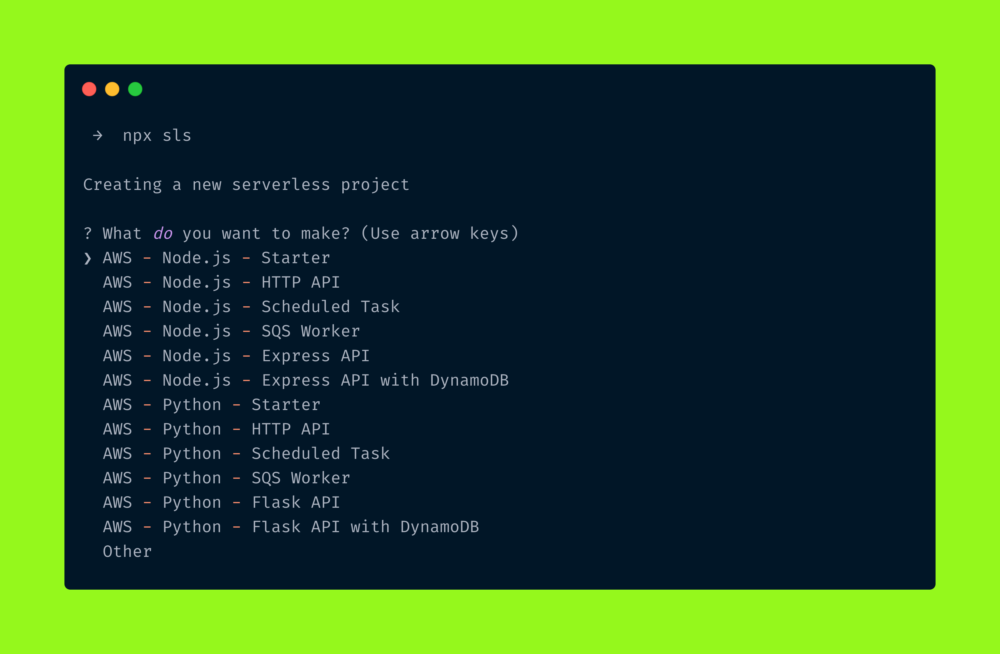
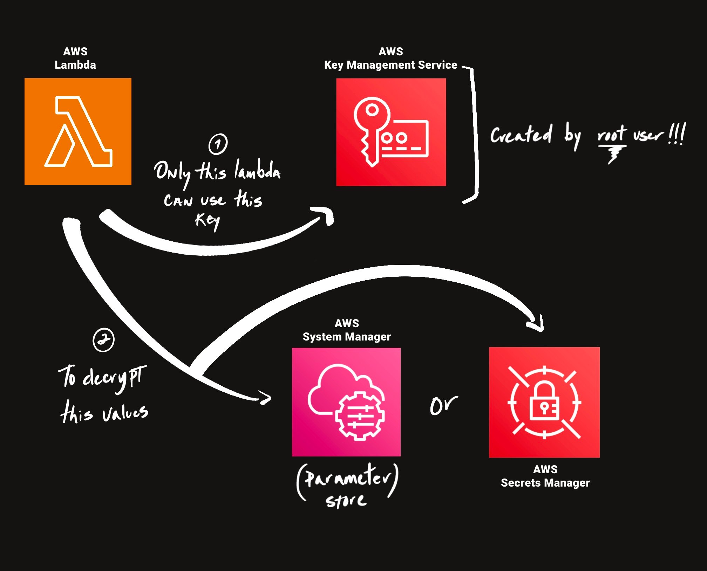

## Ensuring secure values by private keys in AWS (KMS, SSM, Secrets Manager)

Private keys, credentials access and sensitive information such as passwords or any kind of confidential data are essentials in applications logic when interacting with other services or even databases, storing those values can be risky if proper security measures are not in place.

In this post we will dig into one way to accomplish secure access to sensible information in AWS environments. For simplicity we will be using:

- A ready to use [AWS account](https://aws.amazon.com/).
- [Serverless Framework](https://www.serverless.com/framework/docs/getting-started) - to delegate the CloudFormation creation and deployment.

> This implementation focuses on the use of specifics services and functionalities provided by AWS services. Implementations will vary depending on the provider (Azure, GCP).

### Let's start by creating a basic [AWS Lambda](https://aws.amazon.com/lambda/)

This function will try to access our "secure" and use it. By using `npx` command we get access to serverless executable, select the basic to keep it simple, there are options for different types of uses cases, even different languages options in case `Node.js` is not your language:



Some operations used on the lambda function will require some permissions later. Due to this, it's recommended to include and enable those permissions before the IAM role of the lambda gets created. Here are the permissions we need the lambda to have:

```yaml
provider:
  # ...
  iam:
    role:
      statements:
        - Effect: Allow
          Action:
            - "s3:*"
          Resource: "*"
        - Effect: Allow
          Action:
            - "cloudwatch:*"
            - "logs:*"
          Resource: "*"
        - Effect: Allow
          Action:
            - "ssm:GetParameter"
            - "ssm:GetParametersByPath"
          Resource: "*"
        - Effect: Allow
          Action:
            - "secretsmanager:GetSecretValue"
          Resource: "*"
        - Effect: Allow
          Action:
            - "kms:Decrypt"
          Resource: "*"
```

Then, with your [aws account](https://docs.aws.amazon.com/cli/latest/userguide/cli-configure-files.html) already set up, let's deploy it.

```bash
npx sls deploy
```

🎉 After a correct deployment, the code should have been created successfully and be ready to use. Now we need to configure the most important part: security.

## Security

Permissions will be managed via [IAM policies](https://docs.aws.amazon.com/IAM/latest/UserGuide/access_policies.html) with the objective of _only allow the lambda to get and decrypt the secured value_. Plus, the approach used will be based on: **prevent IAM entities from accessing the KMS key and allow the root user account to manage it** (also preventing the root user account from losing access to the KMS key).

This "protection" layer of our sensitive value is based on the composition of two AWS services, [Key Management Service](https://aws.amazon.com/kms/) is the one responsible for creating the private key which will be used to encrypt our value, then [Secret Manager](https://aws.amazon.com/es/secrets-manager/) or [System Manager: Parameters Store](https://aws.amazon.com/systems-manager/), both services allows us to accomplish the same functionality but differ on some caveats, _the chosen one_ will be used for saving the secured encrypted value, here is a quick graphic representation of the implementation:



Now lets translate these concepts into code. The first thing we need after having the lambda functional and usable is to create the key used to encrypt our _precious value_...


So lets create the key using the "root" account and give it access to lambda just for `"kms:Decrypt"`, not other operations!

> Please notice how we control and specify that only a specific ARN can call this value by: `kms:CallerArn: !Sub arn:aws:lambda:region:${AWS::AccountId}:function:myfunction`

```yaml
resources:
    MyPrivateKey:
      Type: AWS::KMS::Key
      Properties:
        Description: "My KMS private key"
        KeyUsage: ENCRYPT_DECRYPT
        KeyPolicy:
          Version: "2012-10-17"
          Id: "my-key-1"
          Statement:
            - Sid: "Enable root user permissions"
              Effect: "Allow"
              Principal:
                AWS: !Sub arn:aws:iam::${AWS::AccountId}:root
              Action: "kms:*"
              Resource: "*"
            - Sid: "Allow use of the key"
              Effect: "Allow"
              Principal:
                Service: lambda.amazonaws.com
              Action:
                - "kms:Decrypt"
              Resource: !Sub arn:aws:kms:region:${AWS::AccountId}:key/my-key-1
              Condition:
                StringEquals:
                  kms:CallerArn: !Sub arn:aws:lambda:${AWS::Region}:${AWS::AccountId}:function:myfunction
    MyPrivateKeyAlias:
      Type: "AWS::KMS::Alias"
      Properties:
        AliasName: alias/myprivatekey
        TargetKeyId: !Ref MyPrivateKey
  Outputs:
    # we will need this value later
    MyKeyId:
      Value: !Ref MyPrivateKey
      Description: The ID of the KMS key used to encrypt
```

In this stage you should be able to have the lambda function and a secret key which both the root user and the lambda ARN can access and use it. Now, how about creating our encrypted values?

For simplicity I personally prefer [AWS CLI](https://aws.amazon.com/cli/) to handle the process of encrypting and saving instead of creating another lambda script that would need to use [AWS SDK](https://aws.amazon.com/sdk-for-javascript/), ending in the same result 🤷🏽

So first, we need to encrypt our secret using the previous key already created, so that even if someone is able to access the value, they will need our key to be able to see the content,

Some of the values used below are not exposed in the serverless deploy output, so those values are gotten via the _stack output_ previously defined as part of `serverless.yml`:

```bash
npx sls info --verbose
```

> --plaintext (data to be encrypted) is required to be base64 text or a blob from a plain text file

```bash
aws kms encrypt \
    --region <same region used by serverless> \
    --key-id <key id from output (MyPrivateKeyId)> \
    --plaintext "<base64 of value> or <fileb://path>" \
    --output text \
    --query CiphertextBlob
```

🎉 You should be able to get a base64 output from the command above with the encrypted value, now what next?

### Store the values

We need to save those values inside a secure service, either a AWS System Manager (using Parameter Store) or a AWS Secret Manager creating directly a key/value. Why not try both?

#### For Parameter Store

For reusability use the previous encrypted output directly with the same command, getting as result:

```bash
aws ssm put-parameter \
  --name "my-parameter-name" \
  --type "SecureString" \
  --value "$(aws kms encrypt --region us-east-1 --key-id <key id> --plaintext "<value>" --output text --query CiphertextBlob | base64 --decode)" \
  --region us-east-1
```

If everything works, you should receive a json payload like this, which means it works, and that the value was created successfully 👏🏽

> Access via AWS Systems Manager -> Parameter Store to see it.

```json
{
  "Version": 1,
  "Tier": "Standard"
}
```

#### For Secrets Manager

Secret manager use the same approach as Parameter store, but with a different command, let's see:

```bash
aws secretsmanager create-secret --name "my-secret" --secret-string "my-secret-value"
```

Running this will creates a new secret in AWS Secrets Manager with the name `my-secret` and a secret value of `my-secret-value`, if the command is successful, it will return a JSON object containing metadata about the newly created secret, including its [Amazon Resource Name (ARN)](https://docs.aws.amazon.com/IAM/latest/UserGuide/reference-arns.html), let's encrypt and send it to `secretsmanager` as follow:

```bash
aws secretsmanager create-secret --name "my-secret" --secret-string "$(aws kms encrypt --region <region> --key-id alias/myprivatekey --plaintext "<value>" --output text --query CiphertextBlob)"  --region <region>
```

🥳 Getting the following payload means it works:

```json
{
  "ARN": "arn:aws:secretsmanager:us-east-1:<account id>:secret:my-secret-j3MXy5",
  "Name": "my-secret",
  "VersionId": "<version id>"
}
```

> Access via AWS Secrets Manager -> Secrets to see it.

Now with both scenarios covered, let's move on and try to access those values from code. Going back to the lambda function, we need to update the code to get and use the value as follow but before let's make sure we can retrieve and decrypt both saved values:

Check that you are able to decrypt the values, use the command below:

```bash
# Using system manager (parameter store)
aws kms decrypt \
    --ciphertext-blob fileb://<(aws ssm get-parameter --region <region> --name "my-parameter-name" --with-decryption --query Parameter.Value --output text | base64 --decode) \
    --key-id alias/myprivatekey \
    --output text \
    --query Plaintext | base64 --decode

# For secrets manager
aws kms decrypt \
    --ciphertext-blob fileb://<(aws secretsmanager get-secret-value --region <region> --secret-id "my-secret" --query SecretString --output text | base64 --decode) \
    --key-id alias/myprivatekey \
    --output text \
    --query Plaintext | base64 --decode
```

✨ You should be able to get you real value, in our case was `my precious value` (base64 encoded at start). Here is what the test code implementation could look like:



This should be the output from logs:

```bash
START RequestId: xxxxxxx Version: $LATEST
2023-04-15T21:51:48.684Z xxxxxxx INFO from parameters store: my precious value
2023-04-15T21:51:48.684Z xxxxxxx INFO from secrets manager: my precious value
END RequestId: xxxxxxx
REPORT RequestId: xxxxxxx Duration: 255.71 ms Billed Duration: 256 ms Memory Size: 1024 MB Max Memory Used: 97 MB Init Duration: 699.66 ms
```

All the code is available [here](https://github.com/frangeris/post-secure-private-keys-using-kms) if you want to test it.

Hope it helps, cheers 🍻
