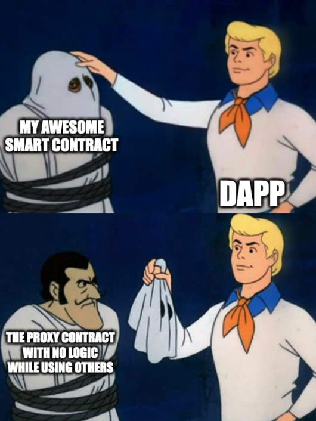
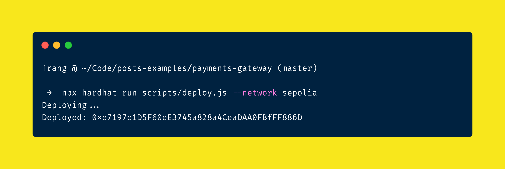

## The basis

This series assumes you have a basic understanding of the smart contracts development and the Ethereum or EVM compatible blockchains and that you also have a local development setup already working. If you are not familiar with these topics, please read the [Introduction to smart contracts](https://ethereum.org/en/smart-contracts/) to start.

One of the most popular implementations of smart contracts today is the [ERC20](https://eips.ethereum.org/EIPS/eip-20) token standard. It is a set of rules that defines how a token contract should behave. It is a standard that allows different applications to interact with the token knowing how it works. For example, a wallet application can display the balance of a token, or a decentralized exchange can trade it. The standard creates and endless possibilities of functionalities that can be built on top of it.

We are going to focus in creating a [payments gateway](https://en.wikipedia.org/wiki/Payment_gateway) by using the ERC20 standard as the basis for our tokens. This will allow us to share the implementation with other applications that support the standard interface as the popular stable coins: [USDC](https://www.circle.com/en/usdc), [USDT](https://tether.to/en/), [DAI](https://makerdao.com/en/).

### _"The immutable problem"_

The pure concept of smart contracts is that they are immutable. Once a contract is deployed, it cannot be changed. This is a great feature because it allows us to trust the code that is running in the blockchain. We can be sure that the code will not change and that it will behave as expected. This means that if we want to add new features or fix something broken inside the contracts, we need to deploy a new contract and migrate the state to the new one; this is not a problem for a new contract, but it is a big problem for an existing one with a lot of users interacting with it.

That's why the concept of "upgradeable contracts" was created. The idea is to have a contract that can be upgraded without losing the state. This is a very complex topic and there are many different approaches to it. We are going to use the [OpenZeppelin Upgrades](https://docs.openzeppelin.com/upgrades-plugins/1.x/) library to create our upgradeable contracts.

### **How the proxy pattern works?**

The secret behinds a proxy consists in a contract that provides a fallback function that delegates all calls to another contract using the EVM instruction `delegatecall`, which is a low-level function that allows calling another contract using the current contract **storage** and **context**. This means that the contract being called can access the storage of the contract that is calling it. This is the key to the proxy pattern.

Here is an example of how `delegatecall` works:

```solidity
// SPDX-License-Identifier: MIT
pragma solidity ^0.8.17;

// NOTE: Deploy this contract first
contract B {
    // NOTE: storage layout must be the same as contract A
    uint public num;
    address public sender;
    uint public value;

    function setVars(uint _num) public payable {
        num = _num;
        sender = msg.sender;
        value = msg.value;
    }
}

contract A {
    uint public num;
    address public sender;
    uint public value;

    function setVars(address _contract, uint _num) public payable {
        // A's storage is update, B state is not modified.
        (bool success, bytes memory data) = _contract.delegatecall(
            abi.encodeWithSignature("setVars(uint256)", _num)
        );
    }
}
```

In short words, the proxy contract is the one that DApps interact with while using the logic of other contract in the proxy context. This means that the proxy contract will be the one that is deployed and the one that users will interact with, while the logic contract will be the one that is upgraded.



More technical documentation can be found on the [Solidity docs](https://docs.soliditylang.org/en/v0.8.20/introduction-to-smart-contracts.html#delegatecall-and-libraries).

> When working with upgradeable contracts using OpenZeppelin Upgrades, there are a few minor caveats to keep in mind when writing your Solidity code.
>
> It’s worth mentioning that these restrictions have their roots in how the Ethereum VM works, and apply to all projects that work with upgradeable contracts, not just OpenZeppelin Upgrades.

Some of the caveats of using the proxy pattern are:

1. Initializers: Contructors are not allowed in upgradeable contracts and we need to use the `initialize` function from the `Initializable` contract instead. This function is called only once when the contract is deployed for the first time. This means that we need to use the `initializer` modifier inside the `initialize` function.

2. Extending from upgradeable contracts libraries: Following the same logic, we need to use the `initializer` modifier when extending from upgradeable contracts libraries for libraries that we are extending from.

3. Initial values and fields declarations: We need to be careful when declaring fields in our contracts, because the initial values are not set when the contract is deployed. This means that we need to set the initial values in the `initialize` function.

4. Initialization of implemented contracts: As constructors are disabled when working with upgradeability, while extending from a contract, we call the function that "initialize" instead of calling the parent via `super`.

5. Not `selfdestruct` or `delegatecall` implemented: These functions are not supported in upgradeable contracts to avoid breaking the proxy pattern or opening a door to security issues.

More detailed information can be found in the [OpenZeppelin Upgrades documentation](https://docs.openzeppelin.com/upgrades-plugins/1.x/writing-upgradeable).

## The implementation

To give the ability of upgradeability to our "Gateway" (in case something goes wrong or needs to be changed), we need to use the proxy pattern. So let's start by creating and deploying a `Gateway.sol` contract:

```solidity
// SPDX-License-Identifier: MIT
pragma solidity ^0.8.18;

import "@openzeppelin/contracts-upgradeable/proxy/utils/Initializable.sol";
import "@openzeppelin/contracts-upgradeable/access/OwnableUpgradeable.sol";

contract Gateway is Initializable, OwnableUpgradeable {
  uint private fee;

  function initialize(uint _fee) public initializer {
    fee = _fee;
    __Ownable_init();
  }

  function getFee() public view returns (uint) {
    return fee;
  }
}
```

This contract is very simple, it has a `fee` variable that can be set by the owner of the contract. This is the contract that we are going to be upgrading.

To deploy it we need to use the `deployProxy` function from the `@openzeppelin/hardhat-upgrades` plugin. This function will deploy the proxy contract and initialize it with the `initialize` function from the `Gateway` contract.

To keep things simple and visible (in case you cant deploy), we will use [Sepolia testnet](https://sepolia.dev/) blockchain and [Hardhat](https://hardhat.org/) as development environment, so to configure hardhat to use sepolia we need to add the following configuration to the `hardhat.config.js` file:

```javascript
  networks: {
    sepolia: {
      url: 'https://rpc.sepolia.org/',

      // take the private key from the first account in the ganache-accounts
      accounts: [process.env.ACCOUNT_PRIVATE_KEY!],
    },
  },
```

Then we can tell Hardhat to run the deployment script while specifying the network to use:

```bash
npx hardhat run scripts/deploy.js --network sepolia
```



You should be able to see the same transaction on [Sepolia Block Explorer](https://sepolia.etherscan.io/address/0x10Ccb5C22C6Ccc78F6B5dfbCB36Ea13bF60d2Ecf). Now let's take a look at the transactions details (lookup your wallet address in etherscan), `3` contracts were created:

1. `TransparentUpgradeableProxy`: This is the proxy contract that will be used to interact with the Gateway contract, [see it here](https://sepolia.etherscan.io/address/0xe7197e1d5f60ee3745a828a4ceadaa0fbfff886d#code).
2. `ProxyAdmin`: This contract is used to manage the proxy contracts (admin / upgrades), [see it here](https://sepolia.etherscan.io/address/0xe754bdb16e0fc27d5d405432c523099c2c9050b2#code).
3. `Gateway`: This is the logic contract that will be used by `TransparentUpgradeableProxy`, [see it here](https://sepolia.etherscan.io/address/0x739af28dfecd11067f5be66f56f3fb37403c496f#code).

> Note that Gateway contract code is not available as the others: only the bytecode is shown. This is because it was deployed by the proxy; to be able to see the real code you can verify and publish it via hardhat.

Any future interaction with the `Gateway` contract will be done via the `TransparentUpgradeableProxy` contract, so let's try to interact with it. To do so, let's use `hardhat console` to interact with the blockchain:

```bash
npx hardhat console --network sepolia
```

Why specify the network? Because we need to tell Hardhat which network to use to interact with the blockchain. In this case we are using the `sepolia` network and we will also use `ethersjs` to interact with the deployed contract.

```bash
frang @ ~/Code/posts-examples/payments-gateway (master)
 →  npx hardhat console --network sepolia
Welcome to Node.js v14.18.1.
Type ".help" for more information.
> const proxy = await ethers.getContractFactory("Gateway")
undefined
> const gateway = await proxy.attach("0xe7197e1D5F60eE3745a828a4CeaDAA0FBfFF886D")
undefined
> (await gateway.getFee()).toString()
'1'
>
```

As you can see, we are able to interact with the `Gateway` contract via the `TransparentUpgradeableProxy` contract, but what if we want to upgrade the `Gateway` contract? Let's add support to allow the owner to change the fee by creating `GatewayV2.sol`:

```solidity
// SPDX-License-Identifier: MIT
pragma solidity ^0.8.18;

import "@openzeppelin/contracts-upgradeable/proxy/utils/Initializable.sol";
import "@openzeppelin/contracts-upgradeable/access/OwnableUpgradeable.sol";

contract GatewayV2 is Initializable, OwnableUpgradeable {
    uint private fee;

    function initialize(uint _fee) public initializer {
        fee = _fee;
        __Ownable_init();
    }

    function getFee() public view returns (uint) {
        return fee;
    }

    function setFee(uint _fee) public onlyOwner {
        fee = _fee;
    }
}
```

The new contract should be exactly the same as the previous one, but with the addition of the `setFee` function, now let's deploy it:

> The difference between `upgrade` script and the previous one is that we are using the `upgradeProxy` function instead of `deployProxy`, this function will upgrade the `Gateway` contract to the new `GatewayV2` contract.

```bash
frang @ ~/Code/posts-examples/payments-gateway (master)
 →  PROXY_ADDRESS=0xe7197e1D5F60eE3745a828a4CeaDAA0FBfFF886D npx hardhat run scripts/upgrade.js --network sepolia
Upgrading...
Upgraded: 0xe7197e1D5F60eE3745a828a4CeaDAA0FBfFF886D
```

The contract was upgraded, but how can we verify that? Let's try to interact with the contract again BUT this time we will use the `GatewayV2` contract instead of the `Gateway` contract while using the same contract address:

```bash
frang @ ~/Code/posts-examples/payments-gateway (master)
 →  npx hardhat console --network sepolia
Welcome to Node.js v14.18.1.
Type ".help" for more information.
> const proxy = await ethers.getContractFactory("GatewayV2")
undefined
> const gateway = await proxy.attach("0xe7197e1D5F60eE3745a828a4CeaDAA0FBfFF886D")
undefined
> (await gateway.getFee()).toString()
'1'
> await gateway.setFee([2])
{
  hash: '0x699ad32e17ca56537d69c60ff4727526f031f53ca46775dad535d37300055cda',
  ...
}
> (await gateway.getFee()).toString()
'2'
```

The contract now has the `setFee` function, so we can change the fee, but how can we verify that the contract was upgraded? Let's take a look at the transaction details on [Sepolia Block Explorer](https://sepolia.etherscan.io/tx/0xc0ea9e236e0aea3534bd060fd081468c39649d0fb00cb44b19e241c85338757b#eventlog), you should be able to see the `Upgraded` event. This event is emitted when the `Gateway` contract was upgraded to the `GatewayV2` contract.

And that's it, we have the first contract for the payments gateway that can be upgraded, but what if we want to add more features to the contract? We can do that by creating a new contract that have the same interface as previous contracts, then just add the new features, deploy it and upgrade the proxy contract to the new contract; this way we can add new features without breaking the existing ones.
With the upgradeable part covered, let's move to the next part.
