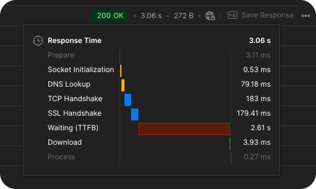
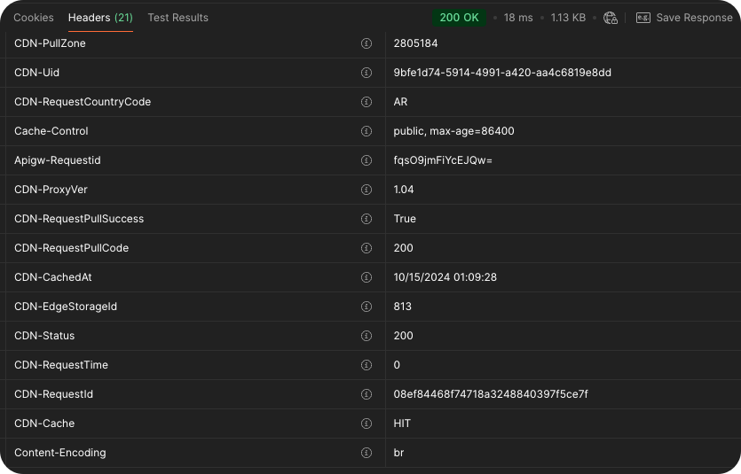

Cache on APIs is a must-have feature for any service that wants to scale. It's a way to reduce the load on your servers and improve the response time for your users by serving the same content multiple times, getting the same result without having to process the request again.

The issue is that... implementing cache systems is hard, tricky and can cause a lot of headaches when it comes to invalidating the cache, purging and keeping the cache fresh with the latest data.

In this article, we will explore the concept of stale cache, test by examples and see how CDNs providers like Bunny CDN can help us to keep the cache fresh without having to purge it every time a new request is made.

---

Let's start by breaking down the pieces.

## ⌛️ Response time

When you make a request to an API, the response time is the time it takes for the server to process the request and send back the response. This time can vary depending on the server's load, the network latency, and the complexity of the request.

Typically the composition of this time is affected multiple factors like:

- **Network latency**: The time it takes for the request to travel from the client to the server.
- **DNS lookup time**: The time it takes for the client to resolve the server's domain name to an IP address.
- **Connections and SSL Handshakes**: Set of ticks and checks that the server needs to do before sending the response.

And when the requests finally arrive, then in the server side we have:

- **Processing time**: Time it takes for the server to process the request and send back the response.
- **Response size**: The size of the response data, which affects the time it takes to transfer the data over the network.

As the processing time in the server is something we can control by optimizing the code, the other factors are out of our control, but we can reduce the time it takes to process the request by using a cache system.

There are others factors like "cold-start" time on serverless implementations that also increase the time it takes to process the request, but this is out of the scope of this article.

## Now, how the cache system works?

[image: cache-system.png]

A client request information to a server, the server process the request and send back the [response body](https://developer.mozilla.org/en-US/docs/Web/HTTP/Messages#body), [http status code](https://developer.mozilla.org/en-US/docs/Web/HTTP/Status) and [headers](https://developer.mozilla.org/en-US/docs/Glossary/Response_header), two of these headers are key to understand how the cache system works:

- **Cache-Control**: Dictates the mechanism to control for _whom_, _how_ and _until when_ the response can be cached.
- **ETag**: Is a unique identifier for the response state.

Currently, the [HTTP/2 RFC Specification](https://www.rfc-editor.org/rfc/rfc7540) defines how the `Cache-Control` header should works telling the client or intermediary caches (like CDNs) how to behave, it inherits the same directives from the HTTP/1.1 specification, but with some improvements.

In the other hand, the `ETag` is used like an index key, if the value hasn't change, the cache can be used, if not, a new fresh response is needed. It solve the problem to see if the data has changed or not, but it doesn't solve the problem of keeping the cache fresh with the latest data, this is where the concept of _stale cache_ comes in.

## Stale cache

This is a concept where the cache is served by an intermediary to the client even if it's expired, but the server is still processing the request in the background to get the latest data, when the server gets the latest data, it updates the cache with the new data and serves the fresh data to clients on the next request.

[image: stale-cache.png]

The `Cache-Control` header can be extended with this functionality described above, this is done via the directive `stale-while-revalidate` that tells the client or intermediary _serve the stale cache while revalidate_ in the background.

The directive can receive a value in seconds, this value is the time that the _stale_ cache can be served while the server is processing the request to get the latest data, for instance, a header with this directive can look like this:

```plaintext
Cache-Control: max-age=604800, stale-while-revalidate=86400
```

> Which translate to: "serve the cache for 7 days, but if the cache is expired, serve the stale cache for 1 day while the server is processing the request to get the latest data".

This level of customization is then used by CDNs to keep the cache fresh without having to purge it every time a new request is made. It's basically always returns the cache, but when a new version is available, update the cache and serve that new version to any new request, simply like magic.

### 🔒 `private` / `public` directives

The `Cache-Control` header can also support "some kind" of privacy level, the difference between having those values is that the `public` value will be interpreted as they are allowed to store the response in a shared cache, while the `private` is intended to be stored only in the client's (local caches or browsers).

Basically the `public` directive is used when the response is the same for all users, while the `private` directive is used when the response doesn't need to be saved as cache by a CDN.

Having understood the concept of stale cache, let's see how we can implement this on a real-world scenario.

## ⚡️ Some testings

Let's test this concept with a simple API that returns a random number, and it will be deployed on `us-east-2` zone on AWS API Gateway.

Making a GET request to the endpoint `/random` will return a random number between 1 and 100, due to the cold-start time of serverless functions, the first request will take a little longer to respond, but the next requests will be faster.



This example shows some of the factors explained at the beginning of the article, subsequent requests can take between `200ms` and `450ms` of response time depending of the lambda invoke response, even with some of tracing being cached like _DNS Lookup, TCP Handshake, SSL Handshake_, this is pretty normal as the origin of the request is from South America and edge locations are not configured.

[image of map travel from ar to east-2]

So, how can we improve this response time? Let's add a cache system to the API.

## Let's introduce bunny.net 🐇

Bunny is a global content delivery platform that help us to delivers cached content faster. In this example, we will use Bunny to cache the responses of the API and see how the cache system works and how the stale cache can be implemented. They have a lot of features and capabilities, but for this example, we will focus on CDN.

With an account already created, we can create a new "pull zone", this is the layer that sits in front of the API and act as intermediary caching everything being requested. Given the name `xxxxxxx.b-cdn.net`, a domain will be created, we need to also add the "Origin URL" that is the api endpoint we want to cache.

While creating the pull zone, they provide the options to check "in what zones" we want to store the cached data, so the content is served from the closest region instead of traveling all the way to the origin, we will select all the zones available so the cache is everywhere 🤯.


With the pull zone created, is ready to be used as proxy for the API, now lets move back the the endpoint code to make the header customization so bunny know what to do with our origin responses.

We can start making request to the new domain pull zone domain, so any requests made to CDN will be forwarded behind scenes to API but caching the response.

```plaintext
// instead of
GET https://api.example.com/random

// use the pull zone domain
GET https://mynewpullzone.b-cdn.net/random
```

By default our cache control header is set to `no-cache`, so every time we hit the pull zone URL provided it will make a request to the origin, so lets change that behavior by just adding `max-age` directive to the header.

```plaintext
"Cache-Control": `public, max-age=86400`,
```

This will tell the CDN to cache the response for 1 day, so the next requests will be served from the cache instead of making a request to the origin. And by enabling the previous regions zones, the request will be served from the closest edge location to the client getting a lightning fast response.



🔥 `18ms` of response time, that's a huge improvement from the previous `200ms - 450ms`, and this is just the beginning.

The `CDN-Cache` header returned in the request tell us if the request was served by the CDN cache or not, in case the value is `MISS`, the request was made to the origin, if the value is `HIT`, the request was served from the cache.

There are other features that can be implemented, bunny provide features like "Query String Sorting" that when enabled, the query parameters will be automatically sorted into a consistent order before checking the cache. For example, this will treat `/random?width=200&height=100` and `/random?height=100&width=200` as the same path.

Implementing a cache system is crucial for improving the performance and scalability of your API services. By leveraging the concept of stale cache and using CDNs like Bunny.net, you can significantly reduce response times and server load. The `Cache-Control` header, with directives like `stale-while-revalidate`, allows you to serve stale content while fetching fresh data in the background, ensuring that your users always get the best possible experience. Remember, while Bunny.net is used in this example, these caching principles can be applied with any CDN provider that supports similar capabilities. Happy caching!
