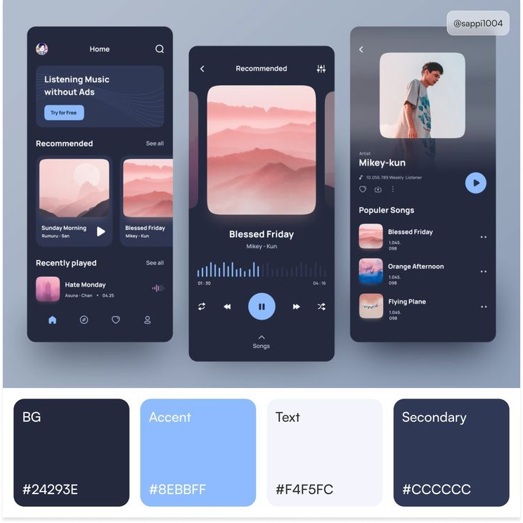
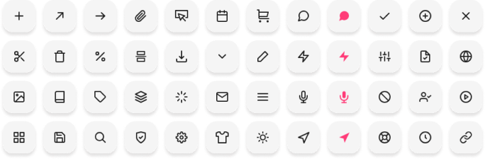
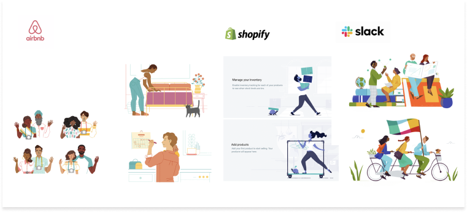
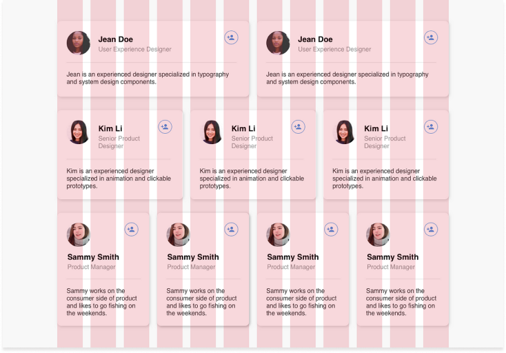

UX/UI design is a critical aspect to consider when developing products, and as a Quality Assurance (QA) professional, having knowledge of this field and the right tools can greatly assist you during your work. In this article, we'll explore the key principles of UX/UI design and essential elements within system design that are important for ensuring consistency, usability, and understandability.

## UX/UI Laws

1. **Jakob's Law:** Users spend most of their time on other websites, so they expect your website to work the same way. Therefore, your website's design should be familiar and consistent with what users are already accustomed to.

2. **Aesthetic-Usability Effect:** When a product or interface is visually appealing, users tend to have a more positive perception of its usability, even if it has the same functionality as a less visually appealing design. This principle highlights the importance of combining aesthetics and usability in UX design.

3. **Fitts's Law:** Emphasizes the importance of making interactive elements larger and placing them closer to the user, making them easier to click or tap.

4. **Proximity:** Users will cognitively group elements that sit next to each other with a defined boundary, as well as elements positioned closely together.

5. **Uniform Connectedness:** This principle suggests that visually connecting related elements through consistent visual cues, such as color, shape, or proximity, helps users understand relationships and interactions in the interface.

6. **Law of Prägnanz:** Emphasizes simplicity, clarity, and minimalism in interface design to enhance user comprehension and create an intuitive user experience.

## Elements of System Design

### Colors

Colors evoke emotions, convey meaning and establish visual hierarchy. Ensure that colors work well together, provide sufficient contrast for readability and meet accessibility standards per Web Content Accessibility Guidelines (WCAG). QA plays a crucial role in testing colors for readability and accessibility.

### Typography

Typography contributes to readability, aesthetics, and branding. Test fonts across different devices, browsers, and screen resolutions, checking font sizes, line heights, letter spacing, and font weights to ensure consistency and readability. Fonts should be responsive and align with brand guidelines.

### Icons

Icons enhance usability and provide quick visual cues. Use standard icon libraries or design systems to maintain consistency. Icons can indicate different states or actions, reducing user confusion.

### Illustrations and Images

Visual elements convey information, evoke emotions, and improve usability. Ensure image quality, alignment, positioning, responsiveness across devices, and compatibility with different browsers.

### Grid

Grids organize and structure layouts, improving readability and navigation. Different types of grids (e.g., column grid, modular grid, hierarchical grid) provide flexible structures that adapt to various screen sizes.

### Responsiveness

Responsiveness ensures your product adapts to different devices and screen sizes, providing users with a consistent and optimal experience. QA should test the application on various devices, browsers, and operating systems to ensure functionality and appearance across all platforms.

In conclusion, the intersection of QA and UX/UI is a crucial nexus for delivering exceptional products that resonate with users. By embracing the principles, tools, and methodologies discussed in this guide, QA professionals can play a pivotal role in shaping remarkable user experiences and driving the success of their projects. Embrace these next steps, and you'll be well on your way to becoming an indispensable asset in the pursuit of excellence in software development.

## Useful Links

- [UX Rules](https://lawsofux.com/)
- [10 Laws of UX](https://uizard.io/blog/10-laws-of-ux-you-need-to-know/)
- [Fonts](https://fonts.google.com/)
- [Dafont](https://www.dafont.com/)
- [Colors](https://colors.eva.design/)
- [Picular](https://picular.co/)
- [AICOLORS](https://aicolors.co/)
- [Images](https://unsplash.com/)
- [Pexels](https://www.pexels.com/)
- [Freepik](https://www.freepik.com/popular-photos)
- [Icons](https://freeicons.io/)
- [Icons8](https://icons8.com/)
- [Flaticon](https://www.flaticon.com/)
- [Behance](https://www.behance.net/)
- [Awwwards](https://www.awwwards.com/)
- [ThemeForest](https://themeforest.net/)
- [Dribbble](https://dribbble.com/search/ux)
- [Illustrations](https://www.freepik.com/vectors/illustrations)
- [Icons8 Illustrations](https://icons8.com/illustrations)
- [WebAIM Contrast Checker](https://webaim.org/resources/contrastchecker/)