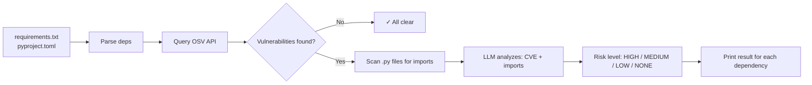
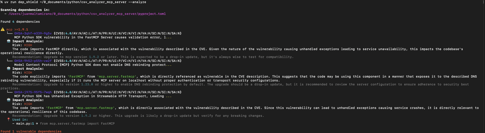

## The Problem

Aren't you tired of pushing new code and then a few days later receiving an alert from Github's Dependabot? Well, I am.
The most annoying part is looking for the CVE, reviewing your code and then detecting that you aren't using the affected part.
Rinse and repeat for every single alert.

---

## The solution?

That's why I built dep_shield — a CLI that I can plug into my common workflow (lint -> dep_shield -> tests -> sonar) and get a straight answer: "this CVE affects you" or "relax, you're fine."

---

## How dep_shield Works



The flow is straightforward:

1. **Parse dependencies** — Read `requirements.txt` or `pyproject.toml`, extract packages and versions
2. **Check for CVEs** — Query the OSV database for known vulnerabilities  
3. **Find usage in code** — Scan your Python files to see where you import vulnerable packages
4. **AI-powered analysis** — Send the CVE description + your import context to an LLM and ask: "Does this actually affect me?"

---

## The Interesting Parts

### Parsing Dependencies (Both Formats)

The tool supports `requirements.txt` and `pyproject.toml` — it figures out which one you're using.
Why both? Well, `requirements.txt` is still widely used, but `uv` is taking over fast.

### Querying OSV (the free vulnerability database)

OSV over NVD or Snyk? No API key, no rate limits, no pricing tiers. NVD is slow and wants you to parse CPE identifiers. Snyk needs auth and has usage limits.
OSV just works — POST a package name, get vulnerabilities back. For a CLI tool meant to run locally and fast, that's exactly what I needed.

```python
OSV_API_URL = "https://api.osv.dev/v1/query"

def query_vulnerabilities(package_name: str, version: str | None) -> list[Vulnerability]:
    payload = {
        "package": {
            "name": package_name,
            "ecosystem": "PyPI"
        }
    }
    if version:
        payload["version"] = version
    
    response = httpx.post(OSV_API_URL, json=payload, timeout=10.0)
    return parse_vulnerabilities(response.json())
```

```json
{
    "vulns": [
        {
            "id": "GHSA-cpwx-vrp4-4pq7",
            "summary": "Jinja2 vulnerable to sandbox breakout through attr filter selecting format method",
            "details": "An oversight in how the Jinja sandboxed environment interacts with the `|attr` filter allows an attacker that controls the content of a template to execute arbitrary Python code.\n\nTo exploit the vulnerability, an attacker needs to control the content of a template. Whether that is the case depends on the type of application using Jinja. This vulnerability impacts users of applications which execute untrusted templates.\n\nJinja's sandbox does catch calls to `str.format` and ensures they don't escape the sandbox. However, it's possible to use the `|attr` filter to get a reference to a string's plain format method, bypassing the sandbox. After the fix, the `|attr` filter no longer bypasses the environment's attribute lookup.",
            "aliases": ["CVE-2025-27516"],
            "modified": "2026-02-04T04:14:58.595738Z",
            "published": "2025-03-05T20:40:14Z",
            "affected": [
                {
                    "package": { "name": "jinja2", "ecosystem": "PyPI", "purl": "pkg:pypi/jinja2" },
                    "ranges": [{ "type": "ECOSYSTEM", "events": [{ "introduced": "0" }, { "fixed": "3.1.6"}] }]
                }
            ]
        }
    ]
}
```

_The full response has more fields (references, versions, etc.), but these are the relevant ones._

---

### Finding Where You Actually Use the Package

It's easy to forget where you actually use a dependency — especially in large projects with dozens of packages. And not all usage is equal: importing requests in your core API is very different from importing it in a one-off migration script.

```python
def scan_file_for_package(file_path: Path, package_name: str) -> list[CodeUsage]:
    pattern_import = rf"^import\s+{package_name}(\s|,|$|\.)"
    pattern_from = rf"^from\s+{package_name}(\s|\.)"
    result = []

    with open(file_path, 'r', encoding='utf-8', errors='ignore') as file:
        for line_num, line in enumerate(file, 1):
            line = line.strip()
            if line.startswith("#"):
                continue

            if re.match(pattern_import, line):
                import_type = "import"
            elif re.match(pattern_from, line):
                import_type = "from"
            else:
                continue

            result.append(CodeUsage(
                file_path=str(file_path),
                line_number=line_num,
                line_content=line,
                import_type=import_type
            ))
    return result
```

---

### The AI Part: Asking A Model If It Matters

Now, here's where it gets interesting. I send the LLM:

- The CVE description
- The import statements from your code

And ask: "Given how this code uses the package, does this vulnerability apply?"

**Important:** Only import lines are sent to the LLM — not your actual business logic. The model sees `from requests import Session`, not the body of your functions. Your code stays local.

```python
_SYSTEM_PROMPT = """You are a security analyst reviewing Python dependency vulnerabilities.
You will be given a CVE description and import-level code evidence.
Your job is to determine if the vulnerability realistically affects this codebase.

Risk level definitions:
- HIGH: The imports directly expose the vulnerable code path
- MEDIUM: Package is imported but no clear evidence the vulnerable feature is used
- LOW: Package only imported in tests or dev tooling
- NONE: CVE conditions are not plausible in this codebase"""
```

I use Pydantic to force the model into a consistent format, no free-form text that I'd have to parse.
It either gives me a valid ImpactAnalysis or it fails. No "well, it depends..." answers.

```python
class ImpactAnalysis(BaseModel):
    risk_level: Literal["HIGH", "MEDIUM", "LOW", "NONE"]
    explanation: str
    recommendation: str
```

---

### Making It Smarter Over Time (RAG)

Here's the thing — the LLM doesn't know your codebase. It analyzes each CVE in isolation. But what if it could remember past analyses?

That's where ChromaDB comes in. Every time the tool analyzes a vulnerability, it stores the result. Next time a similar CVE shows up (same package, similar vulnerability type), it retrieves past analyses as context.

```python
def store_analysis(vulnerability_id: str, analysis: ImpactAnalysis, code_context: str):
    collection.add(
        documents=[f"{vulnerability_id}: {analysis.explanation}"],
        metadatas=[{"risk": analysis.risk_level, "package": package_name}],
        ids=[vulnerability_id]
    )

def get_similar_analyses(vulnerability_description: str, limit: int = 3):
    results = collection.query(
        query_texts=[vulnerability_description],
        n_results=limit
    )
    return results
```

The result? The tool gets better the more you use it. If you analyzed a `requests` CVE last month and a new one appears, the model sees how you handled it before.

---

## What the Output Looks Like



---

## What I Learned

Honestly? It reinforced an ancient rule: _context is everything_
A CVE that sounds critical in the abstract becomes irrelevant when you realize you only import that package in a test helper. OSV turned out to be the perfect data source — free, fast, no API keys, solid Python coverage. And while the LLM does a surprisingly good job at triage, I still treat its output as a suggestion, not a verdict. The RAG layer (ChromaDB) was an afterthought, but it's become one of the most useful parts: the tool genuinely gets better as it sees more of your codebase.

---

## What's Next

I have a few ideas in mind:

- More languages — JavaScript and Go are probably the next ones
- CI/CD integration — run it in your pipeline, make it fail the build if there is any 'HIGH' impact
- Offline mode — run it against a local LLM

---

## Try It Yourself

Give it a shot and let me know what breaks. Seriously — I'd appreciate any feedback.
**Link:** [github.com/juanmaalt/dep_shield](https://github.com/juanmaalt/dep_shield)
