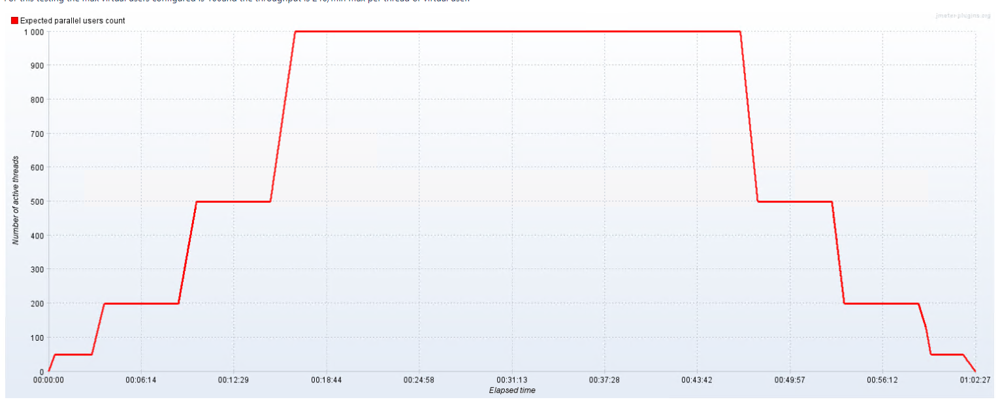
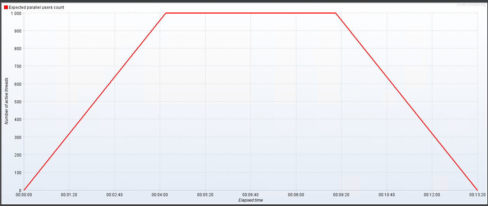
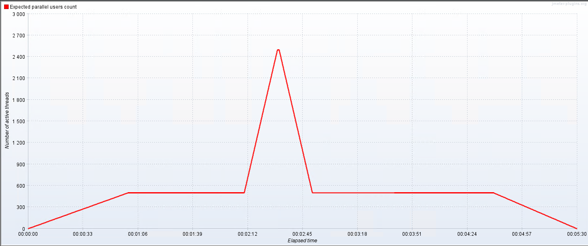
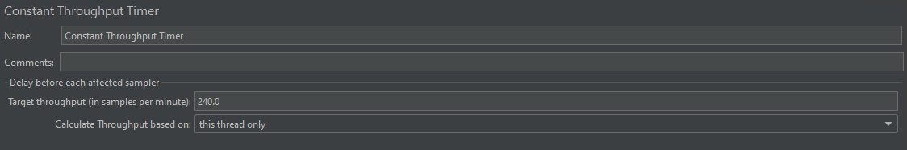
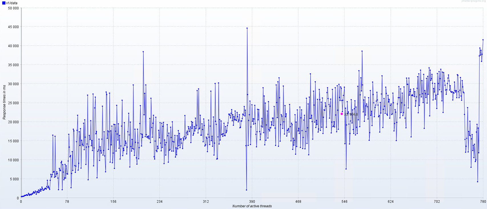

## Overview

When you have an application regardless of it being actually on prod or not, there is a point in time where you actually need to run a performance testing. So you may start googling and see some paid services, some free and rather imposible to understand tools and some concepts that you've never heard about like, load testing it self, spike testing, stress testing, and so on.
So let's try to clarify this matter and provide a usefull walkthrough to one live example.
If you have an API, then performance is divided on two sections, the first one is internal, and the other one is external. Internal performance should evaluate memory allocation, number of threads, disposed objects, etc. While external performance is related, but it will meassure response time, amount of accepted requests, etc.
Let's focus for now on that one.

## The WHY

We run performance testing for two main reasons among others, verify and detect. For verifying we intend to check whether the application fullfills the expected demand, and for detection, we test to verify if the application is breaking, at which load. This later test can be executed when the boundaries are not clear enough, or also to test the app behaviour outside the usage boundaries, ussually above the max level. This is really usefull when we are trying to get prepared for eventual spikes, or future increases in demand.

## The WHEN

We run performance testing once we know the usage the app will have at the point of going into production, we run it before going to production and during production.
We DON't run it on every release. do we?? Well that depends on the environment, on your needs, the team you have to perform these test, the criticity of the affected areas of that release and the application itself.

## The WHAT

This is the most juicy part. Location, location, location.

### Before you start

Things you need to know BEFORE you start thinking on performance and the first one is __boundaries__.
What do we understand by boundaries, well boundaries are that, the limits your application will hit when running.

Going back to boundaries and with respect of an API external testing, what you need to know in advance is:
    - How many requests per second maximun and minimum are you expecting?
    - Are you expecting peaks of load? How much? What times? How long?
Without this info, then running perfomance makes less sense as you don't have a comparison point.

Nice, you got the info? Then it's time to start doing set ups.
Well, not there yet. First you have to draft a plan.

#### The plan

To draft a plan you need to consider the types of performance testing and decide your objectives.
Most commonly you can:
    - Load test
    - Spike testing
    - Stress test
    - Mixed
Each strategy has it's own benefits and drawbacks, and this is tightly bound to what you want to test.

All of these are ussually composed by the __start up__, __the load__, and the __tear down__ phases.

### The start up

There are several ways to do this. You can do a step up/down pattern, you can linear increase (even variating the steep) or you could do exponential increase/decrease.

Step up in 4 phases

Important things to note here:
You have a target of virtual users each one of them will run one or more requests based on your config and your needs. As you can see here we are targeting 1000 virtual users, from 0 to 1000 in 16 minutes and then holding for 30 mins and tearing down again in 15 minutes.

In this case we were testing for a breaking point, which we found at 500 virtual users. This is also called a Load test pattern, as the heaviest load will occurred during sustained time and we will test how the servers behave when load is hold, besides of the advantage it provides if you don't know your boundaries.

If you already knew your limits, then you can plan diferently like:

As you can see, the pattern is different and it's targeting different results.
The former one is increasing by steps so we can measure at different moments in time and also check for infrastructure changes and responses (pods warming up, memory allocation, processor, etc)
The later one increases directly to the top, holds and then decreases, and here the target could be evaluating if we have memory leaks or if the processor can spawn multiple threads and so on. Numerous metrics can be evaluated and it will depend on what are you looking for. I'm just mentioning the common ones.

### The hold

At this stage is were you want to decide if you want to hold, for how much time, if you will have spikes, how many, how long? How steep?

For instance the next image shows a holding pattern interrupted by a 4x peak.

At this point we may want to check containers warm up, horizontal and vertical scaling, failure recovery and so on given that the spike increase is really fast, these are the common breaking points (network and scaling).

### The Tear down

Once you have verified the behaviour on load or spikes, now is time to let the services cool down, for the same reason that we steped in we want to do the tear down to check how the infrastructure is reacting. It could be memory analisys, how much and how fast it got cleared? How fast instances stoped? And etc…

## Real life config

Now all this is fine, but WHAT are we testing?? Well that of course is something really specific to your project, but lets start by testing one endpoint, shall we?
To test an endpoint is bassicaly configuring the given tool to do a get/post/put. In this case I'm going to show how to run a get to a specific api endpoint.

Let's use for this purpose jMeter
By defualt Jameter has some tools to assemble a query such as thread groups, but there are also some cool plugins that we will be using:

Start by installing custom threads group that contains the Ultimate thread group. By using this plugin you will be able to configure the steps you want and many other options.
Second, add some graphs generators of your choice.

Once you have done this, create a test plan and add a Ultimate thread group.
The thread group should be minimaly composed of

- The http Request
  - Then here I'm adding input data from a csv to send query parameters, a Header manager to send a basic auth token and a throughput timer.
- Lets break it into pieces:
  - The http request is pretty self explanatory:
    - You have the name
    - Protocol
    - Server
    - Path
    - Verb
    - And other parameters like port, etc
- Then there are config elements, the first one is the CSV file input
- Then the HTTP header manager
  - This is optional and also provides options for basic, JWT and all the other headers you need to add.
- Third is the throughput. Here is were you also handle the load. I't not the same to have 1000 VU with 1000 requests per minte per user than having 1 request per second per VU.

As you can see on the image:

We are sending a max of 1 request per second per VU. The options here allows you to set an amount shared across all VU or per VU as seen on the image.

## Wrapping up and information analisys

Once the process has completed, it's time to look at the graphs and see what information is being presented and our pain points, and need to improve items. Some results on the previous configuration:

### Response time and threads

This is calculating the average time based on the amount of VU. As you can see on the image, it was averaging 22 seconds for a simple get

### 200 responses and threads

Here you see two things, how the constant trhoughput worked and what's the variance of 200 responses we had.
If you add to this the following image:

### Errors and threads

We can see that when reaching about  500 VU the amount of 502/and 504 errors started increasing.
Further analisys revealed that our instances were not being able to handle the load and we determined that horizontal scaling combined with a small increase of resources on the actual pods would solve the problem, as you will se on the followin image, that for the same pattern of load, the number of errors drastically reduced.

## Conclusion

When running perf analisys is really important to know what you will be looking for, second of course if K.I.S.S. you don't need to get fancy graphics, nor complicated to configure tools, just go simple and straight forward.
Then, make sure you capture all that's important to you and also compare it to the hardware metrics (not covered on this demo) so you can add graphs+logs+hardware metrics to get a great combo and know what you need to improove.
And last but not least, doublecheck and triple check your findings. Running  perf test should be done in isoalted environments, but if that is not possible and you will target staging/uat, make sure you have two or three runs at different times of day so you can evaluate your results as well and compare.
Hopefully this post will aid you on running your first set of performance test.

Good Luck.
__this article was fully written by a person, based on a live example and experience and not by an AI__
