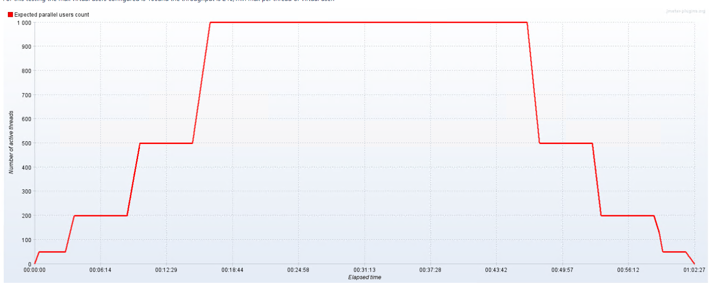
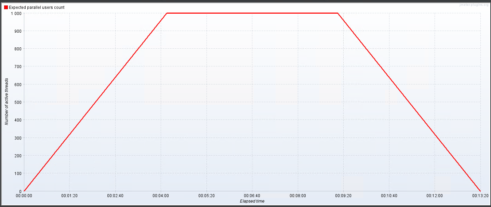
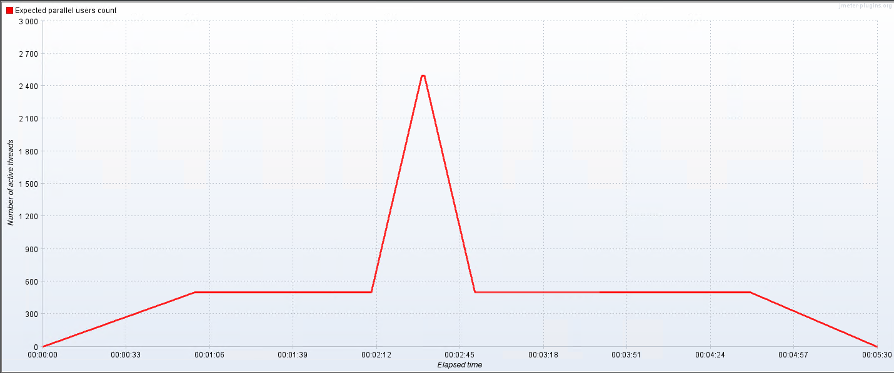
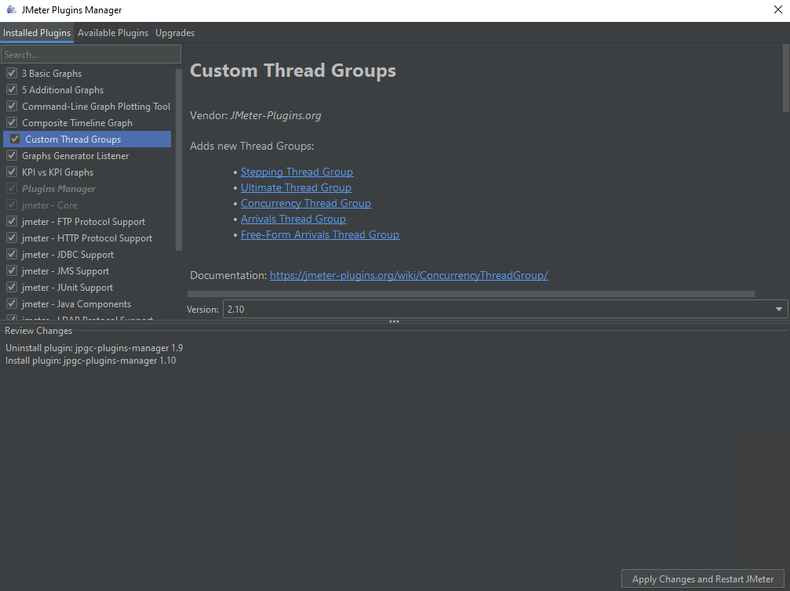
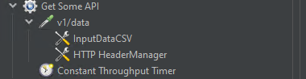
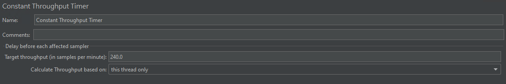
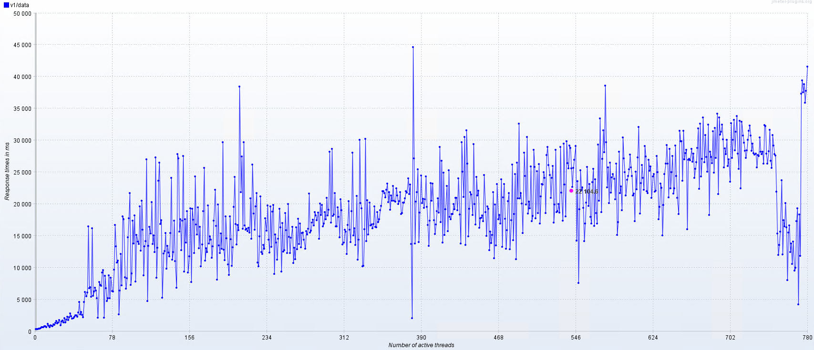
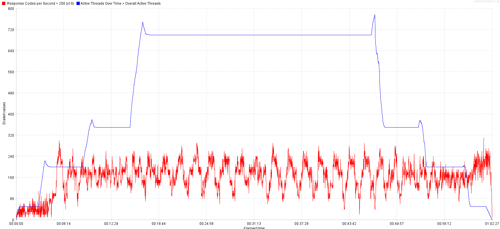
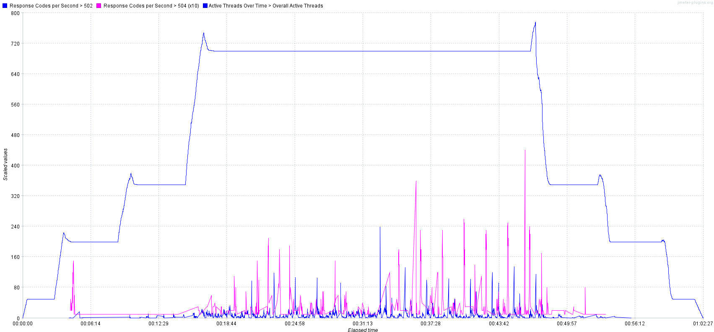
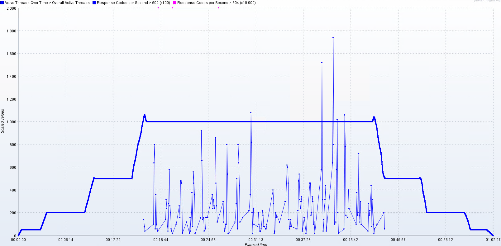

## Overview

When you have an application, regardless of whether it's in production or not, there comes a point when you need to perform performance testing. You might start by searching for various paid services, free tools that are rather difficult to understand, and concepts like load testing, spike testing, stress testing, and more.
Let's try to clarify this matter and provide a useful walkthrough with a live example.
If you have an API, performance can be divided into two sections: internal and external. Internal performance should evaluate memory allocation, the number of threads, disposed objects, etc. External performance is related, but it measures response time, the number of accepted requests, etc.
Let's focus on the external performance for now.

## The WHY

We perform performance testing for two main reasons, among others: verification and detection. For verification, we intend to check whether the application fulfills the expected demand, and for detection, we test to verify if the application breaks, and at what load. This latter test can be executed when the boundaries are not clear enough or to test the app's behavior outside the usage boundaries, usually above the maximum level. This is really useful when we are trying to prepare for eventual spikes or future increases in demand.

## The WHEN

We perform performance testing once we know the expected usage of the app at the point of going into production. We run it before going into production and during production.
However, we do not run it with every release, do we? This decision depends on various factors: the environment, your needs, the team you have to perform these tests, the criticality of the affected areas of that release, and the application itself.

## The WHAT

This is the most crucial part. Location, location, location.

### Before you start

Things you need to know BEFORE you start thinking about performance, and the first one is boundaries.
What do we understand by boundaries? Well, boundaries are the limits your application will hit when running.

Going back to boundaries and regarding external testing of an API, what you need to know in advance is:
    - How many requests per second are you expecting, both maximum and minimum?
    - Are you expecting load peaks? How many? At what times? For how long?
Without this information, then running performance tests makes less sense as you don't have a comparison point.

Nice, you got the info? Then it's time to start doing setups.
Well, not there yet. First, you have to draft a plan.

#### The plan

To draft a plan, you need to consider the types of performance testing and decide on your objectives.
Most commonly, you can:
    - Load test
    - Spike testing
    - Stress test
    - Mixed
Each strategy has its benefits and drawbacks, and this is tightly bound to what you want to test.

All of these are usually composed of the __start-up__, __the load__, and the __tear-down__ phases.

### The start-up

There are several ways to do this. You can use a step-up/down pattern, linear increase (even varying the steepness), or you could use exponential increase/decrease.

Step up in 4 phases

Important things to note here:
You have a target of virtual users; each one of them will run one or more requests based on your configuration and your needs. As you can see here, we are targeting 1000 virtual users, from 0 to 1000 in 16 minutes, and then holding for 30 minutes and tearing down again in 15 minutes.

In this case, we were testing for a breaking point, which we found at 500 virtual users. This is also called a Load test pattern, as the heaviest load will occur during sustained time, and we will test how the servers behave when load is held, besides the advantage it provides if you don't know your boundaries.

If you already know your limits, then you can plan differently like:

As you can see, the pattern is different, and it's targeting different results.
The former one is increasing by steps so we can measure at different moments in time and also check for infrastructure changes and responses (pods warming up, memory allocation, processor, etc.)
The latter one increases directly to the top, holds, and then decreases. Here, the target could be evaluating if we have memory leaks or if the processor can spawn multiple threads and so on. Numerous metrics can be evaluated, and it will depend on what you are looking for. I'm just mentioning the common ones.

### The hold

At this stage is where you want to decide if you want to hold, for how much time, if you will have spikes, how many, how long? How steep?

For instance, the next image shows a holding pattern interrupted by a 4x peak.

At this point, we may want to check container warm-up, horizontal and vertical scaling, failure recovery, and so on, given that the spike increase is really fast; these are the common breaking points (network and scaling).

### The Tear down

Once you have verified the behavior under load or spikes, it's time to let the services cool down, for the same reason that we stepped in; we want to do the tear down to check how the infrastructure is reacting. It could be memory analysis, how much and how fast it got cleared? How fast instances stopped? And etc…

## Real-life config

Now, all of this is fine, but WHAT are we testing?? This, of course, varies according to your project. Let's begin by testing a specific endpoint, shall we?
To test an endpoint is basically configuring the given tool to perform a GET/POST/PUT. In this case, I'm going to show how to run a GET to a specific API endpoint.

Let's use, for this purpose, jMeter.
By default, JMeter has some tools to assemble a query such as thread groups, but there are also some cool plugins that we will be using:

Start by installing the custom threads group that contains the Ultimate thread group. By using this plugin, you will be able to configure the steps you want and many other options.
Second, add some graph generators of your choice.

Once you have done this, create a test plan and add an Ultimate thread group.
The thread group should consist of the following components at a minimum:

- The HTTP Request
  - Then here, I'm adding input data from a CSV to send query parameters, a Header manager to send a basic auth token, and a throughput timer.
- Let's break it into pieces:
  - The HTTP request is pretty self-explanatory:
    - You have the name
    - Protocol
    - Server
    - Path
    - Verb
    - And other parameters like port, etc.
- Then there are config elements, the first one is the CSV file input
- Then the HTTP header manager
  - This is optional and also provides options for basic, JWT, and all the other headers you need to add.
- Third is the throughput. Here is where you also handle the load. It's not the same to have 1000 VU with 1000 requests per minute per user than having 1 request per second per VU.

As you can see in the image:

We are sending a maximum of 1 request per second per VU. The options here allow you to set an amount shared across all VUs or per VU, as seen in the image.

## Wrapping up and information analysis

Once the process has completed, it's time to look at the graphs and see what information is being presented and our pain points and the need to improve items. Some results from the previous configuration:

### Response time and threads

This is calculating the average time based on the number of VUs. As you can see in the image, it was averaging 22 seconds for a simple GET.

### 200 responses and threads

Here, you'll notice two key points: the performance under constant throughput and the variance in 200 responses.
If you add to this the following image:

### Errors and threads

We can see that when reaching about 500 VU, the number of 502 and 504 errors started increasing.
Further analysis revealed that our instances were not able to handle the load, and we determined that horizontal scaling combined with a small increase in resources on the actual pods would solve the problem, as you will see in the following image, that for the same pattern of load, the number of errors drastically reduced.

## Conclusion

When running performance analysis, it's really important to know what you will be looking for. Second, of course, is K.I.S.S. You don't need fancy graphics or complicated-to-configure tools, just go simple and straightforward.
Then, make sure you capture all that's important to you and also compare it to the hardware metrics (not covered in this demo) so you can add graphs, logs, and hardware metrics to get a great combo and know what you need to improve.
And last but not least, double-check and triple-check your findings. Running performance tests should be done in isolated environments, but if that is not possible, and you will target staging/UAT, make sure you have two or three runs at different times of the day so you can evaluate your results as well and compare.
Hopefully, this post will aid you in running your first set of performance tests.

Good Luck.
__this article was fully written by a person, based on a live example and experience and not by an AI__
