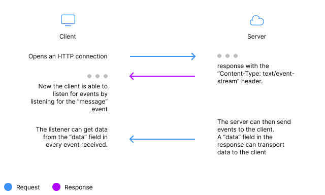

Server-Sent Events (SSE) is a web technology that allows servers to send updates asynchronously to clients in real time. This means that the server can send data to clients without them having to constantly request it. This is a good way to avoid polling the server for updates.

## Server-Sent Events at high level

SSE is a way for a web page to receive automatic updates from a server via HTTP connection. It is a one-way communication from the server to the client. This means that the client can only receive data from the server, but it cannot send data to the server. This is the main difference between SSE and WebSockets (WebSockets is a two-way communication between the client and the server).

### When to use Server-Sent Events?

A common use case for Server-Sent Events is to display real-time updates on a website. For example: 
* a delivery tracking website could use SSE to display real-time updates on the status of a delivery.
* It could also be used to display real-time updates (in an online game maybe? :D)
* to display updates from a news website.

## How does it work?

The client opens an HTTP connection to the server and the server sends data to the client via this connection. The client can receive data from the server as long as the connection is open. When the connection is closed, the client stops receiving data from the server.



> One of the main advantages of SSE is that it is very easy to implement. You don't need to install any additional libraries or frameworks. You can use SSE with any programming language and any web framework.

## How to implement Server-Sent Events in Node.js

I will show you how to implement SSE in Node.js and plain Javascript. Hold on tight, it's going to be fast!

### Backend (Our node.js server)

``` javascript

const http = require('http');

http.createServer((req, res) => {
  // Set the response headers
  res.writeHead(200, {
    'Content-Type': 'text/event-stream',
    'Cache-Control': 'no-cache',
    'Connection': 'keep-alive',
    'Access-Control-Allow-Origin': '*'
  });

  // Send a message to the client every 5 seconds
  setInterval(() => {
    res.write('data: ' + new Date().toLocaleTimeString() + '\n\n');
  }, 5000);
}).listen(3000);

```

In this example, we create an HTTP server that sends a message to the client every 5 seconds using the setInterval() function. The message includes the current time using the toLocaleTimeString() function. It is important that we set the response headers in this way so that the client can correctly process the data.

### Frontend (Our client)

``` javascript

const eventSource = new EventSource('http://localhost:3000');

eventSource.onmessage = (event) => {
  console.log(event.data);
};

```

Here, we create an EventSource object on the client side and pass it the URL of the server that is sending the events. Then we add an onmessage event handler that is executed every time the server sends an event. In this example, we simply print the event data to the browser's console.

## Conclusion

Pretty easy, right? It is very simple to implement and it works with any programming language and any web framework. I hope this is helpful to you. If you have any questions or comments, please leave them in the comments section below.

Thank you for reading!
