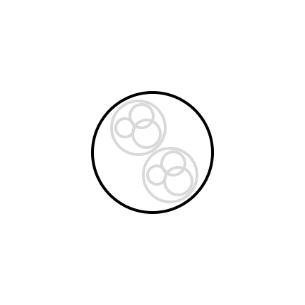

Frontend job can be defined as creating a visual interface using code. However, this definition is basic and doesn't capture the full complexity of modern frontend development.

In the past, there was a conflict between developers and designers due to the lack of rules in UI design. The explosion of creativity from designers and the adoption of new techniques by developers led to both sides improving their skills and establishing clear guidelines for designing and coding interfaces. Fortunately, this conflict has been resolved, and now developers and designers work together.

From the introduction, we can infer a few implicit concepts:

Effective communication and a common language are necessary between both areas.

* Both developers and designers share the same goal.
* This shared goal serves a bigger purpose.
* This point in frontend history can be compared to Henry Ford's factory revolution, as a new paradigm known as the Modern Design System emerged.

Creating and maintaining a modern design system is no longer solely the designer's responsibility. Developers also play a crucial role in integrating the design system into the code by identifying implementation challenges and maximizing its benefits.

This new scenario presents opportunities and challenges. The first challenge is effective communication between developers and designers. The second challenge is establishing a common language or understanding between the two.

## Atoms, Design Tokens, Components, States, Variants... and more is comming.

Effective communication requires that both parties (Emitter and Receiver, and vice versa) have a common language. At this point, it is crucial to understand the meaning and importance of each term involved.

### Atom

An Atom represents the indivisible parts of a UI. In terms of HTML tags, examples of Atoms include buttons, input fields, and span tags. An Atom can consist of one or more tokens.

### Design Token

A Token, encompasses all the values that make up an Atom. Tokens include properties like padding, margin, border, shadow, color, animations, etc. Tokens play a key role in Design Systems (DS) by ensuring consistency in values across the entire system. We can delve deeper into Tokens in a future post, so stay tuned!

### Components

A Component often refers to a group of Atoms working together as a single unit, but with increased complexity. These components, also known as "Molecules," can exhibit the same behavior as an Atom or take advantage of multiple types of Atoms to create new shapes and behavior. In a regular DS, it is an unbreakable rule that Components should never have business rules. If a component requires business rules, it should not be part of the DS but can be considered an internal component within a system. We will discuss this further in a future post.

### States

States can be a bit tricky to understand. A State represents a value that determines the appearance or behavior of a component or atom. For example, a progress bar that displays a confirmation icon when the state changes represents the same component with a different state.

### Variants

A Variant is similar to Alligator Loki from Loki (Marvel fan alert!), but if you're not familiar with the reference, Variants in a DS refer to Buttons (Atoms or even Components) with different colors or shapes within the same DS. Despite the variations, they all remain Buttons.

### Themes

In a Design System, Themes go beyond individual Variants and allow for customization and modifications to multiple Atoms or Components. While Variants represent visual variations of a component, Themes provide higher-level customization capabilities that influence various Variants across different elements of the DS. By utilizing Themes, designers and developers can establish overarching rules and create a cohesive visual identity for the DS, ensuring consistency and flexibility in adapting the system to specific requirements or scenarios.

### Design System

A Design System is a cohesive set of shared rules, components, patterns, and guidelines that unify the language and appearance of a user interface. It provides a collaborative approach that synchronizes terms and best practices between design and development teams with the goal of achieving consistency, efficiency, and a high-quality user experience in digital product creation. A Design System enables constant evolution and continuous improvement of the interface, fostering innovation and facilitating the effective implementation of new ideas and features in a collaborative work environment.

## Final Thoughts

Now that we have a clear understanding of what a modern Design System entails, it's time to embark on the journey of actually building one. In our next article, we'll explore practical steps and strategies for initiating the development of a Design System. From establishing the foundational elements to fostering collaboration between teams, we'll guide you through the process of creating a robust and effective Design System. Get ready to dive deeper into the world of Design Systems and unlock the potential for seamless and efficient digital product creation.
