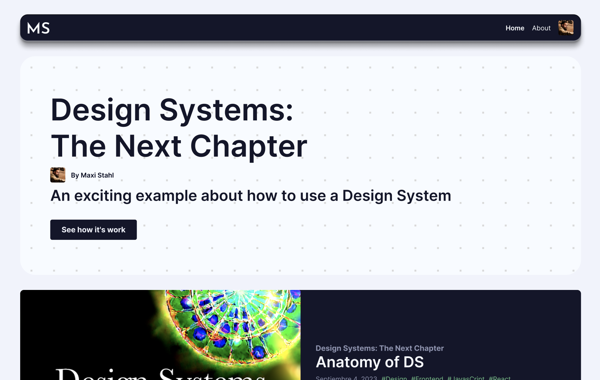

In the previous article, we explored the significance of establishing a shared language between developers and designers and introduced the fundamental concepts of a Design System (DS). Building upon that foundation, this article will delve into creating a basic structure for a DS from both the UI-UX and Development perspectives. By aligning these two crucial aspects, we aim to develop a comprehensive understanding of how to structure and implement a successful Design System.

## The Design System Structure

In addition to defining a basic structure for a Design System, the collaboration between UI-UX and Development teams brings forth numerous benefits. By working together, the speed of UI creation is significantly enhanced, allowing for rapid prototyping and iteration. This streamlined process not only accelerates development but also ensures a consistent and cohesive user interface. Furthermore, the collaborative efforts foster efficient implementation, as developers can leverage the predefined components and styles from the Design System, reducing redundancy and minimizing coding effort. The synergy between UI-UX and Development teams ultimately results in a more efficient and effective workflow, delivering high-quality user experiences in a faster and more scalable manner.

### The Design System Structure from the UI-UX Perspective

The Design System Structure from the UI-UX Perspective involves a progressive workflow that starts with defining tokens. Since most of the basic atoms are already established by default (basic HTML tags), the designer's focus shifts to creating and refining the tokens. Subsequently, the tokens are applied to different atoms, and the designer begins iterating on special components. This iterative process continues until a solid foundation is established, forming the basis for working on variants, themes, and layouts. This approach guarantees a methodical and iterative strategy for constructing the Design System, empowering the UI-UX team to develop uniform and harmonious designs while upholding adaptability and expansiveness across the design process.

We choose Figma as our tool to create the Design System Structure.



To see an example of this workflow in action, you can take a look at the [Figma file](https://www.figma.com/file/6GMJzNpoQ4VSokG2S52ip6/Design-System?type=design&node-id=152%3A78&mode=design&t=OSxTDaNaPDp8YKNG-1) that I created for this serie.

This is the moment to add a couple of rules that will help you to create a better Design System:

* First one: **"Every business rule should be implemented in the code, not in the Design System"**. This rule will help you to create a better Design System, and to avoid the creation of a "Frankenstein" Design System.

* Second one: **"Order and consistency are the keys to success."** Do not create a Design System with a lot of components, create a Design System with a few components, but with a lot of variants.

* Third one: **"Create visual behavior, not business behavior."** Think about the rules that you need to place a component in a container. Meaning, the container should handle the position of the component, not the component itself. In the example of a Card, the button could be centered, but in another container (let say a form) the button could be aligned to the right.

### The Design System Structure from the Development Perspective

The Design System Structure from the Development Perspective involves translating the Design System's structure into code. It requires making key decisions regarding the organization of styles and resources, selecting the development framework, and establishing coding and implementation guidelines. This process ensures a consistent and efficient development workflow, where developers can easily access and utilize the predefined components, styles, and resources provided by the Design System. By defining a clear roadmap for coding and implementation, the Development team can maintain code consistency, streamline development efforts, and enable seamless collaboration between team members. This approach lays a solid foundation for building scalable and maintainable software solutions while adhering to established coding practices and leveraging the power of the Design System.

We choose React as our framework to create the Design System Structure.

Here is an example of the Design System Structure from the Development Perspective:

```bash
├── src
│   ├── components
│   │   ├── button
│   │   │   ├── button
│   │   │   ├── button.js
│   │   │   ├── button.css
│   │   │   └── index.js
│   │   ├── input
│   │   │   ├── input.js
│   │   │   ├── input.css
│   │   │   └── index.js
│   │   ├── form
│   │   │   ├── form.js
│   │   │   ├── form.css
│   │   │   └── index.js
│   │   ├── card
│   │   │   ├── card.js
│   │   │   ├── card.css
│   │   │   └── index.js
│   │   ├── header
│   │   │   ├── header.js
│   │   │   ├── header.css
│   │   │   └── index.js
│   │   ├── footer
│   │   │   ├── footer.js
│   │   │   ├── footer.css
│   │   │   └── index.js
│   │   └── ...
│   ├── templates
│   │   ├── home
│   │   │   ├── home.js
│   │   │   ├── home.css
│   │   │   └── index.js
│   │   ├── about
│   │   │   ├── about.js
│   │   │   ├── about.css
│   │   │   └── index.js
│   │   └── ...
│   ├── styles
│   │   ├── tokens.css
│   ├── assets
│   │   ├── logo.svg
│   │   ├── hero.png
│   │   ├── ...
│   └── ...
├── .gitignore
├── package.json
├── README.md
└── ...
```

> At this point we are excluding all reference to tests, documentation, and other important aspects of a project. We will discuss these topics in future posts.

In my experience we can split the stylesheets in two parts: one for behavior and another for visual presentation.

In React component development, it is common to follow the principle of separating concerns, where each part of the component has a specific role.

The stylesheet that handles behavior focuses on the interactions and internal logic of the component. Here, you define rules related to state manipulation, events, animations, and any other functionality necessary for the proper functioning of the component. For example, in a dropdown, the behavior stylesheet could include code to toggle the visibility of the options box.

On the other hand, the visual stylesheet is responsible for handling the component's visual appearance. It defines styles related to colors, positioning, margins, animations, and other visual properties. This stylesheet helps achieve the desired visual design and ensures consistency across the application.

Following this principle, in the previous example, inside of button folder you have a stylesheet for behavior called button.css and another for visual presentation inside of folders "template" and "styles".

Separating behavior and visual stylesheets provides several benefits. It improves code organization, making it easier to understand and maintain. It also enables reusability since you can use the same behavior styles with different visual styles or vice versa. Additionally, it allows for a clear separation of concerns between developers working on the functionality and designers focusing on the visual aspects.

By separating behavior and visual styles, you can create more modular and flexible React components within your Design System. This promotes code reusability, collaboration between developers and designers, and helps maintain a scalable and consistent codebase.

## Huge Benefits, but How?

One of the key advantages of developing a Design System early in a project is that it allows for a clear division of roles and responsibilities. By creating a robust structure that aligns with the project requirements, designers can focus on crafting the user experience, while developers can concentrate on implementing the product and the underlying information flow that drives the user experience within the business context. This approach ensures that the development process remains business-focused rather than solely focused on frontend implementation. By leveraging the Design System, the team can optimize their efforts and create a seamless collaboration that prioritizes the overall business objectives, resulting in a more efficient and impactful development process.

### Next steps

As we have explored the fundamental concepts of Design Systems and their importance in creating consistent user experiences, the next step is to dive deeper into the practical implementation. In our upcoming article, we will take a closer look at how to translate these concepts into code. We will explore specific techniques, best practices, and code examples for writing the Design System's core elements, such as components, tokens, and styles. By gaining a comprehensive understanding of how to write code for a Design System, you will be equipped with the necessary knowledge to create scalable and reusable UI components. Get ready to roll up your sleeves and delve into the fascinating world of code implementation in our next article.

*Follow me, I won't disappoint you!* ;)
