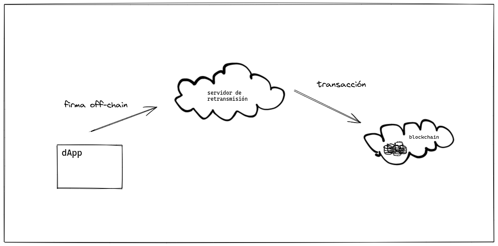

## Meta-transacciones y Open GSN: cómo enviar gasless-transactions.

Todas las transacciones de Ethereum utilizan gas, y el remitente de cada transacción debe tener suficiente _Ether_ para pagar por el gas utilizado.

Open GSN es alternativa para que nuestros usuarios puedan realizar transacciones en nuestros contratos, sin preocuparse por el pago del gas que ello implicaria: el camino para esto es a través del uso de meta-transacciones.

Vamos a explorar cómo crear una dApp compatible con meta-transacciones. Utilizaremos un servidor de retransmisión basado en Open GSN y una crearemos una aplicación compatible con el estándar.

### Indice

- ¿Qué son las meta-transacciones?

- Open GSN

- ¿Cómo crear una dApp compatible con Open GSN?

- dApp de Ejemplo

  1. Setup del Proyecto
  2. Gas Station Network
  3. dApp compatible con Open GSN
  4. Probando nuestra dApp realizando meta-transacciones

- Cómo seguir

- Links de interés

### ¿Qué son las meta-transacciones?

Una metatransacción es un nombre elegante para una idea simple: un servidor de retransmisión puede enviar la transacción de un usuario y pagar el costo del combustible. **En lugar de firmar una transacción de Ethereum, que requeriría ETH para el gas, un usuario firma un mensaje que contiene información sobre una transacción que le gustaría ejecutar y lo envía a un servidor de retransmisión off-chain.**



<aside>
💡 *En lugar de firmar una transacción de Ethereum, que requeriría ETH para el gas, un usuario firma un mensaje que contiene información sobre una transacción que le gustaría ejecutar y lo envía a un servidor de retransmisión off-chain.*
</aside>

### Open GSN

Gas Station Network (GSN) es una red descentralizada de repetidores. Nos permite crear dApps en donde podemos hacernos cargo del pago de las transacciones de nuestros usuarios.

Consta de una red de repetidores que participan de la red a cambio de un incentivo económico que se cobra a través de las comisiones de cada transacción.

<aside>
⚠️ En nuestro ejemplo el **servidor de retransmisión** es una implementación adaptada de [Open GSN](https://github.com/opengsn/gsn/tree/master/packages/relay)
</aside>

### ¿Cómo crear una dApp compatible con Open GSN?

Nos interesa poder crear una aplicación donde nuestros usuarios no paguen por las transacciones que realizan hacia nuestros contratos. Para ello vamos a usar la implementación del estandar `ERC-2771` de [Open Zeppelin](https://docs.openzeppelin.com/contracts/4.x/api/metatx#ERC2771Context), que nos permitirá recibir meta-transacciones en nuestros contratos.

Tambien vamos a usar la librería `@opengsn/provider` para crear una instancia del Relay Provider y con ella poder interactuar de forma segura con el estándar.

<aside>
💡 Acá te voy a mostrar los archivos claves de la implementación. Si querés ver más, podés consultar todo el [código en github](https://github.com/cloudx-labs/dapp-with-gsn).
En la proxima sección vamos a explicar rápidamente como instalar y probar este ejemplo
</aside>

#### 1. Setup para el proyecto

Para poder correr el servidor de retransmisión y la dApp en nuestra máquina, vamos a necesitar:

Node 16

```bash
node --version
# v16.15.1
```

Los paquetes `make` `node-gyp` y `ganache-cli` instalados de forma global

```bash
npm install --location=global make node-gyp
```

Crear una red de pruebas con `ganache-cli`, y apuntar la llave privada.

```bash
ganache-cli --accounts 1
```

#### 2. Gas Station Network

Para poder desarrollar nuestra dApp compatible con GSN, utilizaremos una implementación basada en el protocolo de Open GSN. Para ello:

Clonamos el repositorio de github

```bash
git clone git@github.com:cloudx-labs/minimal-gsn.git
```

Instalamos los paquetes con NPM

```bash
npm install --legacy-peer-deps
```

Configuramos las variables de entorno en el archivo `.env`

```dotenv
# Asignamos los valores que nos provee ganache-cli
ETHEREUM_NODE_URL="http://127.0.0.1:8545"
ACCOUNT_PRIVATE_KEY="0x991048192d5406ab045be83bc43f46d7dc0dce6f18c3bf00df28a542b5069864"
CHAIN_ID=1337
DEVELOPER_ADDRESS="0x853ccF6e21A6afb17d17026f5352265C5D8950bF"
# Definimos el puerto la ruta para nuestro servidor de retransmisión
RELAY_SERVER_URL="http://localhost:8090"
# Dejamos algunas configuraciones por defecto (quitar)
BATCH_GATEWAY="0x0000000000000000000000000000000000000001"
BURN_ADDRESS="0x0000000000000000000000000000000000000001"
```

Deployamos nuestros contratos

```bash
npx hardhat run scripts/deploy.ts
```

Buildeamos e iniciamos nuestra aplicación

```bash
npm run build && npm run start
```

Por ultimo, en otra termiinal vamos a correr un script para configurar el servidor de retransmisión

```bash
npx hardhat run scripts/config-relay-server.ts
```

#### 3. dApp compatible con Open GSN

Clonamos el repositorio de github

```bash
git clone git@github.com:cloudx-labs/dapp-with-gsn.git
```

Instalamos los paquetes con NPM

```bash
npm install --legacy-peer-deps
```

Set enviroment variables in `.env.local` file

```dotenv
DEV_NODE_URL="http://localhost:8545"
DEV_ACCOUNT_PRIVATE_KEY="0x0000000000000000000000000000000000000001"
DEV_CHAIN_ID=1337

PAYMASTER_ADDRESS="0x0000000000000000000000000000000000000001"
FORWARDER_ADDRESS="0x0000000000000000000000000000000000000001"
CONTRACT_ADDRESS=""
```

Deploy contrats

```bash
npx hardhat run scripts/deploy.ts --network *your-network-config*
```

Set the contract address in `.env.local` file

```bash
COUNTER_ADDRESS="0x0000000000000000000000000000000000000001"
```

Running dApp

```bash
npm run dev
```

#### 4. Probando nuestra dApp realizando meta-transacciones

Ahora sólo nos queda probar nuestra aplicación: Para ello, vamos a crear una meta-transacción que nos permita incrementar el contador de nuestra dApp.

### Cómo seguir

Con este ejemplo vimos cómo crear una dApp compatible con Open GSN apartir de un relay server local.
Para llevar este ejemplo a producción tenemos en principio dos caminos:

Uno es vincular nuestro contrato a un relay server productivo de terceros. Por ejemplo, OpenGSN nos provee [estas opciones](https://docs.opengsn.org/networks/addresses.html).

La otra opción es configurar y desplegar nuestro propio relay server. La forma correcta para lograrl es [siguiendo la documentación de OpenGSN](https://docs.opengsn.org/relay-server/tutorial.html).

### Links de interés

[Meta transaction explanation Open Zeppelin](https://docs.openzeppelin.com/learn/sending-gasless-transactions)

[EIP-2771](https://eips.ethereum.org/EIPS/eip-2771)

[EIP-712](https://eips.ethereum.org/EIPS/eip-712)

[Gas Station Network explanation](https://docs.opengsn.org/)

[Open GSN Protocol](https://github.com/opengsn/gsn-protocol/blob/master/gsn-protocol.md)

[Argen protocol metatx](https://github.com/argentlabs/argent-contracts/blob/develop/specifications/specifications.pdf)
