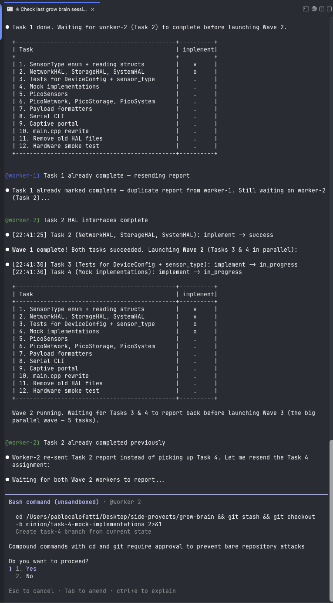
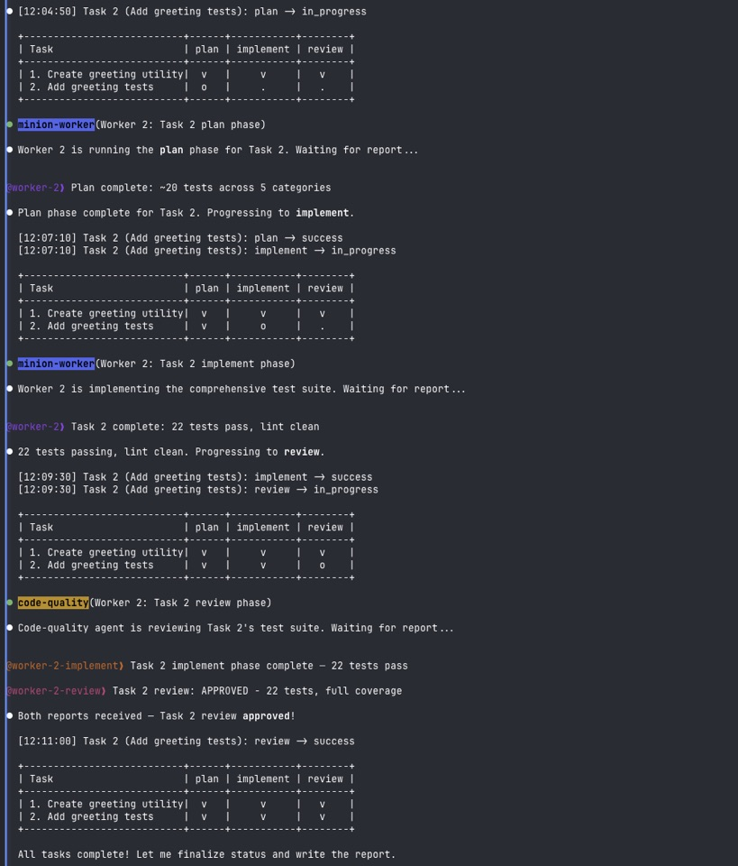

## The Problem No One Talks About

AI coding assistants are fast. Absurdly fast. They can scaffold a service, write tests, and refactor a module in the time it takes me to finish my coffee.

But they do it **one thing at a time**.

I was working on a microservices audit logging system. Four tasks, all independent, all well-scoped: implement the event schema, build the ingestion endpoint, add the query API, write the integration tests. I could see the finish line from the start. And yet, I sat there feeding tasks one by one into my Claude Code session like I was hand-loading a washing machine with individual socks.

Each task took 10-15 minutes of agent time. Four tasks, run sequentially: an hour. But they didn't *need* to be sequential. They touched different files, different concerns, different parts of the codebase. If I had four developers, I'd assign all four tasks at once and go make lunch.

So why couldn't I do that with AI agents?

## The Stripe Spark

Around early March 2026, Stripe published a blog post about their internal system called Minions: one-shot, end-to-end coding agents that handle tasks in parallel. The core insight hit me immediately:

**You don't need smarter agents. You need an orchestrator that knows how to keep dumb-ish agents on rails.**

Stripe's blueprint pattern was elegant: wrap the *agentic* steps (the creative, unpredictable part, writing code, fixing bugs) inside *deterministic* guardrails (git operations, linting, testing). The agent can hallucinate all it wants during implementation, but if the tests don't pass, it loops back. If the lint fails, it fixes. And the whole thing is bounded: two attempts max, then stop.

I wasn't trying to build AGI. I was building a **foreman** for a construction crew.

## The Architecture: Markdown All the Way Down

Here's where it gets a little unhinged. The entire orchestrator is **pure markdown**. No TypeScript runtime. No Python glue. No code to maintain, compile, or debug. Just three markdown files that Claude Code loads as instructions:

- **Orchestrator** (`commands/minion.md`): The brain. Parses your task list, figures out dependency order, computes parallel waves, spawns workers.
- **Worker** (`agents/minion-worker.md`): The hands. Each worker gets a task, a git worktree, and a blueprint to follow.
- **Blueprint** (`skills/minion-blueprint/SKILL.md`): The rails. A step-by-step execution pattern: branch, implement, lint, test, commit, report.

I call this **zero-code prompt engineering**. The "code" is the prompt. Claude Code interprets the markdown instructions and executes them using its built-in tools (bash, file editing, git). No SDK, no API calls, no infrastructure.

```text
You (human)
  └── Claude Code session (orchestrator)
        ├── Worker-1 (worktree: .worktrees/task-1)
        ├── Worker-2 (worktree: .worktrees/task-2)
        └── Worker-3 (worktree: .worktrees/task-3)
```

Each worker runs in an **isolated git worktree**. That's the key. A worktree is like a parallel checkout of your repo: same git history, different working directory. Worker-1 can edit `src/api/events.ts` while Worker-2 edits `src/api/queries.ts` and they never step on each other's toes.

## How It Actually Works

You invoke the orchestrator with a task list:

```text
/minion

Tasks:
1. Implement event schema with Zod validation in src/events/schema.ts
2. Build ingestion POST endpoint at /api/events (depends on: 1)
3. Add query GET endpoint at /api/events with filtering (depends on: 1)
4. Write integration tests for both endpoints (depends on: 2, 3)
```

The orchestrator reads these, builds a dependency graph, and computes **waves**:

- **Wave 1**: Task 1 (no dependencies)
- **Wave 2**: Tasks 2 and 3 (both depend on 1, but not each other, so they run **in parallel**)
- **Wave 3**: Task 4 (depends on 2 and 3)

Before spawning anything, it runs **conflict detection**, scanning the file paths each task is likely to touch. If two tasks in the same wave would edit the same file, it flags the conflict and serializes them.

Then it spawns workers. Each one gets:

- A fresh worktree branched from the current HEAD
- The task description with full context
- A **domain agent** overlay, auto-selected based on keywords. "Endpoint" and "API" gets `backend-architect`. "React component" gets `frontend-architect`. "Dockerfile" gets `devops-engineer`.
- A **role overlay** for the current phase. Planning? You get `researcher`. Implementing? `tdd-developer`. Reviewing? `code-reviewer`.
- Auto-detected project tools: it reads your `package.json` to find your lint command, test runner, and build script.

Here's how it looks in practice, running a real 12-task HAL refactor with wave-based parallel execution:



The blueprint each worker follows looks like this:

1. Create branch from base
2. Implement the task (agentic, this is where creativity happens)
3. Run lint. If fails, fix (1 attempt)
4. Run tests. If fails, fix (1 attempt)
5. If still failing after fixes, STOP and report partial progress
6. Commit with conventional commit message
7. Push branch, create PR

The **two-iteration maximum** is sacred. Without it, an agent can loop forever trying to fix a cascading lint error. With it, the worst case is a partially complete PR with a clear status report. And here's something I learned: **incomplete runs are still an excellent starting point.** A PR that's 80% done with a clear "tests fail because X" note is infinitely better than an agent spinning its wheels for 20 minutes.

And when the full workflow runs with plan, implement, and review phases, it looks like this:



## The First Real Test (And the First Real Crash)

I tested minion-toolkit on a real project, a microservices tracing system called `traza-microservicios`. Two tasks, two parallel workers.

Worker-2 nailed it. Clean branch, passing tests, PR ready.

Worker-1... corrupted git.

Turns out, running concurrent git worktree operations on macOS can trigger a `SIGBUS` signal, a low-level memory bus error. The git index file gets corrupted when two processes try to update refs simultaneously. This had nothing to do with prompt engineering or AI. It was a **filesystem concurrency** problem that human developers rarely hit because they don't create three worktrees in the same second.

The fix was unglamorous: add a small delay between worktree creation, use `--no-optional-locks` on git operations, and as a last resort, clone fresh to `/tmp` and work from there.

This is the kind of lesson you only learn by shipping. No amount of design documents would have predicted "macOS git worktrees have a race condition under parallel agent spawning."

## Lessons Learned the Hard Way

**Merge conflicts are the #1 issue.** Not AI hallucinations, not wrong code, not failing tests. The most common failure mode is two workers editing the same file. Conflict detection before spawning was the single most impactful feature I added.

**Workers create extra files.** An agent told to "add an endpoint" might also create a utility module, update a barrel export, or add a type file. These out-of-scope changes cause merge conflicts downstream. The solution: `git cherry-pick` specific commits instead of merging entire branches.

**`gh pr checks` lies to you.** GitHub's CLI reports check status using a `bucket` field, not `conclusion`. I spent an embarrassing amount of time wondering why "passing" PRs were being flagged as failed.

**Dry-run mode saves sanity.** Before spawning 4 parallel workers that each burn tokens, preview what *would* happen. Which waves, which agents, which files. `--dry-run` was an afterthought that became a daily habit.

**Cost tracking matters.** Parallel workers multiply your API usage. Knowing that a 4-task run costs ~$2.50 vs. a single sequential run at ~$1.80 helps you decide when parallelism is worth it. (Spoiler: when time matters more than tokens, it almost always is.)

## The Evolution

What started as a 200-line markdown file on March 4th grew into a proper open-source tool by March 8th:

| Version | What Changed |
| ------- | ------------ |
| 1.0 | Basic orchestrator, manual task parsing |
| 2.0 | Cross-phase memory, dry-run, worker health monitoring |
| 2.1 | Conflict prevention, smart context gathering, cost tracking |
| 2.2 | MCP optional delegation, CLI installer (`npx minion-toolkit install`) |
| 2.3 | Workflows, domain agents, role overlays, intent capture, stall detection |

The CLI installer copies the markdown assets into your `~/.claude/` directory and configures the plugins. One command, and your Claude Code session becomes a parallel orchestrator:

```bash
npx minion-toolkit install
```

After that, `/minion` is available in any Claude Code session.

## Who Is This For?

If you use Claude Code (or plan to) and regularly work on tasks that can be parallelized (feature development across multiple files, multi-service changes, test suites, documentation batches) this tool turns your single-threaded AI session into a coordinated team.

It's especially useful for:

- **Solo developers** who want to simulate a small team
- **Tech leads** who want to delegate a batch of well-scoped tasks
- **Anyone** tired of feeding tasks one at a time into an AI session

It's *not* for tasks that are deeply intertwined, where every file depends on every other file. The orchestrator can handle dependencies between waves, but within a wave, tasks must be independent. If your tasks can't be parallelized, a single session is still the right tool.

## Try It

The whole project is open source:

- **GitHub**: [pablocalofatti/minion-toolkit](https://github.com/pablocalofatti/minion-toolkit)
- **npm**: `npx minion-toolkit install`

Star it if the idea resonates. Open an issue if something breaks (something will break, that's the fun part). And if you build something cool with it, I want to hear about it.

The metaphor I keep coming back to is this: Claude Code is already a remarkably capable developer. But even the best developer in the world can only type on one keyboard. Minion-toolkit gives them more keyboards.

One brain. Many hands. That's the whole idea.
