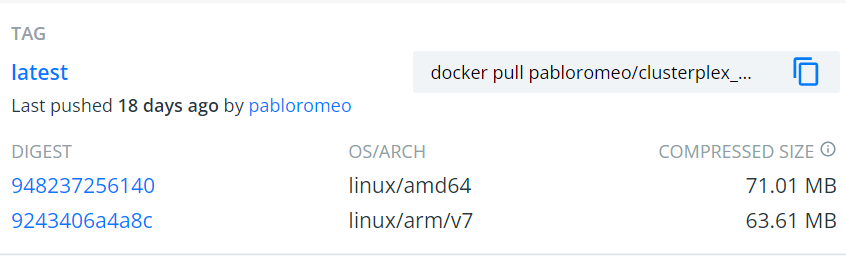
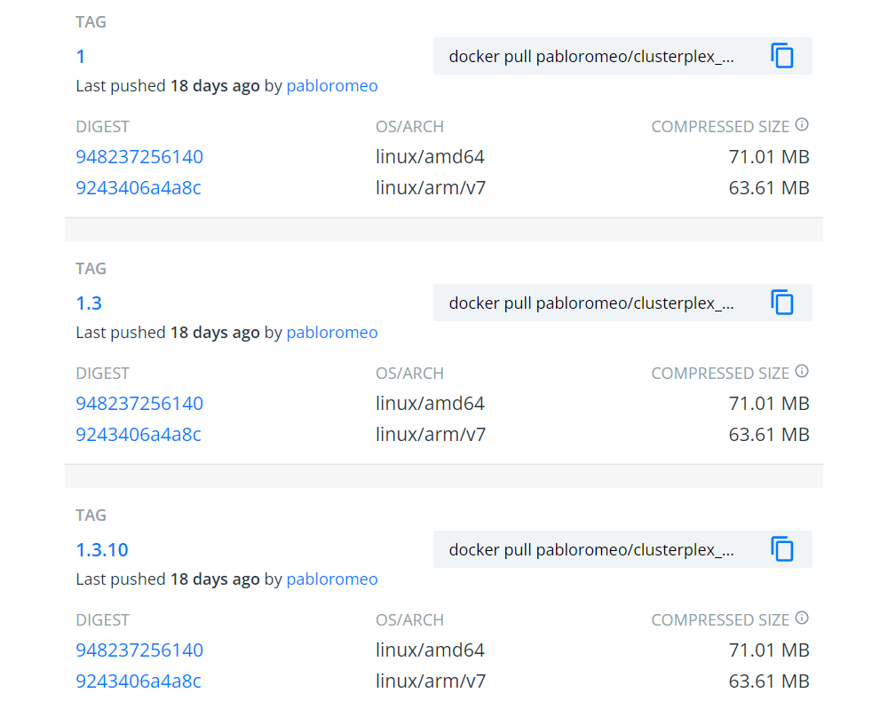

You may have come across Docker images like the one above :point_up:. In this example, you can see that the `latest` tag supports two different architectures. Meaning there are two different images for the same tag, and docker will pull the appropriate one depending on the target architecture. But...how are they built?

## The old way ##
Back in the day, the only option was to manually built each separate image using the `ARCH` build-arg, push it, and then use the `docker manifest` command to group the images together under the same manifest. 
This manual process is described in depth in [this post by the Docker team](https://www.docker.com/blog/multi-arch-build-and-images-the-simple-way/). But now there's even an easier way.

## Buildx to the rescue ##
Thankfully [Buildx](https://docs.docker.com/buildx/working-with-buildx/) automates this process and simplifies it quite a bit. A single command can do all that for you.
But who wants to be building images locally anyway? :grin:
Plus, automating it with Github Actions is a great excuse to also implement a proper tagging and versioning strategy as well as exploring multiple Container Registries.
Let's get to it! :muscle:

## Github Actions build##
The overall process is as follows:

1. Checkout the code
2. Setup [QEMU](https://www.qemu.org/)
3. Setup Buildx
4. Log into the target container registry
5. Docker Metadata tag voodoo magic _(optional)_
6. Build and push

Let's assume we have a Github repo with a `main` and a `dev` branch, PRs, as well as [versioned releases](https://docs.github.com/en/repositories/releasing-projects-on-github/managing-releases-in-a-repository).

We'll have a github actions YAML similar to the following:
```yaml
name: Build

# Controls when the workflow will run
on:
  workflow_dispatch
  push:
    branches:
      - 'main'
      - 'dev'
    tags:
      - 'v*.*.*'
  pull_request:
    branches:
      - 'main'
      - 'dev'

# permissions are needed if pushing to ghcr.io
permissions: 
  packages: write
  
jobs:
  build:
    runs-on: ubuntu-latest
    steps:
```

### Steps 1,2 and 3 ###
These are quite straightforward:
```yaml
      # Get the repository's code
      - name: Checkout
        uses: actions/checkout@v2
      # https://github.com/docker/setup-qemu-action
      - name: Set up QEMU
        uses: docker/setup-qemu-action@v1
      # https://github.com/docker/setup-buildx-action
      - name: Set up Docker Buildx
        id: buildx
        uses: docker/setup-buildx-action@v1
```
### Step 4 ###
For Github's Container Registry you can use the following:
```yaml
      - name: Login to GHCR
        if: github.event_name != 'pull_request'
        uses: docker/login-action@v1
        with:
          registry: ghcr.io
          username: ${{ github.repository_owner }}
          password: ${{ secrets.GITHUB_TOKEN }}
```
And for Dockerhub:
```yaml
      - name: Login to Docker Hub
        if: github.event_name != 'pull_request'
        uses: docker/login-action@v1
        with:
          username: ${{ secrets.DOCKERHUB_USERNAME }}
          password: ${{ secrets.DOCKERHUB_TOKEN }}
```
Create a [dockerhub access token](https://docs.docker.com/docker-hub/access-tokens/) and set the corresponding [github secrets](https://docs.github.com/en/actions/security-guides/encrypted-secrets).

### Step 5 ###
We could skip this step and just use the `latest` docker tag, but in real world scenarios you'll likely want a more elaborate image tagging strategy. Such as sha, branch, [Semantic Versioning](https://semver.org/), etc. 

So we'll use the extremely useful `docker/metadata-action@v3` for preparing those tags for us.
Check out [https://github.com/docker/metadata-action](https://github.com/docker/metadata-action) for more example tagging strategies. The documentation is great!

```yaml
      - name: Docker meta
        id: <meta_id> # you'll use this in the next step
        uses: docker/metadata-action@v3
        with:
          # list of Docker images to use as base name for tags
          images: |
            <specify the image name>
          # Docker tags based on the following events/attributes
          tags: |
            type=schedule
            type=ref,event=branch
            type=ref,event=pr
            type=semver,pattern={{version}}
            type=semver,pattern={{major}}.{{minor}}
            type=semver,pattern={{major}}
            type=sha
```
- This prepares image tags for branch, PR, major, major.minor, version, and sha, which you should adapt according to your own release process.
- Replace `meta_id` with something more appropriate. It will be used in the next step.
- Specify the image name under the `images:` section. For ex: `ghcr.io/pabloromeo/foo` for GHCR or `pabloromeo/foo` for dockerhub.

### Step 6 ###
And the final step is to actually build for each target platform and push to the registry.

```yaml
      - name: Build and push
        uses: docker/build-push-action@v2
        with:
          context: .
          platforms: linux/amd64,linux/arm/v7
          push: ${{ github.event_name != 'pull_request' }}
          tags: ${{ steps.<meta_id>.outputs.tags }}
          labels: ${{ steps.<meta_id>.outputs.labels }}
```
Change the following:
- The target architecture platforms to build, using `platforms:` (in this example AMD64 and ARMv7)
- Replace `<meta_id>` with the proper id used previously. 

## Final comments ##
This turned out to be a lengthy post, but the actual build definition is quite simple when put together, and you'll not only  get multi-arch docker images, but nice semver versioning and tagging as well. :smile:



To see full working examples of this we can take a look at the builds of two pet projects of mine: [Docker-Dogecoin](https://github.com/pabloromeo/docker-dogecoin) and [ClusterPlex](https://github.com/pabloromeo/clusterplex).

In [Docker-Dogecoin's Dockerfile](https://github.com/pabloromeo/docker-dogecoin/blob/master/Dockerfile) there's an example of how to write conditional logic as part of the docker build process depending on the target architecture to install different binaries for each.

In [Clusterplex's build](https://github.com/pabloromeo/clusterplex/blob/master/.github/workflows/main.yml) it actually pushes to BOTH ghcr.io and Dockerhub simultaneously, as well as updating Dockerhub's Description page to the content of the README.md in the repo.
