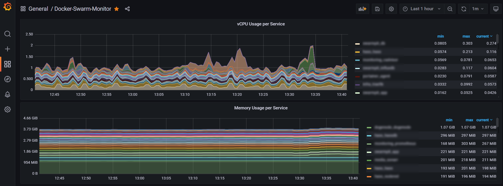
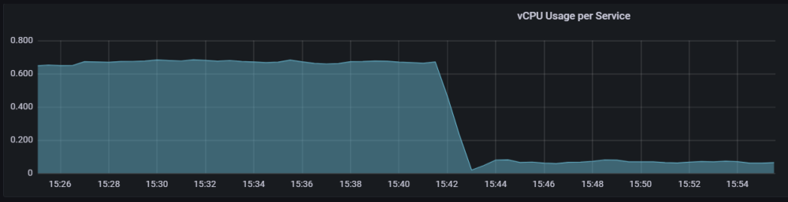

When running multiple docker containers, be it on a single server, a Kubernetes cluster or in Docker Swarm, it is very important to be able to monitor their resource usage.

That's where [cAdvisor](https://github.com/google/cadvisor) comes in. It provides useful metrics to build Monitoring Dashboards using Grafana and Prometheus:


But there is one big problem: **cAdvisor's default settings**.

The consequence of running the default configuration is very high CPU usage. Especially noticeable in low-powered devices such as the Raspberry Pi's from the cluster in the graph above.

cAdvisor uses more CPU than the containers it is monitoring! :sob:

# The fix #
Thankfully, it's quite simple. The parameters that make the biggest impact are:

- housekeeping_interval
- docker_only
- disable_metrics

A detailed explanation of each can be found [here](https://github.com/google/cadvisor/blob/master/docs/runtime_options.md).

# Docker-compose Swarm example #

Below I'm defining a `housekeeping_interval` of 30 seconds, setting `docker_only` to `true`, and disabling metrics I'm not interested in, using `disable_metrics`.

*NOTE*: Beware that I'm using an ARM version of cAdvisor, change the image/tag accordingly.

```yaml
version: '3.4'

services:
  cadvisor:
    image: zcube/cadvisor:latest
    ports:
      - published: 9102
        target: 9102
        mode: host
    command:
      - "--port=9102"
      - "--housekeeping_interval=30s"
      - "--docker_only=true"
      - "--disable_metrics=percpu,sched,tcp,udp,disk,diskIO,accelerator,hugetlb,referenced_memory,cpu_topology,resctrl"
    volumes:
      - /var/lib/docker/:/var/lib/docker:ro
      - /dev/disk/:/dev/disk:ro
      - /sys:/sys:ro
      - /var/run:/var/run:ro
      - /:/rootfs:ro
      - /sys/fs/cgroup:/cgroup:ro
      - /etc/machine-id:/etc/machine-id:ro
      - /etc/localtime:/etc/localtime:ro
    deploy:
      mode: global
      update_config:
        order: stop-first
      resources:
        reservations:
          memory: 80M
    healthcheck:
      test: wget --quiet --tries=1 --spider http://localhost:9102/healthz || exit 1
      interval: 15s
      timeout: 15s
      retries: 5
      start_period: 30s
```

# Did it help?

Check this out:


I'm sure you can guess at what time the new settings kicked in :smirk:. From **0.68** vCPU to **0.08** vCPU! 
Not bad at all.
