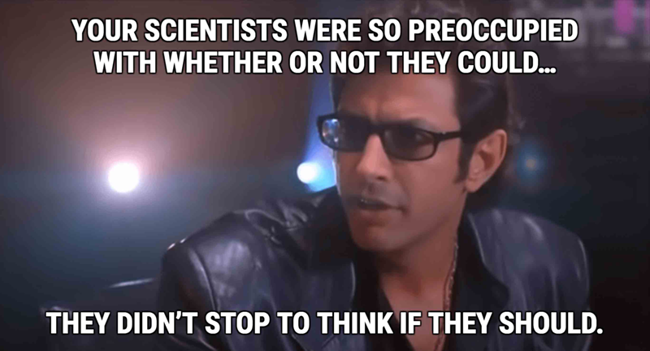

Co-written with [Pablo Coronel](https://github.com/pablitxn)

What if for the activities you do on your day-to-day you were **rewarded with tokens** that would allow you to participate in company decisions? Sounds great, right? It is possible. We might not all be part of the Roy family from Succession, but we can have access to certain decisions of our company depending on our participation in it.

In this article we will tell you about the idea that led us to build our own **Decentralized Autonomous Organization (DAO)**, and how we are implementing it within CloudX.

<figcaption>The Roy family from Succession series</figcaption>

## First things first… What is a DAO?

A DAO is an organization that runs on blockchain and is controlled in its entirety by computational algorithms—aka **smart contracts**. Once published to the blockchain, smart contracts execute autonomously and determine how the DAO’s participants should behave. A DAO is coordinated in a **decentralized, horizontal** fashion, meaning that each one of its participants has an equal right to make decisions. Additionally, if any modification needs to be made to the DAO, all of its members must reach **consensus** in order to apply the change.

There are infinite use cases for DAOs, but they are specially being implemented **in the financial world**. In LatAm there are many projects exploring DAOs application in other fields, for example to provide transparency in nonprofit organizations, or in social verification methods such as [Proof of Humanity](https://github.com/Proof-Of-Humanity).

## Now, what is our motivation?

Usually, we start most of the initiatives of the Research & Development team in CloudX with a simple question: _“I wonder if «some crazy idea» is possible to do?”_. This case was not different.

In CloudX, we frequently open the decision making process to the whole team. How? Through **polls in Slack**. That made us think: would it be possible to implement **a similar participation system** but based on crypto tokens? This simple question took us down a rabbit-hole to a final outcome: let’s create a **Decentralized Autonomous Organization (DAO)** for internal use within CloudX.

Our main goals are to:

* Have **active participation** of the team in the decision making process.
* Have **weighted governance** while voting for company initiatives.
* Add **gamification** and **fun** to it, with rewards for employees.

By implementing a DAO in our company, not only we are expecting to meet these goals, but also we get to familiarize our team with the crypto ecosystem, while learning about DAOs, meta-transactions and dApps.

## Implementing a DAO in a software company

In our DAO, users are rewarded with **governance tokens** for different activities they can engage in within CloudX. There is a vast spectrum of activities across the different areas of the company, for example, publishing a tech article in Dev.to, interviewing candidates, giving a tech talk, preparing a course or workshop, assisting other coworkers, reaching milestones, and so on.

This brings **Gamification** to the table, because when it’s time to vote for new proposals, votes are weighted proportionally to the amount of tokens the voter holds.

The **proposals** we are thinking about voting via our DAO are those that involve different team members of the company in daily activities. They can be very simple things, such as deciding on which date and time we should hold an all-hands meeting, proposing topics for internal workshops, or deciding what our company merch should be.

Nevertheless, we naturally ran into an interesting problem. In the blockchain ecosystem—and DAOs are no different—every transaction has a **fee**. We absolutely don’t want CloudX members having to spend money from their wallets in order to vote for initiatives. his problem led us to think of a solution that allowed CloudX to cover transaction fees in a transparent way.

To solve this problem we came up with the use of **meta-transactions**, which are transactions that are signed off-chain—outside the blockchain itself—by our DAO’s users. These meta-transactions are then embedded into another transaction which, in turn, is submitted and **paid by a different account** that will ultimately take care of the costs. In consequence, this enables the participants of our DAO to interact with it but not having to worry about the network’s fees.

## How are we doing it?

**We are creating a dApp**—decentralized application—, which is a type of application where operations do not depend on centralized control points or servers, but works based on a **decentralized network**. Our DAO will run on **Ethereum** blockchain.

For the development we chose **Solidity**, which is a language with a large community and an extensive tool set. It also gives us the possibility to make our smart contracts compatible with many of the most popular and widely used networks.

For the operation of our DAO we have two smart contracts that articulate it as follows:

1. **GovernorContract**: Manages the governance of our DAO, the creation and execution of proposals, the voting and quorum required for approval, and the duration of each proposal.
2. **GovernanceToken**: Manages votes and participation. Each participant of the DAO holds governance tokens in their wallets.

Some of **the tools** we are using for this development are:

* **OpenZeppelin** provides us with a set of smart contracts that are audited and approved by its community, which makes it completely secure for implementation. In our case, the governor contracts, the governance tokens and the administration tokens were created with this library.
* **Foundry** is a suite of tools for the development of smart contracts that allows us to manage dependencies, compile our contracts, run tests, deploy them and interact with them through scripts. All of this uses Solidity in its entirety.
* We are considering using **OpenGSN** as the protocol to provide us with the infrastructure to handle our users' meta-transactions. It provides us with different relayers that will receive the meta-transactions from our users, execute the final transaction and pay the network cost.

## What's next?

As our DAO starts to gain adoption within CloudX, we will continue to improve it, adding new features in order to make it more robust and empower people to participate in it.

Some of the ideas we have in mind for future iterations are to:

* Enable the DAO to be **self-managed** and able to define the weight (amount of tokens) per activity.
* Depending on the level of adoption, analyze the need to apply some adjustment mechanism to **balance** longstanding holders versus new members of the organization.
* Evaluate the possibility to offer **buy-back** to holders, meaning that somebody who owns tokens can sell them back to CloudX.
* Brainstorm additional **integrations** that enable new activities that can mint tokens.
* **Host** our DAO in a decentralized way via a protocol such as IPFS.

As we do in many projects, this internal initiative from the Research & Development team of CloudX is a sort of **“proof of concept”**. All the time we are coming up with ideas to use technology to improve our daily tasks.

In CloudX we are passionate about what we do and we think of **technology as an end in itself**. And, why not, we also like to have fun with it and transform our organization with a gamification process—that has also a lot to do with learning—and that has, as a result, the benefit of making more people participate in our decision making process.
