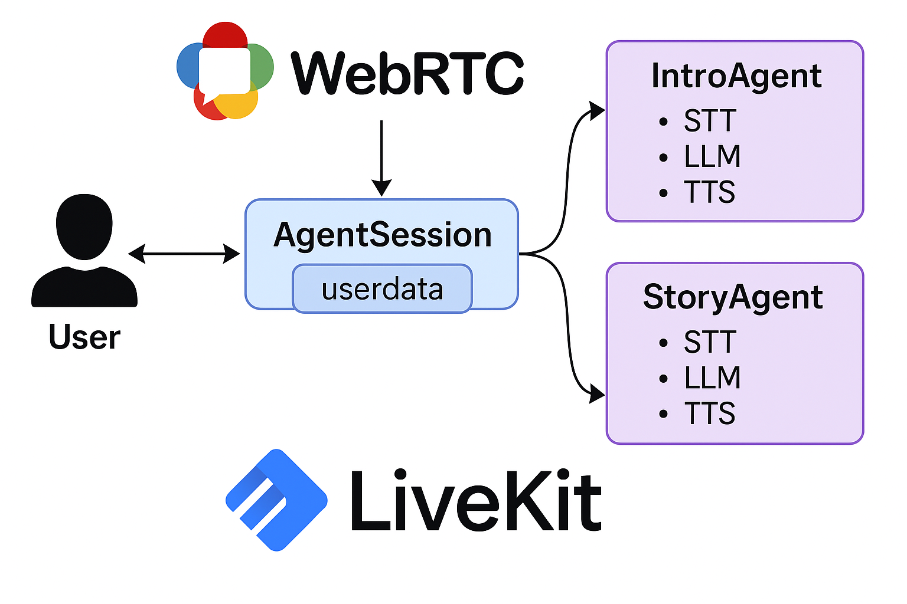

## From Simple Bots to Dynamic Conversations

We've all seen the basic voice AI demos – ask a question, get an answer. But real-world interactions often involve multiple stages, different roles, or specialized knowledge. How do you build a voice AI system that can gracefully handle introductions, gather information, perform a core task, and then provide a conclusion, potentially using different AI "personalities" or models along the way?

Chaining traditional REST API calls for STT, LLM, and TTS already introduces latency and state management headaches for a *single* agent turn. Trying to orchestrate *multiple* logical agents or conversational stages this way becomes exponentially more complex, laggy, and brittle.

This article explores a powerful solution: building **multi-agent voice AI sessions** using **WebRTC** for real-time communication and the **LiveKit Agents framework** for orchestration. We'll look at a practical Python example of a "storyteller" agent that first gathers user info and then hands off to a specialized story-generating agent, all within a single, low-latency voice call.

## Why Does the Standard API Approach Fall Short (Especially for Multi-Agent)?

The typical STT → LLM → TTS cycle via separate API calls suffers from:

*   🐌 **High Latency:** Each step adds delay, making turn-taking slow.
*   💸 **Potential High Cost:** Multiple API calls per user turn can get expensive.
*   🧠 **State Management Hell:** Keeping track of conversation history and shared data *across different logical stages or agents* is difficult with stateless APIs.
*   📉 **Reliability & Scalability Issues:** A single backend process trying to juggle multiple users *and* complex state logic becomes a bottleneck and point of failure.
*   😠 **Robotic Interaction:** Difficulty handling interruptions or smoothly transitioning between conversational goals.

## The Solution: Real-Time Foundations with WebRTC & LiveKit

**WebRTC (Web Real-Time Communication):** This browser and mobile standard allows direct, low-latency audio/video/data streaming between participants. It's the foundation for seamless voice calls.

**LiveKit:** An open-source infrastructure layer that makes building scalable, reliable WebRTC applications *much* easier. For voice AI, it provides:

*   **Signaling & Room Management:** Handles participant connections, discovery, and the state of the "room" where the conversation happens. This is our "virtual conference room."
*   **Optimized Media Streaming:** Ensures audio flows efficiently.
*   **Scalability:** Designed for many concurrent users.
*   **Agent Framework (`livekit-agents`):** A specific Python library (and SDKs for other languages) built on LiveKit, designed explicitly for creating voice (and text) AI agents. It manages the complexities of:
    *   Real-time audio stream processing.
    *   Integrating STT, LLM, TTS plugins.
    *   Handling interruptions (using VAD - Voice Activity Detection).
    *   **Crucially for this article: Managing multiple agents within a single session and facilitating handoffs and shared state.**

## Multi-Agent Architecture with LiveKit Agents

The provided example demonstrates a pattern where agents collaborate within a single `AgentSession`:

1.  **User & Session Start:** The user connects to a LiveKit room. An `AgentSession` is created, managing the overall interaction and holding shared `userdata`. The *initial* agent (`IntroAgent`) is added to the session.

2.  **Agent 1 (`IntroAgent`) Execution:**
    *   Receives the user's audio stream.
    *   Uses its configured STT, LLM (e.g., GPT-4o-mini), and TTS to interact according to its specific `instructions` (gather name and location).
    *   The LLM identifies when the required information is gathered.
3.  **Agent Handoff:**
    *   The LLM triggers a specific function call defined on `IntroAgent` (e.g., `information_gathered`).
    *   This function receives the gathered data (`name`, `location`).
    *   It **updates the shared `userdata`** within the `AgentSession`.
    *   It **creates an instance of the *next* agent** (`StoryAgent`), potentially passing it the gathered data or the existing chat context.
    *   It **returns the `StoryAgent` instance** to the `AgentSession`.
4.  **Agent 2 (`StoryAgent`) Activation:**
    *   The `AgentSession` replaces `IntroAgent` with `StoryAgent`.
    *   `StoryAgent`'s `on_enter` method might be called to kick off its part of the conversation.
    *   It now handles the user's audio stream, using its *own* potentially different configuration (e.g., real-time OpenAI LLM with built-in voice) and `instructions` (tell a story using the name/location from `userdata`).
5.  **Further Interaction & Termination:**
    *   The `StoryAgent` interacts with the user.
    *   When the story concludes (potentially triggered by another function call like `story_finished`), the agent can generate a final message and even initiate disconnecting the user or closing the LiveKit room.


*(Diagram: User interacts with the AgentSession, which activates Agent 1 or Agent 2. Agents can access/modify shared userdata and trigger handoffs.)*

## Let's Build: The Multi-Agent Storyteller (Python)

Let's break down the key parts of the provided code. (There will be a link to the official livekit repository at the end)

### 1. Prerequisites:

*   Python 3.8+
*   LiveKit Cloud account ([free tier](https://cloud.livekit.io/)) or self-hosted server (URL, API Key, API Secret).
*   OpenAI API Key.
*   Deepgram API Key.
*   (Optional) Silero VAD model (downloaded automatically by the plugin).
*   Install libraries:
    ```bash
    pip install "livekit-agents[openai,silero,deepgram]~=1.0rc" python-dotenv # Add any other plugins you might use
    ```

### 2. Setup (`.env` file):

```bash
# .env
LIVEKIT_URL="wss://YOUR_PROJECT_URL.livekit.cloud"
LIVEKIT_API_KEY="YOUR_LK_API_KEY"
LIVEKIT_API_SECRET="YOUR_LK_API_SECRET"

OPENAI_API_KEY="sk-..."
DEEPGRAM_API_KEY="..."
# Optional webhook for StoryAgent's finish function if needed
# CRM_WEBHOOK_URL="..."
```

### 3. Core Agent Code Breakdown (agent.py):
* **Imports:** Loads essential Python standard libraries (`logging`, `dataclasses`, `typing`, `dotenv`) and core components from the `livekit-agents` SDK:
  - `Agent`, `AgentSession`, and `RunContext`: Power the lifecycle and logic of agents.
  - `RoomInputOptions` and `RoomOutputOptions`: Configure how audio is handled in the LiveKit room.
  - `function_tool`: Allows the LLM to expose callable functions as part of the agent logic.
  - `deepgram`, `openai`, `silero`: Pre-built plugin integrations for STT (speech-to-text), LLM (language model), TTS (text-to-speech), and VAD (voice activity detection).

  This setup gives you full control and **modularity** over what models and services each agent uses for voice and language tasks.

```python
import logging
from dataclasses import dataclass
from typing import Optional

from dotenv import load_dotenv

from livekit import api
from livekit.agents import (
    Agent,
    AgentSession,
    ChatContext,
    JobContext,
    JobProcess,
    RoomInputOptions,
    RoomOutputOptions,
    RunContext,
    WorkerOptions,
    cli,
    metrics,
)
from livekit.agents.job import get_current_job_context
from livekit.agents.llm import function_tool
from livekit.agents.voice import MetricsCollectedEvent
from livekit.plugins import deepgram, openai, silero
```

* **Logger & Environment Setup:**
  - `logger = logging.getLogger("multi-agent")`: Sets up a logger instance named `"multi-agent"` for outputting logs throughout the agent lifecycle. Helpful for debugging and usage tracking.
  - `load_dotenv()`: Loads environment variables from a `.env` file, allowing credentials or config values (e.g., API keys for OpenAI or Deepgram) to be securely managed outside the code.

```python
logger = logging.getLogger("multi-agent")
load_dotenv()
```

* **Instruction Prompt:**
  - `common_instructions`: A base prompt string used to define the persona and behavior of both agents. In this case, the agent is introduced as **"Echo"**, a friendly and curious storyteller who interacts via voice.

```python
common_instructions = (
    "Your name is Echo. You are a story teller that interacts with the user via voice."
)
```

*   `StoryData` **Dataclass:**

```python
@dataclass
class StoryData:
    name: Optional[str] = None
    location: Optional[str] = None
```
This simple structure holds the shared state (user's name and location) that needs to persist between agents. It's attached to the `AgentSession`.

- **IntroAgent**:
  - `__init__`: Sets specific `instructions` to gather name and location. Uses default models configured later in the `AgentSession`.
  - `on_enter`: Called when this agent becomes active. It immediately prompts the LLM to generate a reply based on its instructions (the introduction).
  - `information_gathered` **Function Tool**:

```python
class IntroAgent(Agent):
    def __init__(self) -> None:
        super().__init__(
            instructions=f"{common_instructions} Your goal is to gather a few pieces of "
            "information from the user to make the story personalized and engaging."
            "You should ask the user for their name and where they are from."
            "Start the conversation with a short introduction.",
        )

    async def on_enter(self):
        # when the agent is added to the session, it'll generate a reply
        # according to its instructions
        self.session.generate_reply()

    @function_tool
    async def information_gathered(
        self,
        context: RunContext[StoryData],
        name: str,
        location: str,
    ):
        """Called when the user has provided the information needed to make the story
        personalized and engaging.

        Args:
            name: The name of the user
            location: The location of the user
        """

        context.userdata.name = name
        context.userdata.location = location

        story_agent = StoryAgent(name, location)
        # by default, StoryAgent will start with a new context, to carry through the current
        # chat history, pass in the chat_ctx
        # story_agent = StoryAgent(name, location, chat_ctx=context.chat_ctx)

        return story_agent, "Let's start the story!"
```
This is the key handoff mechanism. The LLM calls this function. It updates userdata, creates StoryAgent, and returns it to the session manager.

- **StoryAgent**:
  - `__init__`: Takes `name` and `location` (retrieved from `userdata` by the caller). Sets its own `instructions` incorporating this data.
    - Crucially, it overrides the LLM to use `openai.realtime.RealtimeModel` (which includes voice output) and sets `tts=None`. This shows agent-specific model configuration.
    - It can optionally receive the `chat_ctx` to continue the history.
  - `on_enter`: Similar to `IntroAgent`, starts the interaction.
  - `story_finished` **Function Tool**: Allows the LLM to signal the end of the story, generate a goodbye, and terminate the room via the LiveKit API.

```python
class StoryAgent(Agent):
    def __init__(self, name: str, location: str, *, chat_ctx: Optional[ChatContext] = None) -> None:
        super().__init__(
            instructions=f"{common_instructions}. You should use the user's information in "
            "order to make the story personalized."
            "create the entire story, weaving in elements of their information, and make it "
            "interactive, occasionally interating with the user."
            "do not end on a statement, where the user is not expected to respond."
            "when interrupted, ask if the user would like to continue or end."
            f"The user's name is {name}, from {location}.",
            # each agent could override any of the model services, including mixing
            # realtime and non-realtime models
            llm=openai.realtime.RealtimeModel(voice="echo"),
            tts=None,
            chat_ctx=chat_ctx,
        )

    async def on_enter(self):
        # when the agent is added to the session, we'll initiate the conversation by
        # using the LLM to generate a reply
        self.session.generate_reply()

    @function_tool
    async def story_finished(self, context: RunContext[StoryData]):
        """When you are fininshed telling the story (and the user confirms they don't
        want anymore), call this function to end the conversation."""
        # interrupt any existing generation
        self.session.interrupt()

        # generate a goodbye message and hang up
        # awaiting it will ensure the message is played out before returning
        await self.session.generate_reply(
            instructions=f"say goodbye to {context.userdata.name}", allow_interruptions=False
        )

        job_ctx = get_current_job_context()
        lkapi = job_ctx.api
        await lkapi.room.delete_room(api.DeleteRoomRequest(room=job_ctx.room.name))
```

- **prewarm** **Function**: Loads the Silero VAD (Voice Automatic Detection) model once when the worker starts, avoiding redundant loading for each session.

```python
def prewarm(proc: JobProcess):
    proc.userdata["vad"] = silero.VAD.load()
```

- **entrypoint** **Function**:
  - Connects to the LiveKit room.
  - **Creates the `AgentSession`**:
    - Passes the prewarmed VAD.
    - Sets the default STT, LLM, and TTS plugins (agents can override these).
    - Initializes the shared `userdata` with an empty `StoryData` instance.
  - Sets up metrics collection (good practice!).
  - **Starts the session**:
    - Crucially, passes the initial agent (`IntroAgent()`) to the `start` method.
    - Configures room input/output options (like noise cancellation or transcription).
  - Includes a loop to keep the agent process alive.

```python
async def entrypoint(ctx: JobContext):
    await ctx.connect()

    session = AgentSession[StoryData](
        vad=ctx.proc.userdata["vad"],
        # any combination of STT, LLM, TTS, or realtime API can be used
        llm=openai.LLM(model="gpt-4o-mini"),
        stt=deepgram.STT(model="nova-3"),
        tts=openai.TTS(voice="echo", model="gpt-4o-mini-tts"),
        userdata=StoryData(),
    )

    # log metrics as they are emitted, and total usage after session is over
    usage_collector = metrics.UsageCollector()

    @session.on("metrics_collected")
    def _on_metrics_collected(ev: MetricsCollectedEvent):
        metrics.log_metrics(ev.metrics)
        usage_collector.collect(ev.metrics)

    async def log_usage():
        summary = usage_collector.get_summary()
        logger.info(f"Usage: {summary}")

    ctx.add_shutdown_callback(log_usage)

    await session.start(
        agent=IntroAgent(),
        room=ctx.room,
        room_input_options=RoomInputOptions(
            # uncomment to enable Krisp BVC noise cancellation
            # noise_cancellation=noise_cancellation.BVC(),
        ),
        room_output_options=RoomOutputOptions(transcription_enabled=True),
    )


if __name__ == "__main__":
    cli.run_app(WorkerOptions(entrypoint_fnc=entrypoint, prewarm_fnc=prewarm))
```

### 4. Running & Connecting:

- Run the agent: `python agent.py`
- Connect using the Agent Playground (link below) or your own client, pointing to your LiveKit instance, ensuring you join the room the agent is listening for (usually determined by how the agent job is launched or configured).

---

### Why This Multi-Agent Approach Rocks

- 🧩 **Modular Roles**: Each agent focuses on a specific task with its own instructions and even different AI models.
- 🧼 **Clean State Management**: `userdata` provides a clear way to share necessary information between agents.
- 🔁 **Seamless Handoffs**: Function calls provide a natural mechanism for transitioning conversational stages.
- ⚡ **Low Latency**: Still benefits from WebRTC’s real-time streaming.
- 🧠 **Flexibility**: Mix and match standard and real-time models, different STT/TTS providers per agent.
- 🏗️ **Scalable**: Built on the robust LiveKit infrastructure.

---

### Conclusion

Managing complex, multi-stage voice conversations requires moving beyond simple request-response cycles. The LiveKit Agents framework, built on the real-time foundation of WebRTC, provides elegant solutions for orchestrating multiple agents, managing shared state, and facilitating smooth handoffs – all while maintaining low latency.

This storyteller example showcases the power of this approach, allowing different AI "personalities" or specialists to collaborate within a single, natural-feeling voice session.

- Dive deeper into the [LiveKit Agents Documentation](https://docs.livekit.io/agents).
- Explore the full [multi-agent example code](https://github.com/livekit/agents/blob/dev-1.0/examples/voice_agents/multi_agent.py).
- To use as a client explore the [agent-playground example code](https://github.com/livekit/agents-playground/tree/main).
- Sign up for [LiveKit Cloud](https://cloud.livekit.io) to get started quickly.

**What kind of multi-agent voice interactions would you build with this? Share your ideas in the comments!**
