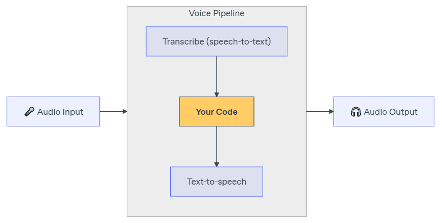

## Beyond Single Turns: OpenAI Enters the Voice Agent Arena

In our previous post, [Building Multi-Agent Conversations with WebRTC & LiveKit](https://dev.to/cloudx/building-multi-agent-conversations-with-webrtc-livekit-48f1), we explored how to create complex, multi-stage voice interactions using the real-time power of WebRTC and the orchestration capabilities of the LiveKit Agents framework. We saw how crucial low latency and effective state management are for natural conversations, especially when handing off between different agent roles.

Recently, OpenAI has significantly enhanced its offerings for building agentic systems, including dedicated tools and SDKs for creating voice agents. While the core concept of chaining Speech-to-Text (STT), Large Language Model (LLM), and Text-to-Speech (TTS) remains, OpenAI now provides more integrated primitives and an SDK designed to simplify this process, particularly within their ecosystem.

This article dives into building voice agents using the OpenAI Agents SDK. We'll examine its architecture, walk through a Python example, and critically compare this approach with the LiveKit method discussed previously, highlighting the strengths, weaknesses, and ideal use cases for each.

## OpenAI's Vision for Agents: Primitives and Orchestration

OpenAI positions its platform as a set of composable primitives for building agents, covering domains like:

* **Models:** Core intelligence (GPT-4o, the latest GPT-4.1 and GPT-4.1-mini, etc.) capable of reasoning and handling multimodality.
* **Tools:** Interfaces to the outside world, including developer-defined function calling, built-in web search, file search, etc.
* **Knowledge & Memory:** Using Vector Stores and Embeddings for context and persistence.
* **Audio & Speech:** Primitives for understanding and generating voice.
* **Guardrails:** Moderation and instruction hierarchy for safety and control.
* **Orchestration:** The Agents SDK, Tracing, Evaluations, and Fine-tuning to manage the agent lifecycle.

For **Voice Agents**, OpenAI presents two main architectural paths:

1. **Speech-to-Speech (Multimodal - Realtime API):** Uses models like gpt-4o-realtime-preview that process audio input directly and generate audio output, aiming for the lowest latency and understanding vocal nuances. This uses a specific Realtime API separate from the main Chat Completions API.
2. **Chained (Agents SDK + Voice):** The more traditional STT → LLM → TTS flow, but orchestrated using the openai-agents SDK with its [voice] extension. This provides more transparency (text transcripts at each stage) and control, making it easier to integrate into existing text-based agent workflows.

**This post will focus on the Chained architecture using the OpenAI Agents SDK, as it aligns more closely with common agent development patterns and provides a clearer comparison point to the plugin-based approach of LiveKit.**

## The OpenAI Agents SDK: Simplifying Agent Logic

The `openai-agents` Python SDK aims to provide a lightweight way to build agents with a few core concepts:

* **Agent:** An LLM equipped with instructions, tools, and potentially knowledge about when to hand off tasks.
* **Handoffs:** A mechanism allowing one agent to delegate tasks to another, more specialized agent. Agents are configured with a list of potential agents they can hand off to.
* **Tools (`@function_tool`):** Decorator to easily expose Python functions to the agent, similar to standard OpenAI function calling.
* **Guardrails:** Functions to validate inputs or outputs and enforce constraints.
* **Runner:** Executes the agent logic, handling the loop of calling the LLM, executing tools, and managing handoffs.
* **VoicePipeline (with [voice] extra):** Wraps an agent workflow (like one using Runner) to handle the STT and TTS parts of a voice interaction.

The philosophy is "Python-first," relying on Python's built-in features for orchestration rather than introducing many complex abstractions.

## Architecture with OpenAI Agents SDK (Chained Voice)

When using the `VoicePipeline` from the SDK, the typical flow for a voice turn looks like this:

1. **Audio Input:** Raw audio data (e.g., from a microphone) is captured.
2. **VoicePipeline (STT):** The pipeline receives audio chunks. It uses an OpenAI STT model (like `gpt-4o-transcribe` via the API) to transcribe the user's speech into text once speech ends (or via push-to-talk).
3. **Agent Workflow Execution (MyWorkflow.run in the example):**
    * The transcribed text is passed to your defined workflow (e.g., a class inheriting from `VoiceWorkflowBase`).
    * Inside the workflow, the `Runner` is invoked with the current `Agent`, conversation history, and the new user text.
    * The `Agent` (LLM) decides whether to respond directly, call a `Tool` (function), or `Handoff` to another agent based on its instructions and the user input.
    * If a tool is called, the `Runner` executes the Python function and sends the result back to the LLM.
    * If a handoff occurs, the `Runner` switches context to the new agent.
    * The LLM generates the text response.
4. **VoicePipeline (TTS):** The final text response from the agent workflow is sent to an OpenAI TTS model (e.g., `gpt-4o-mini-tts`) via the API to generate audio.
5. **Audio Output:** The generated audio data is streamed back to be played to the user.


*(Diagram: Microphone feeds audio to VoicePipeline for STT. Text goes to Agent Workflow (using Runner, Agent, Tools, Handoffs). Text response goes back to VoicePipeline for TTS, then to Speaker.)*

This contrasts with the LiveKit architecture where WebRTC handles the audio transport layer directly, and the `livekit-agents` framework integrates STT/LLM/TTS plugins into that real-time stream.

## Let's Build: The Multi-Lingual Assistant (Python Example)

Let's break down the key parts of the official OpenAI Agents SDK voice example. (Link to the repository will be at the end).

## 1. Prerequisites

* Python 3.8+
* OpenAI API Key.
* Install the SDK with voice extras:

```bash
pip install "openai-agents[voice]" sounddevice numpy python-dotenv textual # For the demo UI
```

## 2. Setup (.env file)

```bash
# .env
OPENAI_API_KEY="sk-..."
```

## 3. Core Agent Logic (`my_workflow.py`)

This file defines the agents and the workflow logic that runs after speech is transcribed to text and before the response text is sent for synthesis.

* **Imports:** Necessary components from `agents` SDK (`Agent`, `Runner`, `function_tool`, `VoiceWorkflowBase`, etc.).
* **Tool Definition (`get_weather`):** A simple Python function decorated with `@function_tool` to make it callable by the `agent`. The SDK handles generating the schema for the LLM.

```python
import random
from collections.abc import AsyncIterator
from typing import Callable

from agents import Agent, Runner, TResponseInputItem, function_tool
from agents.extensions.handoff_prompt import prompt_with_handoff_instructions
from agents.voice import VoiceWorkflowBase, VoiceWorkflowHelper

@function_tool
def get_weather(city: str) -> str:
    """Get the weather for a given city."""
    print(f"[debug] get_weather called with city: {city}")
    choices = ["sunny", "cloudy", "rainy", "snowy"]
    return f"The weather in {city} is {random.choice(choices)}."
```

* **Agent Definitions (`spanish_agent`, `agent`):**
  * Each `Agent` is created with a `name`, `instructions` (using a helper `prompt_with_handoff_instructions` to guide its behavior regarding handoffs), a `model`, and optionally `tools` it can use and other `handoffs` it can initiate.
  * The `handoff_description` helps the calling agent decide which agent to hand off to.

```python
spanish_agent = Agent(
    name="Spanish",
    handoff_description="A spanish speaking agent.",
    instructions=prompt_with_handoff_instructions(
        "You're speaking to a human, so be polite and concise. Speak in Spanish.",
    ),
    model="gpt-4.1",
)

agent = Agent(
    name="Assistant",
    instructions=prompt_with_handoff_instructions(
        "You're speaking to a human, so be polite and concise. If the user speaks in Spanish, handoff to the spanish agent.",
    ),
    model="gpt-4.1",
    handoffs=[spanish_agent], # List of agents it can hand off to
    tools=[get_weather],      # List of tools it can use
)
```

* **Workflow Class (`MyWorkflow`):**
  * Inherits from `VoiceWorkflowBase`.
  * `__init__`: Stores configuration (like the `secret_word` for a simple game logic) and maintains state like conversation history (`_input_history`) and the currently active agent (`_current_agent`).
  * `run(transcription: str)`: This is the core method called by the `VoicePipeline` after STT.
    * It receives the user's transcribed text.
    * Updates the conversation history.
    * Contains custom logic (like checking for the secret word).
    * Invokes `Runner.run_streamed` with the current agent and history. This handles the interaction with the LLM, tool calls, and potential handoffs based on the agent's configuration.
    * Uses `VoiceWorkflowHelper.stream_text_from` to yield text chunks as they are generated by the LLM (enabling faster TTS start).
    * Updates the history and potentially the `_current_agent` based on the `Runner`'s result (if a handoff occurred).

```python
class MyWorkflow(VoiceWorkflowBase):
    def __init__(self, secret_word: str, on_start: Callable[[str], None]):
        # ... (init stores history, current_agent, secret_word, callback) ...
        self._input_history: list[TResponseInputItem] = []
        self._current_agent = agent
        self._secret_word = secret_word.lower()
        self._on_start = on_start # Callback for UI updates

    async def run(self, transcription: str) -> AsyncIterator[str]:
        self._on_start(transcription) # Call the UI callback

        self._input_history.append({"role": "user", "content": transcription})

        if self._secret_word in transcription.lower(): # Custom logic example
            yield "You guessed the secret word!"
            # ... (update history) ...
            return

        # Run the agent logic using the Runner
        result = Runner.run_streamed(self._current_agent, self._input_history)

        # Stream text chunks for faster TTS
        async for chunk in VoiceWorkflowHelper.stream_text_from(result):
            yield chunk

        # Update state for the next turn
        self._input_history = result.to_input_list()
        self._current_agent = result.last_agent # Agent might have changed via handoff
```

## 4. Client & Pipeline Setup (`main.py`)

This file sets up a simple Textual-based UI and manages the audio input/output and the `VoicePipeline`.

* It initializes `sounddevice` for microphone input and speaker output.
* Creates the `VoicePipeline`, passing in the `MyWorkflow` instance.
* Uses `StreamedAudioInput` to feed microphone data into the pipeline.
* Starts the pipeline using `pipeline.run(self._audio_input)`.
* Asynchronously iterates through the `result.stream()` to:
  * Play back audio chunks (`voice_stream_event_audio`).
  * Display lifecycle events or transcriptions in the UI.
* Handles starting/stopping recording based on key presses ('k').
*(Note: We won't dive deep into the Textual UI code here, focusing instead on the agent interaction pattern.)*

## 5. Running the Example

* Ensure .env is set up.
* Run the main script: python main.py
* Press 'k' to start recording, speak, press 'k' again to stop. The agent should respond.

## Comparing Approaches: OpenAI Agents SDK vs. LiveKit Agents

Both frameworks allow building sophisticated voice agents with multiple roles, but they excel in different areas due to their underlying philosophies and technologies:

| **Feature**                | **OpenAI Agents SDK (Chained Voice)**                                              | **LiveKit Agents Framework (WebRTC)**                                      |
|------------------------|----------------------------------------------------------------------------------|------------------------------------------------------------------------|
| **Core Technology**        | 🐍 Python SDK orchestrating OpenAI APIs (STT, LLM, TTS)                            | 🌐 Python Framework built on LiveKit & WebRTC                             |
| **Latency**                | ⚠️ Higher (API calls for STT, LLM, TTS per turn)                                   | ✅ Lower (Direct WebRTC streaming, optimized for voice)                   |
| **Real-time Audio**        | ⚠️ Handled by SDK (VoicePipeline), abstracts away stream                           | ✅ Core feature via WebRTC, fine-grained control possible                 |
| **Setup Complexity**       | ✅ Generally Lower (mainly SDK install & API keys)                                 | ⚠️ Higher (Requires LiveKit server setup/cloud account)                   |
| **STT/TTS Flexibility**    | ⚠️ Primarily uses OpenAI models via API.                                           | ✅ Plugin-based (OpenAI, Deepgram, Google, etc.) easy swap                |
| **LLM Flexibility**        | ⚠️ Uses OpenAI models via API.                                                     | ✅ Plugin-based (OpenAI, Anthropic, Local models, etc.)                   |
| **Interruption Handling**  | ⚠️ Not built-in for StreamedAudioInput. Requires manual implementation listening to lifecycle events. | ✅ Built-in using VAD plugins (e.g., Silero).                             |
| **State Management**       | ⚠️ Managed within Python workflow (e.g., list history)                             | ✅ Explicit userdata on AgentSession, shared state                        |
| **Multi-Agent Handoff**    | ✅ Declarative (handoffs list in Agent)                                            | ⚠️ Imperative (Agent function returns next agent instance)                |
| **Ecosystem**              | ✅ Integrated with OpenAI Tracing, Evals, Fine-tuning.                             | ⚠️ Focused on real-time communication infrastructure.                     |
| **Scalability**            | ⚠️ Depends on Python deployment & API limits.                                     | ✅ Built on scalable WebRTC infrastructure (LiveKit).                     |

**Note on OpenAI Realtime API:** OpenAI does offer the gpt-4o-realtime-preview model via a separate Realtime API for true speech-to-speech with potentially very low latency. However, this is a different architecture than the Agents SDK VoicePipeline discussed here, uses specific models, and has its own implementation details.

## When to Choose Which?

* **Choose OpenAI Agents SDK (Chained Voice) When:**
  * You primarily want to work within the OpenAI ecosystem (Models, Tracing, Evals).
  * Your application can tolerate slightly higher latency inherent in the chained API calls.
  * You prefer a simpler initial setup without managing WebRTC infrastructure.
  * You need transparency with text transcripts at each stage (STT output, LLM input/output).
  * Built-in, low-latency interruption handling is not a critical out-of-the-box requirement.
  * Your core logic is already text-based, and you're adding a voice interface.
* **Choose LiveKit Agents Framework When:**
  * **Minimizing latency** is paramount for natural turn-taking.
  * You need **robust, built-in interruption handling**.
  * You require **flexibility to choose and easily swap** different STT, LLM, and TTS providers (including non-OpenAI or self-hosted).
  * You need fine-grained control over the real-time audio/video streams (WebRTC).
  * You are building applications that inherently benefit from a "room"-based model (e.g., multiple users, agent joining calls).
  * Scalability for many concurrent real-time connections is a primary concern.

## Conclusion

OpenAI's introduction of the Agents SDK, especially with its voice capabilities, provides a compelling and relatively straightforward path for developers already invested in their ecosystem to build voice agents. The VoicePipeline abstracts away some of the complexities of the STT → LLM → TTS chain. Its strengths lie in integration with OpenAI's tools (like tracing) and the declarative nature of defining agents, tools, and handoffs.

However, for applications demanding the absolute lowest latency, seamless interruption handling, and maximum flexibility in choosing underlying AI models, the WebRTC-based approach offered by frameworks like LiveKit Agents remains a very strong contender. It requires more infrastructure setup but provides unparalleled control over the real-time aspects of the conversation.

The choice depends heavily on your specific project requirements, tolerance for latency, need for flexibility, and existing technology stack. Both approaches offer powerful ways to move beyond simple bots and create truly interactive voice AI experiences.

* Explore the [OpenAI Agents SDK Documentation](https://openai.github.io/openai-agents-python/).
* Check out the [OpenAI Agents GitHub Repository](https://github.com/openai/openai-agents-python) and the [voice example](https://github.com/openai/openai-agents-python/tree/main/examples/voice).
* Learn about the [OpenAI Realtime API](https://platform.openai.com/docs/guides/realtime) for speech-to-speech.
* Revisit the [LiveKit Agents Documentation](https://docs.livekit.io/agents/) for comparison.

**What are your thoughts on these different approaches to building voice agents? Let me know in the comments!**
