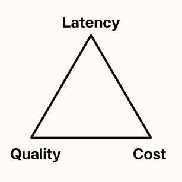

## Introduction — Why We’re Racing for *Sub-Second* Voice Loops

In **October 2024** OpenAI unveiled its **Realtime API**, the first end-to-end **multimodal model** able to convert speech → text → reasoning → speech fast enough to feel *human*.  
That launch set the **hype machine** spinning: “Why bother wiring three engines together when a single neural giant can do voice-to-voice in one shot?”

Reality check:

| Pain Point | Real-time Voice API |
|------------|--------------------|
| **Cost**   | ~**$20/hour** of two-way conversation — rough for contact-center scale. |
| **Voices** | Locked to a handful of OpenAI-curated timbres; no custom cloning or branded voices. |
| **Swapability** | You wait for *their* next model drop — can’t plug in a brand-new STT or TTS that shipped yesterday. |

Meanwhile, the open-source and vendor ecosystem didn’t sit still. By mid-2025 we could stitch together **Deepgram STT + GPT-4 Nano/Mini + Cartesia Sonic (or ElevenLabs)** and hit *similar* latency **for a fraction of the cost** — while choosing any voice we like.

The trick is to keep every stage **modular**:

* **Speech-to-Text (STT)** — use whatever recognizer is fastest or cheapest today.  
* **Large Language Model (LLM)** — swap Mini ↔ Nano ↔ Flash checkpoints as they evolve.  
* **Text-to-Speech (TTS)** — pick the voice library that matches your brand.

### Enter **[LiveKit](https://livekit.io)**

The glue that lets us shuffle those **building blocks** in real time is **LiveKit** — a WebRTC orchestration layer with an SDK that can fan-out telephone legs, browser streams, and AI workers on the same SFU.

New STT, LLM, or TTS drops on a Friday?  
We just **swap the block**, **restart the worker**, and it's live by lunch.

No retraining. No monolithic rebuilds. Just composable parts evolving at their own pace.

---

## What “Latency” Really Means (and Why It Hurts)

Human turn-taking is *fast*. Large-scale multilingual studies show that the **median inter-turn gap is ≈ 200 ms**, but the range spans from as low as **7 ms** (in Japanese) to over **440 ms** (in Danish), depending on the language, sentence structure, and context of the exchange [[1]](https://arxiv.org/pdf/2404.16053v1).  
A replication focused on English measured an average gap of **236 ms ± 520 ms SD**, confirming that even within a single language, there’s wide variance depending on interaction type and formality.

When the silence between turns stretches, our perception shifts:

| One-way gap      | How it feels                              |
|------------------|--------------------------------------------|
| **< ≈ 400 ms**   | Still “natural”, but you notice a beat.    |
| **> ≈ 400 ms**   | ITU-T G.114 flags this as *unacceptable* for conversational quality. |
| **> ≈ 600–700 ms** | Most people label the call “robotic” or “satellite-delayed”. |

These reference points form the benchmark we’re chasing:  
**get the bot’s first syllable inside the ~400 ms comfort zone**—or, at the very least, close enough that the pause doesn’t break the conversational rhythm.

---

## Anatomy of a Voice Pipeline

A real-time loop has **three streaming stages** that run strictly in series:

| Stage | What it does | Latency metric |
|-------|--------------|----------------|
| **STT – Speech-to-Text** | Turns audio frames into text tokens. | *Final transcript time* (but with proper streaming this is ≈ 0 ms relative to the next stage). |
| **LLM – Large Language Model** | Crafts the reply. | **TTFT (Time to First Token):** delay between sending the prompt and receiving the *first* generated token. |
| **TTS – Text-to-Speech** | Voices the reply. | **TTFB (Time to First Byte):** delay between sending the text and receiving the first playable PCM chunk. |

> **Key observation:** in every stack we measured, **LLM TTFT + TTS TTFB account for 90 %+ of total loop time**; with streaming recognizers, STT is effectively negligible.

All three stages run in streaming inference — we start passing tokens or audio frames downstream the moment we see them.

---

## The Latency / Quality / Cost Triangle

Push one corner, the others move:

* **Lower latency ⇢** smaller / quantized models, “good-enough” neural voices.  
* **Higher quality ⇢** bigger LLMs, premium TTS; usually slower.  
* **Lower cost ⇢** open-source or micro-models; may ding both speed *and* fidelity.

Our job is to find the *quickest* loop that still sounds customer-ready and doesn’t torch the budget.

---

## How We Benchmarked

* Same system prompt in **English** *and* **Spanish**.  
* Dozens of **STT + LLM + TTS combinations** (cloud & OSS of which we have selected the top performing).  
* **LiveKit** measured STT duration, TTFT, TTFB on every turn.

### A few things we learned fast

1. **LLMs & TTS slow down outside English.**  
2. A long system prompt only punishes the **first** turn (~ +300 ms); later turns ride the KV-cache.  
3. The newest “nano” LLMs plus an ultra-fast TTS can get that **first syllable under 800 ms**, scraping the human comfort ceiling.

| #   | STT                   | LLM (version)     | TTS                  | Language | TTFT (1st / next)           | TTS TTFB    | First Byte Latency* | Tokens/s |
|-----|------------------------|-------------------|-----------------------|----------|-----------------------------|-------------|----------------------|-----------|
| 1   | Whisper-1 (no stream)  | GPT-4o-mini       | ElevenLabs            | EN       | 0.34 / 0.34 s               | 0.42–0.47 s | 3.1–3.9 s            | 19–48     |
| 2   | Deepgram               | GPT-4o-mini       | ElevenLabs            | EN       | 0.31–1.63 / 0.31–0.45 s     | 0.35–0.46 s | 0.7–2.1 s            | 9–23      |
| 3   | Deepgram               | GPT-4.1-mini      | ElevenLabs            | EN       | 0.31–0.44 / 0.31–0.40 s     | 0.40–0.59 s | 0.71–1.03 s          | 13–67     |
| 4   | Deepgram               | GPT-4.1-mini      | ElevenLabs            | ES       | 0.77–1.33 / 0.75–0.95 s     | 0.56–0.69 s | 1.33–2.02 s          | 29–38     |
| 5   | Deepgram               | Gemini 1.5 Flash  | ElevenLabs            | EN       | 0.45–0.76 / 0.35–0.55 s     | 0.45–0.70 s | 1.2–1.5 s            | 40–85     |
| 6   | Deepgram               | Gemini 1.5 Flash  | ElevenLabs            | ES       | 1.30–2.37 / 1.10–1.40 s     | 0.46–0.69 s | 1.8–3.0 s            | 25–58     |
| 7   | Deepgram               | GPT-4.1-mini      | Cartesia Sonic-2      | EN       | 1.22–1.41 / 0.42–0.90 s     | 0.43–0.45 s | 1.65–1.86 s          | 23–46     |
| 8   | Deepgram               | GPT-4.1-mini      | Cartesia Sonic-2      | ES       | 0.74–1.38 / 0.70–0.90 s     | 0.48–0.52 s | 1.22–1.90 s          | 22–42     |
| 9   | Deepgram               | GPT-4.1-mini      | Cartesia Sonic-Turbo  | EN       | 1.15–1.24 / 0.44–0.65 s     | 0.38–0.41 s | 1.53–1.65 s          | 17–45     |
| 10  | Deepgram               | GPT-4.1-mini      | Cartesia Sonic-Turbo  | ES       | 0.75–1.11 / 0.30–0.40 s     | 0.43–0.46 s | 1.18–1.57 s          | 31–51     |
| 11  | Deepgram               | Gemini 1.5 Flash  | Cartesia Sonic-Turbo  | EN       | 1.19–1.27 / 1.19–1.27 s     | 0.40–0.43 s | 1.59–1.70 s          | 12–44     |
| 12  | Deepgram               | Gemini 1.5 Flash  | Cartesia Sonic-Turbo  | ES       | 1.28–1.39 / 1.00–1.10 s     | 0.42–0.44 s | 1.70–1.83 s          | 40–56     |
| 13  | Deepgram               | GPT-4.1-nano      | Cartesia Sonic-Turbo  | EN       | 0.90–0.97 / 0.30–0.40 s     | 0.42–0.52 s | 0.73–1.45 s          | 40–105    |
| 14  | Deepgram               | GPT-4.1-nano      | Cartesia Sonic-Turbo  | ES       | 1.00–1.07 / 0.26–0.40 s     | 0.43–0.50 s | 0.75–1.53 s          | 70–116    |

---

## What the Numbers Tell Us

### 1. First-Turn Overhead Is Real

Every stack shows a **heavier first turn** because the LLM must ingest the entire system prompt before it can cache the KV-state.  

* Example:* in the **GPT-4 Mini + Sonic-2 (EN)** stack the first TTFT clocks at **≈ 1.22 s**, but subsequent turns fall to **≈ 0.42–0.90 s**. The “prompt tax” is ~300–800 ms, and it vanishes after turn 2 because the model re-uses its internal cache.

### 2. We’re Getting Closer to Human Latency — But Not Quite There Yet

* **Human comfort band:** ~0.1–0.4 s one-way; anything above **0.6–0.7 s** starts to feel "robotic."
* **Best first syllable today:** **0.73 s** (GPT-4 Nano + Sonic-Turbo, EN) and **0.75 s** (same stack, ES).  
  *That’s about 2× slower than a natural gap, but already below the ITU’s 400 ms threshold for unacceptable RTT.*
* **Second turn latency:** Since TTFT drops to **0.26–0.40 s** and TTFB remains around **0.43 s**, many loops land **just under 0.7–0.8 s**—close enough that most users don’t perceive a delay.

### 3. English Still Wins the Speed Race

Across the board, Spanish incurs an extra **+300–500 ms** in TTFT, and often a few additional milliseconds in TTFB.  
This isn't surprising: most language models are trained on English-dominant datasets, and their tokenizers are optimized for English morphology. That means fewer tokens per word, higher-confidence predictions, and faster decoding paths.  

In contrast, other languages often lead to:

* More tokens per sentence (due to suboptimal tokenization),
* Less frequent vocabulary (slower logits resolution),
* Slightly longer prompts (higher input load),
* And more uncertainty during generation (costlier decoding).

Model providers are still actively optimizing multilingual performance—but for now, English remains the latency benchmark.

### 4. STT Is a Non-Issue (When Streamed)

Deepgram’s streaming mode continually emits tokens, so by the time the user finishes speaking the transcript is already done. **< 5 ms** in our logs—effectively zero.

---

## Which Stack for Whom?

| Goal | Stack to Watch | Why |
|------|---------------|-----|
| **Ultra-low latency (< 0.8 s first byte)** | **GPT-4 Nano + Cartesia Sonic-Turbo** (rows 13–14) | Fastest TTFT (< 1 s first turn, < 0.40 s thereafter). Great for IVRs, live game NPCs, or any app where “snappiness” beats eloquence. Expect slightly terser, less nuanced language. |
| **Balanced latency & quality** | **GPT-4 Mini + Cartesia Sonic-2 / Sonic-Turbo** (rows 7–8 & 10–11) | Adds ~150-250 ms but yields noticeably richer wording and better reasoning. Sweet spot for customer support or sales calls where tone matters. |
| **Language coverage beyond English** | **Mini or Nano stacks + Sonic-Turbo (ES)** | Spanish numbers are catching up; Sonic voices remain natural and the Nano drop still delivers TTFT < 1.1 s. |
| **Premium voice fidelity** | **ElevenLabs + Mini stacks** (rows 1–4) | Neural voices lead the market in prosody; latency penalty is ~0.05–0.1 s vs. Sonic-Turbo—fine for podcasts, high-touch brand experiences. |

(Quality judgments are subjective; we used blind AB tests on 30 clips per stack.)

## Conclusions & Near-Term Outlook

1. **Composable beats monolithic—today.**  
   Because STT, LLM, and TTS evolve on different cadences, a modular pipeline lets you upgrade components the moment something faster drops—unlike monolithic models, where you must wait for the next provider release.

2. **Sub-second voice loops are already viable** for English and edging in for Spanish. With smarter caching, phoneme-level streaming, and incremental TTS we expect **< 500 ms** within a year.

3. **Model shrinkage will continue.**  
   “Nano” and “flash” checkpoints show that aggressive distillation + quantization can keep quality “good enough” while halving latency every generation.

4. **Edge deployment is accelerating.**  
    Thanks to aggressive quantization (8-bit and even 4-bit), large language and speech models are now deployable on local hardware—consumer GPUs, mobile NPUs, and even embedded systems. This allows parts of the voice loop to run **on-device**, cutting out network delays and shaving **50–150 ms** off total latency.  
    [Source: “AI Voice Inference at the Edge is Finally Here,” *VoiceTech Insights, 2025*](https://substack.com/home/post/p-160808933?source=queue&utm_source=chatgpt.com)

5. **Joint LLM-TTS training is emerging.**  
    A new generation of end-to-end speech models is beginning to bypass traditional TTS stages entirely. These models, like **VITA-Audio** (2025), predict multiple audio tokens in a single step, generating speech directly from text while drastically reducing inference time. Once stable in streaming mode, these architectures could cut TTS latency to **mere milliseconds**.  
    [Source: “VITA-Audio: Parallel Token-to-Audio Generation with Context-Aware Semantic Guidance,” *arXiv, May 2025*](https://arxiv.org/abs/2505.03739)

> **Bottom line:** We’re only a few iteration cycles away from voice agents that *consistently* reply in the same temporal rhythm as humans. If you build with LiveKit-style modular pipelines today, you can ride that curve with an overnight adjustment.

Stay tuned—the sub-half-second voice loop is closer than most teams think.
